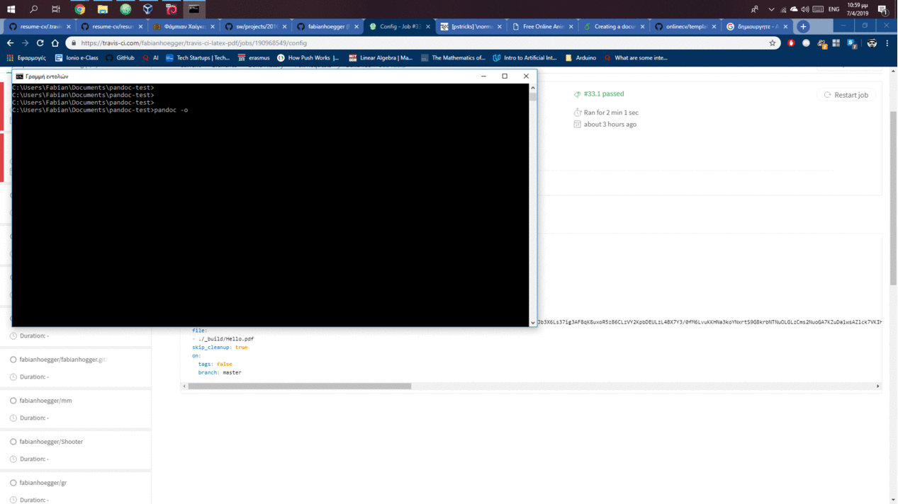

Φάμπιαν Χαίγκερ
ΑΜ :2016187

# Εργασία Μπόνους

Link: https://fabianhoegger.github.io/resume-cv/

Repository:  https://github.com/fabianhoegger/resume-cv
   
# Βιογραφικό
# 1ό παραδοτέο
- [x] Βρήκα ένα [theme](https://github.com/jglovier/resume-template) για βιογραφικό σημείωμα στατικού τύπου(χρήση αρχείων yml και jekyll για την υλοποιηση του site) και συμπλήρωσα τα         στοιχεία μου.
- [x] Πρόσθεσα εικόνα background, μενού πλοήγησης και κουμπί επιστροφής στην κορυφή της σελίδας με τέτοιο τρόπο ώστε να ταιριάζει με το theme (text styling,columns etc)

# 2ό παραδοτέο
- [x] Με τη βοήθεια του εργαλείων Pandoc και Latex μετάτρεψα τοπικά τα αρχεία .yml που περιέχουν τις πληροφορίες του βιογραφικού σε αρχεία  Latex 
- [x] Στη συνέχεια με τη βοήθεια του Travis και του παραδείγματος στο github : https://github.com/jackolney/travis-ci-latex-pdf 
πρόσθεσα Continuous Integration έτσι ώστε με κάθε αλλαγή μα δημιουργείται το νέο pdf

