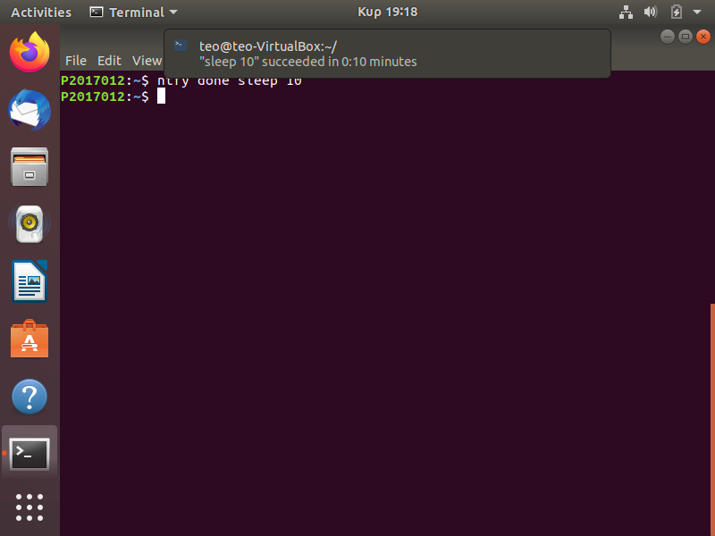
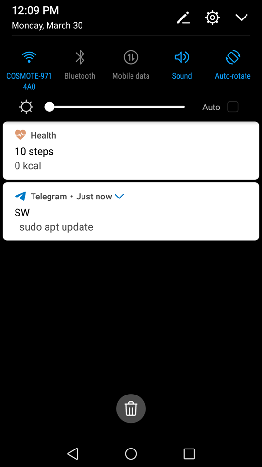

# Τεχνολογία λογισμικού

## Πλιάφας Θεόδωρος ΑΜ:2017012

## Συμμετοχικό εκπαιδευτικό υλικό

[Προσωπικό αποθετήριο](https://github.com/Thodoros/gr)

[Link βιβλίου](https://thodoros.netlify.com)

  Για την εργασία του συμμετοχικού υλικού επέλεξα τα **παραδοτέα Α και Β**. Για το **παραδότεο Α** βρήκα δύο εικόνες με ελεύθερα πνευματικά δικαιώματα και τις πρόσθεσα στο βιβλίο με μία μικρή περιγραφή. Η πρώτη εικόνα αφορά το **ubuntu terminal** και η δεύτερη το **raspberry pi zero**. Για το **παραδοτέο Β** πρόσθεσα ένα διαδραστικό παράδειγμα από το Codepen με ένα **Apple keyboard**, πάνω στο οποίο ο χρήστης έχει τη δυνατότητα να πατάει τα κουμπιά, καθώς επίσης και να το τροποποιήσει και να αλλάξει τον κώδικα.

* [Εικόνα ubuntu terminal στο αποθετήριό μου](https://github.com/Thodoros/gr/blob/master/_gallery/ubuntu-terminal.md)

* [Εικόνα ubuntu terminal στο βιβλίο](https://thodoros.netlify.com/gallery/ubuntu-terminal/)

* ~~[Εικόνα raspberry pi zero στο αποθετήριό μου]~~(https://github.com/Thodoros/gr/blob/master/_gallery/raspberry-pi-zero.md)

* ~~[Εικόνα raspberry pi zero στο βιβλίο]~~ (https://thodoros.netlify.com/gallery/raspberry-pi-zero/)

* ~~[Διαδραστικό παράδειγμα στο αποθετήριό μου]~~ (https://github.com/Thodoros/gr/blob/master/_remix/apple-keyboard.md)

* ~~[Διαδραστικό παράδειγμα στο βιβλίο]~~ (https://thodoros.netlify.com/remix/apple-keyboard/)

  Μετά από την παρακολούθηση μαθημάτων και ιδεών και οδηγιών που δώθηκαν αποφάσισα να αντικαταστήσω την εικόνα του Raspberry pi zero και το διαδραστικό παράδειγμα με το apple keyboard ώστε το περιεχόμενο να ταιριάζει καλύτερα στα πλαίσια του μαθήματος.

* [Εικόνα Gimp στο αποθετήριό μου](https://github.com/Thodoros/gr/blob/master/_gallery/gimp.md)

* [Εικόνα Gimp στο βιβλίο](https://thodoros.netlify.app/gallery/gimp/)

* [Διαδραστικό παράδειγμα στο αποθετήριό μου](https://github.com/Thodoros/gr/blob/master/_remix/terminal.md)

* [Διαδραστικό παράδειγμα στο βιβλίο](https://thodoros.netlify.app/remix/terminal/)

## Εργασίες Τεχνολογία Λογισμικού

### Πρώτη εργασία

* **Title:** Try different terminals and shells

* **Deliverables:** Repeat some of the previous exercises with a different terminal-shell and create a custom configuration that fits your needs

* [Asciinema link](https://asciinema.org/a/314665)

* Σε αυτή την άσκηση εγκατέστησα το [Z shell](http://www.zsh.org) μαζί με ένα framework του,το [ohmhzsh](https://github.com/ohmyzsh/ohmyzsh), με το οποίο άλλαξα το theme μέσω του **~/.zshrc**. Επίσης, πρόσθεσα κάποια plug-ins, το [autojump](https://github.com/wting/autojump) με το οποίο μπορώ να μετακινούμαι σε directories απευθείας τα οποία έχω ήδη επισκεφθεί προηγουμένως με μεγαλύτερη ευκολία και ταχύτητα και το [thefuck](https://github.com/nvbn/thefuck) το οποίο διορθώνει errors σε εντολές που έχεις γράψει λανθασμένα, προτείνοντας τις πιο κοντινές εκδοχές σε αυτό που ήθελες. Για να δείξω οπτικά τις αλλαγές του καινούργιου theme που επέλεξα δείχνω τον καιρό σε δύο πόλεις μέσω του [wttr](https://github.com/chubin/wttr.in) καθώς και τα τελευταία νέα σχετικά με τον κορονοϊό μέσω του getnews.tech.

### Δεύτερη εργασία

* **Title:** Use the terminal as an IDE

* **Deliverables:** Edit your files (e.g., cv, website, code, etc) in vim or emacs and compile it in a different panel or use a plug-in

* [Asciinema link](https://asciinema.org/a/314619)

* Σε αυτή την άσκηση εγκατέστησα το [neovim](https://github.com/neovim/neovim) και το τροποποίησα ώστε να μπορώ να το χρησιμοποιώ ως **Python IDE**. Πρόσθεσα δύο plug-ins, το [python-mode](https://github.com/python-mode/python-mode) το οποίο είναι αυτό που μετατρέπει το vim σε **Python IDE**, το [python-syntax](https://github.com/vim-python/python-syntax) το οποίο χρησιμοποιείται για highlighting και έπειτα έτρεξα ένα μικρό παράδειγμα. Δημιούργησα ένα αρχείο average.py στο οποίο γράφω ένα μικρό script ώστε να βρεθεί και να εκτυπωθεί ο μέσος όρος. Για να εκτελεστεί το script χρησιμοποιώ το **\r**.

### Τρίτη εργασία

* **Title:** Send notifications to your desktop-mobile

* **Deliverables:** Send a notifcation when a big task completes, eg download, compiling, etc

* [Asciinema link](https://asciinema.org/a/314820)

* Σε αυτή την άσκηση, εγκατέστησα πρώτα το [ntfy](https://github.com/dschep/ntfy) το οποίο είναι ένα εργαλείο που στέλνει ειδοποιήσεις στο desktop αλλά και στο κινητό. Έπειτα τοποθέτησα την εντολή **eval "$(ntfy shell-integration)"** στο **~/.bashrc** ώστε να στέλνονται κανονικά οι ειδοποιήσεις για διαδικασίες οι οποίες ξεπερνάνε ένα συγκεκριμένο χρονικό όριο. Αρχικά, έτρεξα την εντολή **ntfy done sleep 10** όπου στέλνει μία desktop ειδοποίηση μετά από 10 seconds όπως φαίνεται παρακάτω στο **screenshot_1**. Έπειτα,για να μπορώ να έχω τα notifications και στο κινητό μου, κατέβασα την εφαρμοφή [Telegram](https://telegram.org) και δημιούργησα ένα bot μέσω του BotFather το οποίο το σύνδεσα με το terminal μου μέσω ενός token το οποίο μου στάλθηκε. Για να μου σταλθεί ειδοποίηση για κάποια διαδικασία που έχει τερματίσει στο κινητό μου το μόνο που αρκεί είναι να βάλω στο τέλος της εντολής το **; tg** όταν την τρέξω,όπως έκανα και στην εντολή **sudo apt update** που φαίνεται στο **screenshot_2**.

### Τέταρτη εργασία

* **Title:** Performance monitoring

* **Deliverables:** Monitor the performance of your python scripts and visualize them with colors and/or spark lines

* [Asciinema link](https://asciinema.org/a/312503)

* Σε αυτή την άσκηση, εγκατέστησα το [hyperfine](https://github.com/sharkdp/hyperfine) το οποίο το χρησιμοποίησα για να συγκρίνω την ταχύτητα δύο αλγορίθμων ταξινόμησης, του **bubble** και του **heapsort** τους οποίους τους έχω σε python scripts και τους βρήκα μέσα από ένα απλό **Google Search**. Έπειτα τοποθέτησα κάποιες εντολές στον κώδικα και των δύο scripts ώστε να αντλούν τους αριθμούς που θα χρησιμοποιήσουν για την ταξινόμηση από ένα νέο txt αρχείο. Το txt αρχείο αυτό, δημιουργείται από το script **rand** το οποίο παράγει ένα σύνολο τυχαίων αριθμών που καθορίζει ο χρήστης. Στη συγκεκριμένη περίπτωση το έβαλα να μου δώσει 10.000 τυχαίους αριθμούς. Τέλος, με την εντολή **hyperfine** και τις απαραίτητες παραμέτρους τρέχω τα δύο scripts και προβάλλονται τα αποτελέσματα σχετικά με το χρόνο εκτέλεσης του κάθε αλγορίθμου.

### Πέμπτη εργασία

* **Title:** Set-up a system for python development

* **Deliverables:** Install and configure in a user folder a python project that is not available through the package manager

* [Asciinema link](https://asciinema.org/a/324803)

* Σε αυτή την άσκηση αρχικά εγκατέστησα το pip3, το [virtualenv](https://virtualenv.pypa.io/en/latest/) και το [pipenv](https://github.com/pypa/pipenv). Αρχικά, δημιούργησα ένα νέο directory με όνομα **folder1** στο οποίο εγκατέστησα τη βιβλιοθήκη [psutil](https://pypi.org/project/psutil/) για τα την κάνω **import** στο script μου. Έπειτα, με την εντολή **pipenv shell** ενεργοποιώ το περιβάλλον και ξεκινάω να επεξεργάζομαι το **script.py** στο οποίο γράφω κάποιες εντολές κώδικα για την εκτύπωση κάποιων χαρακτηριστικών του υπολογιστή. Το πρώτο **print** εμφανίζει το χρόνο τον οποίο πέρασε η CPU στην συγκεκριμένη λειτουργία, το δεύτερο **print** εμφανίζει τον μέσο φόρτο του συστήματος το τελευταίο λεπτό και τα τελευταία 5 και 15 λεπτά αντίστοιχα. Το τρίτο **print** εμφανίζει την εναπομείνουσα μπαταρία του συστήματος, όμως στην περίπτωσή μας εμφανίζει **None** διότι δεν υπάρχουν οι απαραίτητες μετρήσεις. Τέλος, δημιουργώ ένα δεύτερο directory με το όνομα folder2 στο οποίο αντιγράφω το python script μου και έπειτα το τρέχω χωρίς επιτυχία αφού δεν είναι εγκατεστημένη η **psutil**.

### Έκτη εργασία

* **Title:** Set-up cloud services

* **Deliverables:** ssh to a remote machine and demonstrate your remote cli user land (e.g., email, editor, cv, code, etc)

* [Asciinema link](https://asciinema.org/a/327277)

* Σε αυτή την άσκηση εγκατέστησα τον **ssh server** με την εντολή **sudo apt-get install openssh-server**. Δε χρειάστηκε να εγκαταστήσω το **ssh client** αφού υπάρχει ήδη προεγκατεστημένο στο Ubuntu. Όπως φαίνεται και στο [Asciinema](https://asciinema.org/a/327277) έχω ένα μικρό python script το οποίο εμφανίζει τους αριθμούς από το 1-5. Συνδέομαι στον server τοπικά με την εντολή **ssh localhost** και τον κωδικό του υπολογιστή. Πλέον, είμαι συνδεδεμένος στον server από τον οποίο μπορώ να επεξεργαστώ και να τρέξω αρχεία καθώς και να τρέξω διάφορες εντολές, τα αποτελέσματα των οποίων θα υπάρχουν και στον υπολογιστή μου μόλις τερματίσω την σύνδεσή μου με τον server. Χρησιμοποιώ δύο εντολές, την **ls** και την **vi num.py** με την οποία επεξεργάζομαι το python script και το κάνω να εμφανίζει τους αριθμούς από το 1-10. Έπειτα, αφού τρέξω το script στον server εμφανιζόνται κανονικά οι αριθμοί από το 1-10 και με την εντολή **exit** τερματίζω τη σύνδεση με τον server. Τρέχω ξανά το python script στον υπολογιστή μου αυτή τη φόρα και βλέπουμε πως οι αλλαγές έχουν πραγματοποιηθεί και εμφανίζει τους αριθμούς από 1-10. 
