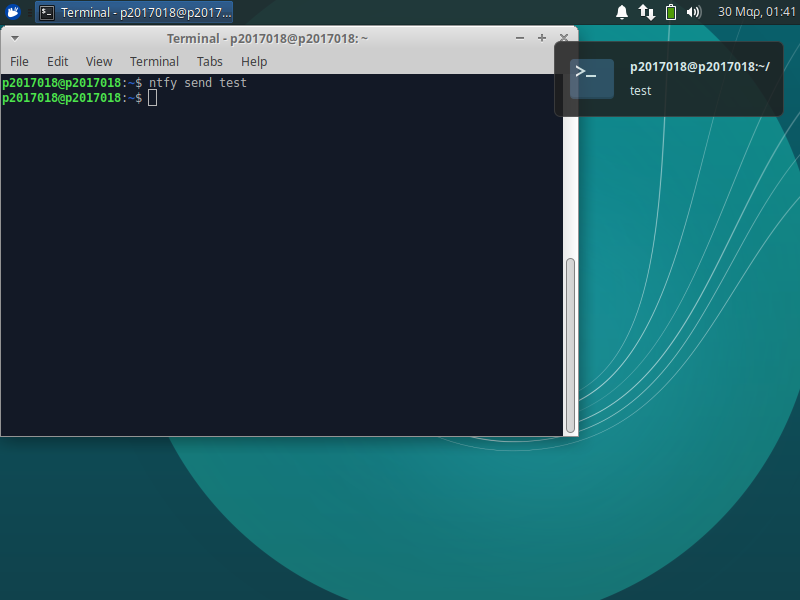
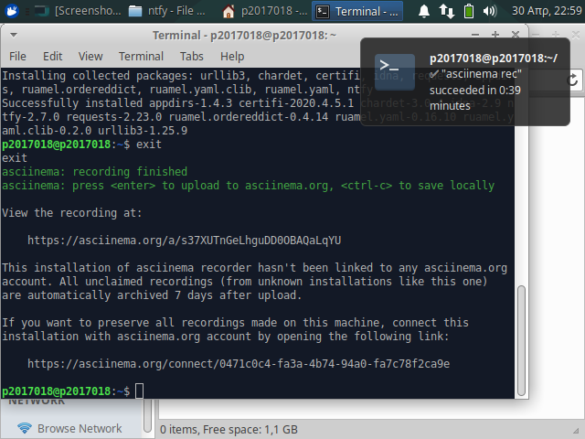
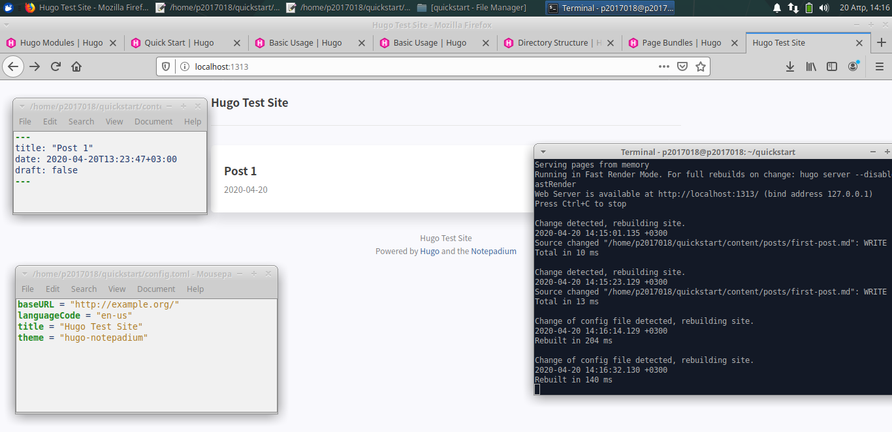

# Τμήμα Πληροφορικής Ιονίου Πανεπιστημίου
### Μάθημα: Τεχνολογίες Λογισμικού
* Σύνδεσμος Αποθετηρίου: https://github.com/mmits/sw

#### Στοιχεία Φοιτητή
* Ονοματεπώνυμο: Ελένη Μαρία Μητσοπούλου
* ΑΜ: Π2017018

#### Επιβλέπων Καθηγητής
* Χωριανόπουλος Κωνσταντίνος

---

## Άσκηση 1:
<b>Τίτλος:</b> Use the terminal as an IDE 
<b>Περιγραφή:</b> Edit your files (e.g., cv, website, code, etc) in vim or emacs and compile it in a different panel or use a plug-in

Χρησιμοποίησα το [SpaceVim](https://spacevim.org/), μια επέκταση του text editor Vim η οποία διαθέτει εργαλεία για την ανάπτυξη κώδικα σε διάφορες γλώσσες προγραμματισμού και πολλά άλλα.
Στην άσκησή μου, πρόσθεσα νέα configurations ώστε να μετατρέψω το SpaceVim σε ένα Python IDE το οποίο επίσης κάνει compile and run.

Μετά την εγκατάσταση του SpaceVim, αλλάζω και προσθέτω νέες παραμέτρους στο config file του προγράμματος, ώστε να υποστηρίζει τη γλώσσα Python. Οι παράμετροι αυτοί 

Γράφω ένα μικρό πρόγραμμα το οποίο μετά κάνω compile and run.

## Άσκηση 2:
<b>Τίτλος:</b> Send notifications to you desktop-mobile 
<b>Περιγραφή:</b> Send a notifcation when a big task completes, eg download, compiling, etc

Χρησιμοποίησα το [ntfy](https://github.com/dschep/ntfy), μια python-based εφαρμογή η οποία στέλνει notifications στο περιβάλλον του υπολογιστή μου.

Σε περιβάλλοντα Linux, όπως το xUbuntu, απαιτείται η εντολή `eval "$(ntfy shell-integration)"` στο config file του bash για να στέλνεται ειδοποίηση κάθε φορά που τερματίζεται μια διεργασία.

Παρακάτω ένα παράδειγμα ειδοποίησης.

## Άσκηση 3:
<b>Τίτλος:</b> Create an agent for news 
<b>Περιγραφή:</b> The demo should display the new content added on a news web site

## Άσκηση 4:
<b>Τίτλος:</b> Create your own static site and blog generator 
<b>Περιγραφή:</b> Monitor the performance of your python scripts and visualize them with colors and/or spark lines

Χρησιμοποίησα το [Hugo](https://gohugo.io/). 

Αφού εγκατέστησα την εφαρμογή, άλλαξα το θέμα της ιστοσελίδας μου στο [Notepadium](https://themes.gohugo.io/hugo-notepadium/) και μετά έγραψα ένα νέο post, όπως φαίνεται παρακάτω.

## Άσκηση 5:
<b>Τίτλος:</b> Performance monitoring 
<b>Περιγραφή:</b> Send a notifcation when a big task completes, eg download, compiling, etc

Asciinema link: https://asciinema.org/a/dZMJ2XSyOhdkNAAn8ZWo69ZjS

## Άσκηση 6:

