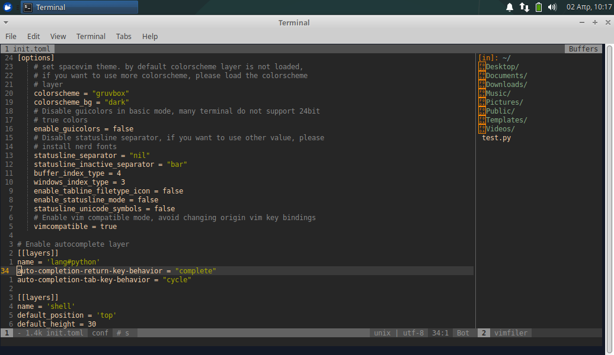
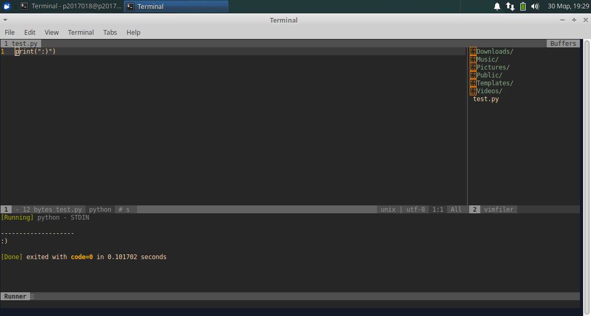

# Τμήμα Πληροφορικής Ιονίου Πανεπιστημίου
### Μάθημα: Τεχνολογίες Λογισμικού

#### Στοιχεία Φοιτητή
* Ονοματεπώνυμο: Ελένη Μαρία Μητσοπούλου
* ΑΜ: Π2017018

#### Επιβλέπων Καθηγητής
* Χωριανόπουλος Κωνσταντίνος

---

## Άσκηση 1:
<b>Τίτλος:</b> Use the terminal as an IDE 
<b>Περιγραφή:</b> Edit your files (e.g., cv, website, code, etc) in vim or emacs and compile it in a different panel or use a plug-in

Για την άσκηση αυτή χρησιμοποίησα το [SpaceVim](https://spacevim.org/), μια επέκταση του text editor Vim που προσφέρει ειδικά εργαλία για την ανάπτυξη κώδικα σε διάφορες γλώσσες προγραμματισμού και πολλά άλλα. Στην άσκησή μου, πρόσθεσα νέα configurations ώστε να μετατρέψω το SpaceVim σε ένα Python IDE το οποίο επίσης κάνει compile and run κώδικα σε Python.

Μετά την εγκατάσταση του SpaceVim, αλλάζω και προσθέτω νέες παραμέτρους στο config file του προγράμματος, ώστε να υποστηρίζει τη γλώσσα Python, και από σκοπιά compile του κώδικα και από σκοπιά auto-complete καθώς γράφω τον κώδικά μου.

Γράφω ένα μικρό πρόγραμμα το οποίο μετά κάνω compile and run.

## Άσκηση 2:
<b>Τίτλος:</b> Send notifications to you desktop-mobile 
<b>Περιγραφή:</b> Send a notifcation when a big task completes, eg download, compiling, etc
