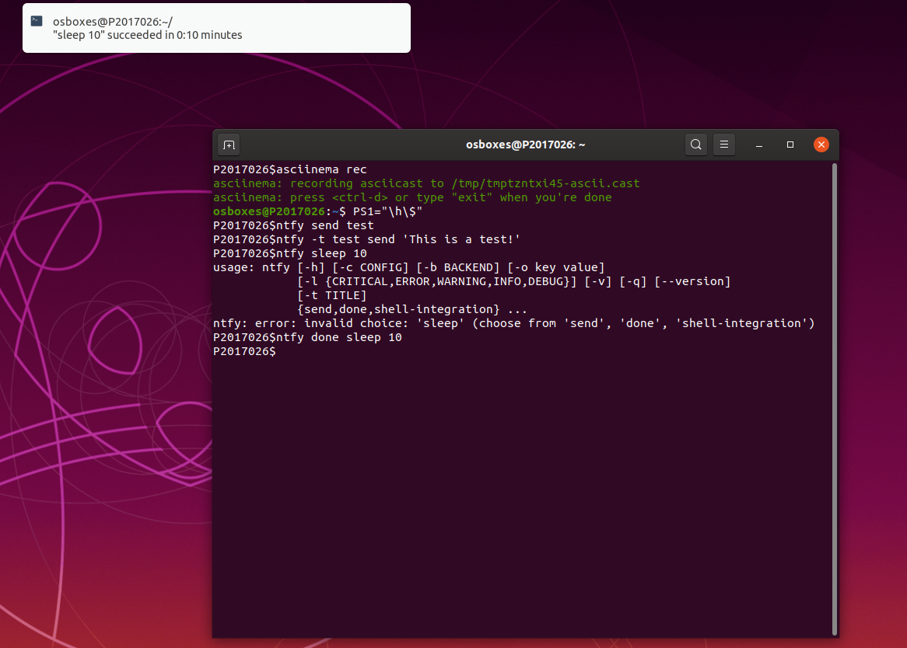
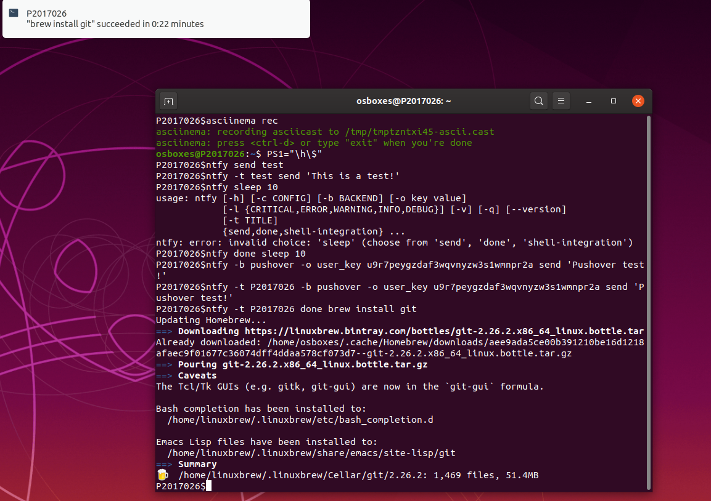
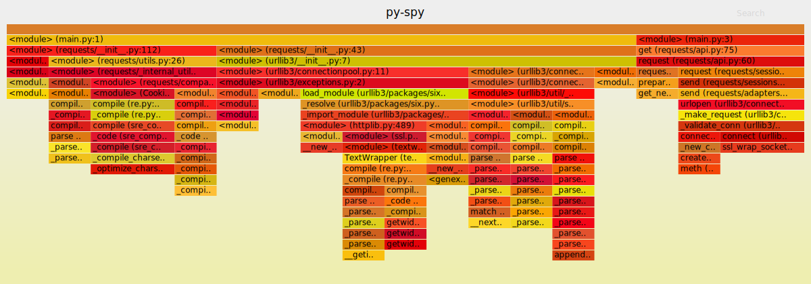

### ΟΝΟΜΑΤΕΠΏΝΥΜΟ: Χουλιαράκη Παναγιώτα 
### ΑΜ: Π2017026
### ΕΜΑΙL: p17chou@ionio.gr

## ΕΡΓΑΣΙΕΣ ΚΑΙ ΕΠΙΠΛΕΟΝ ΣΤΟΙΧΕΙΑ:

### ΕΡΓΑΣΙΑ 1Η: [set-up continuous integration]()
#### Assignment: set-up continuous integration
#### Deliverables: build and deploy your static site and your cv dynamically every time you make a small change in the source files

### ΕΡΓΑΣΙΑ 2Η: [configure a custom window manager](https://asciinema.org/a/Rde5lMIEsPptM14bcbGRpFAM6) 
#### Assignment: configure a custom window manager
#### Deliverables: try different wm and configure one to fit your needs

Σε αυτή την εργασία είχαμε να κάνουμε configure ένα custom window manager. Επέλεξα το sowm.  

### ΕΡΓΑΣΙΑ 3Η: try different terminals and shells 
#### Assignment: try different terminals and shells
#### Deliverables: repeat some of the previous exercises with a different terminal-shell and create a custom configuration that fits your needs
### [part one] (https://asciinema.org/a/PFjzUNhe4sQysRepYbd5O4YHK) 
### [part two] (https://asciinema.org/a/W4IhC9BSYcrFRIS1McXc1y5pr)

Για αυτή την εργασία αποφάσισα να χρησιμοποιήσω το fish shell. Το έκανα install μαζι με τα packages που χρειαζόταν για να λειτουργήσει.
Τέλος, για το asciinema έτρεξά μερικές εντολές και το py-spy.

### ΕΡΓΑΣΙΑ 4Η: [use the terminal as an IDE](https://asciinema.org/a/ibe3ymRrxEs7qFNx4rj23GTbb)
#### Assignment: use the terminal as an IDE
#### Deliverables: edit your files (e.g., cv, website, code, etc) in vim or emacs and compile it in a different panel or use a plug-in

Για να χρησιμοποιήσω το terminal σαν IDE έκανα install το spacevim. 'Aνοιξα με αυτό ένα python αρχείο που έκανα για τεστ και είχε λάθη. Το διόρθωσά στο spacevim, ώστε να μπορεί να τρέξει κανονικά. Τέλος, το έτρεξά στο terminal για να φανούν οι αλλαγές.

### ΕΡΓΑΣΙΑ 5Η: [set-up a system for python development](https://asciinema.org/a/TNfyMaOxs6BIWOgGIC61XJS5C)
#### Assignment: set-up a system for python development
#### Deliverables: install and configure in a user folder a python project that is not available through the package manager

Στην συγκεκριμένη εργασία, στόχος μου ήταν η δημιουργία μέσα σε ένα user folder ενός project το οποίο θα αξιοποιεί μία απο τις διαθέσιμες βιβλιοθήκες της python γράφοντας ένα script. Για αυτο χρειάστηκα να έχω python και το pip. Με το pip κατέβασά το pipenv, ώστε μέσω αυτού να κάνω install το requests package και για να τρέξω το script της python. Έπειτα, χρησιμοποίησα το virtualenv,ώστε να δημιουργήσω το απομονωμένο περιβαλλόντον Python. Το virtualenv δημιουργεί ένα φάκελο που περιέχει όλα τα απαραίτητα εκτελέσιμα για τη χρήση των πακέτων που θα χρειαζόταν ένα έργο Python. Ετσί, δήμιούργησα το εικονικό περιβάλλον python και το ένεργοποιήσα, για να μπορεί να χρησιμοποιήθει για διάφορα project.

### ΕΡΓΑΣΙΑ 6Η: [send notifications to your desktop-mobile](https://asciinema.org/a/sVgGLPoH47cnPCgCjNFMjGemj)
#### Assignment: send notifications to your desktop-mobile
#### Deliverables: send a notifcation when a big task completes, eg download, compiling, etc

Xρησιμοποίησα το ntfy και αρχικά εκάνα καποιά test notifications, τα οποία γινόντουσαν μόνο στο desktop.Αρχικά τo ntfy δεν μπορεί να στείλει στο κινητό τις ειδοποιήσεις. Για να γίνει αυτό χρείαζεται η εγκατάσταση μιας εφαρμογής στο κινητό στην οποία θα στέλνονται οι ειδοποιήσεις απο το terminal. Εγώ χρησιμοποίησα το pushover που προτίνει σαν βασικό το ntfy. Ηθελά να μου βγάζει τα notification και στον Η/Υ και στο κινητό γι'αυτό αλλάξα το ~/.ntfy.yml και πρόσθεσα τα παρακάτω:

```
---
backends:
    - default
    - pushover
pushover:
    user_key: u9r7peygzdaf3wqvnyzw3s1wmnpr2a
cellphone:
    backend: pushover
    user_key: u9r7peygzdaf3wqvnyzw3s1wmnpr2a

```
Τέλος, για την καταγραφή του βίντεο στο Asciinema επέλεξα να κάνω install το git μέσω του brew το όποιο ήξερα πως το χρειαζόμουν για κάποιες από τις άλλες εργασίες. Παρακάτω φαίνονται screeshots απο τις ειδοποιήσεις στο desktop και mobile phone μου καθώς δεν ήταν δυνατή η καταγραφή τους μέσω του asciinema.
  

  


### ΕΡΓΑΣΙΑ 7Η: create your own static site and blog generator ([part one](https://asciinema.org/a/hvlXDChOgxOS9Etx6RYAanPw8))
#### Assignment: create your own static site and blog generator
#### Deliverables: the generator should consider posts, pages, and templates

Έκανα install το Jenny, το οποίο έιναι ένα static blog generator. Στόχος του είναι να εργαστεί με ελάχιστες απαιτήσεις παρέχοντας παράλληλα μερικές σύγχρονες ανέσεις. 

### ΕΡΓΑΣΙΑ 8Η: create an agent for news ([part one](https://asciinema.org/a/JNXI9FCIzb6fZFb10Go3YNPwD))
#### Assignment: create an agent for news
#### Deliverables: the demo should display the new content added on a news web site

Για αυτή την εργασία χρειάστηκα το Huginn. Το Huginn είναι ένα σύστημα για οικοδόμους που εκτελούν αυτοματοποιημένες εργασίες για εσάς στο διαδίκτυο. Δεν μπορούσα να το χρησιμοποιήσω, απλά κατεβάζοντας το, καθώς είχε αρκετά dependencies. Γι'αυτό έκανα install τη ruby, rubygems,mysql,mysqlserver,rake,bundle. Επειτά έστησα το mysql-server και έτρέξα το rake για τη βάση δεδομένων μέσω του bundle.

```
bundle exec rake db:create
bundle exec rake db:migrate
bundle exec rake db:seed

```

Mόλις τελιώσα όλα αυτά μπορούσα πλέον να συνδεθώ στο huginn.

### ΕΡΓΑΣΙΑ 9Η: [programmable voice]
#### Assignment: programmable voice
#### Deliverables: deploy an application that forwards a call depending on a white- and black- list of phone numbers
### [part one](https://asciinema.org/a/BRF9uuL5oiSZs7tQLKwCP3Vx2)
### [part two](https://asciinema.org/a/5qJEwEkpyxuMIissJoNTds6Z3)

Για αυτή την εργασία χρειάστηκε το twilio. Με το twilio κατάφερα να βάλω τον υπολογιστή μου με τη χρήση python scripts να κάνει κλήση στο κινητό μου με ένα αυτοματοποιημένο μυνημα, οπώς και να στείλω SMS κάτι που ήθελα. Μέσω της πλατφόρμας του twilio έκανα function που το ονόμασα blacklist με το οποίο θα έιχε blacklist όσα κινητά έχω προσθέσει.

### ΕΡΓΑΣΙΑ 10Η: [choose your stack]()
#### Assignment: choose your stack
#### Deliverables: set-up a set of cli tools with minimal dependencies and a software licence that allows commercial use and selling

Χρήση του howdoi για να βάλω ένα set από cli tools.

### ΕΡΓΑΣΙΑ 11Η: [performance monitoring](https://asciinema.org/a/oCQAXIPzVcCtvYq1fQIhNJoIR)
#### Assignment: Performance monitoring
#### Deliverables: Monitor the performance of your python scripts and visualize them with colors and/or spark lines

Σε αυτή την εργάσια είχα να κάταγράψω τις επιδόσεις από python scripts. Για να τις απεικονήσω χρησιμοποίησα το py-spy. To έκανα install στον Η/Υ και έτρεξά ένα python script χρησιμοποιόντας την εντολή: 

```
py-spy record -o profile.svg -- python main.py
```
Με αυτό κατέγραψα την επιδοσή του main.py και το απεικόνησα όπως φαίνεται στο παρακάτω screenshot σε ένα αρχείο svg που το ονόμασα profile.svg.


