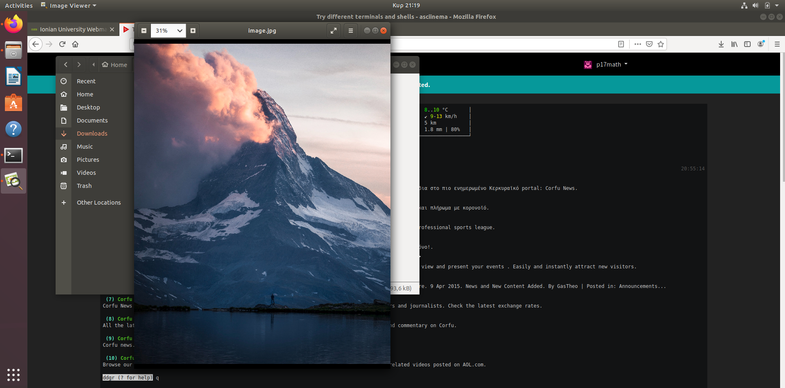
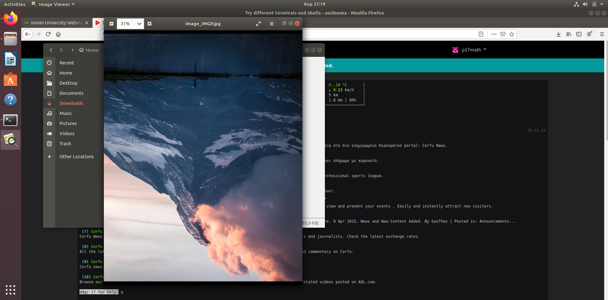
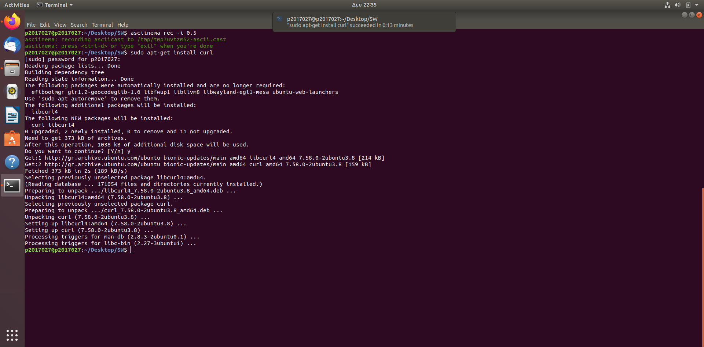
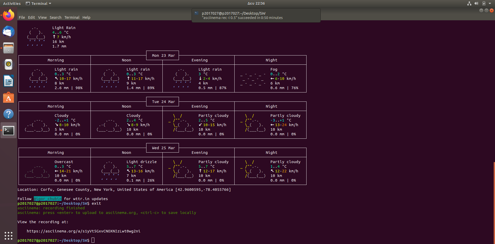
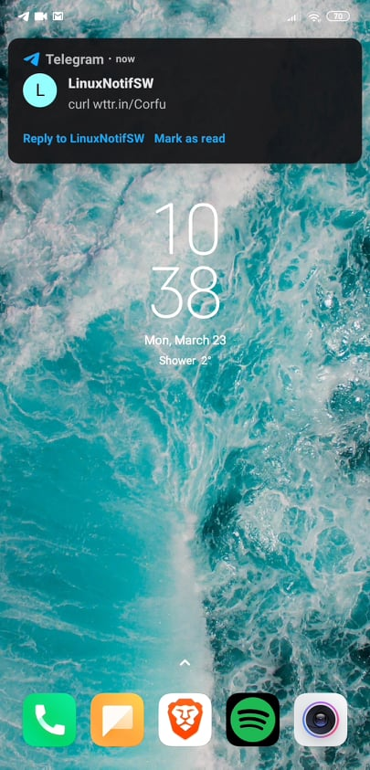
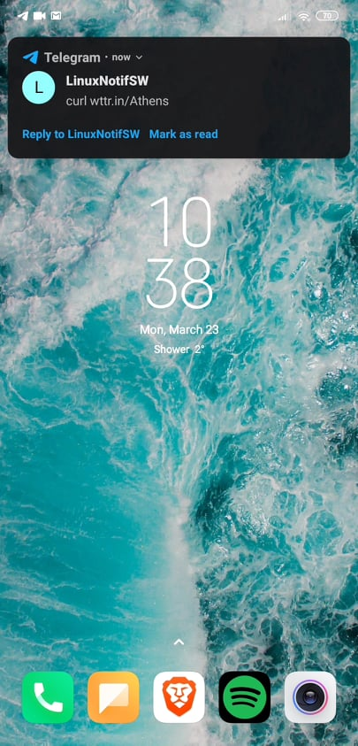
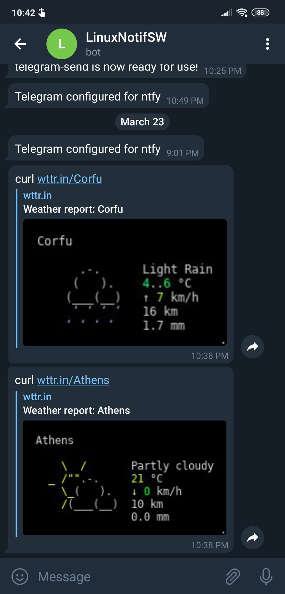

# Τεχνολογία λογισμικού
## Εμμανουήλ Μαθιουδάκης | Π2017027
## Συμμετοχικό εκπαιδευτικό υλικό
#### [Προσωπικό link βιβλίου](https://p17math.netlify.com/)
#### [Προσωπικό αποθετήριο](https://github.com/p17math/gr)
  * Για την εργασία συμμετοχικού περιεχομένου ακολουθήσαμε τα **πρώτα δυο παραδοτέα, Α και Β**. Πιο αναλυτικά, εισήχθησαν για το **πρώτο παραδοτέο** δύο εικόνες με λεζάντα και ελεύθερα πνευματικά δικαιώματα στους κατάλληλους φακέλους του δικού μας αποθετηρίου, μια που αφορά το **Nvidia Shield** και βρίσκεται [εδώ](https://github.com/p17math/gr/blob/master/_gallery/nvidia-shield.md) και ακόμη μια που αφορά το **Visual Studio Code** και βρίσκεται [εδώ](https://github.com/p17math/gr/blob/master/_gallery/visual-studio-code.md). Για το **δεύτερο παραδοτέο** δημιουργήθηκε ένα **διαδραστικό παράδειγμα** το οποίο απεικονίζει ένα **terminal** το οποίο δίνει την δυνατότητα στον χρήστη με το πάτημα του enter να δημιουργεί ένα nickname και βρίσκεται [εδώ](https://github.com/p17math/gr/blob/master/_remix/terminal-nickname-generator.md).
## Εργασίες SW
### Πρώτη εργασία
#### Assignment: Τry different terminals and shells
#### Deliverables: Repeat some of the previous exercises with a different terminal-shell and create a custom configuration that fits your needs
#### [Asciicast](https://asciinema.org/a/314638)
#### Περιγραφή: 
  * Σε αυτό το assignment αρχικά εγκαταστήσαμε το [fish shell](https://github.com/fish-shell/fish-shell) και το framework του ([oh-my-fish](https://github.com/oh-my-fish/oh-my-fish)) με βάση τις οδηγίες που δίνονται στις αντίστοιχες σελίδες και αφού ελέγξαμε τα διαθέσιμα **themes** του shell, το τροποποιήσαμε ώστε να το φέρουμε στα μέτρα μας. Από προηγούμενες ασκήσεις αποφασίσαμε να εκτελέσουμε αυτήν όπου ελέγχουμε τον καιρό με δύο τρόπους, μία φορά με τo plug-in [weather](https://github.com/oh-my-fish/plugin-weather) που είχαμε προσθέσει και άλλη μία με το [wttr.in](https://github.com/chubin/wttr.in), αυτή όπου κάνουμε μια αναζήτηση στο διαδίκτυο από το terminal μέσω του [ddgr](https://github.com/jarun/ddgr) αλλά και την άσκηση όπου αλλάζουμε το μέγεθος μια φωτογραφίας. (Στην περίπτωσή μας κάναμε rotate μια φωτογραφία που είχαμε κατεβάσει χρησιμοποιώντας το [imgp](https://github.com/jarun/imgp). Παρακάτω παραθέτουμε screenshots με την εικόνα πριν και μετά το rotation. Επίσης κάναμε μια μικρή επίδειξη ενός ακόμα χρήσιμου εργαλείου που προσθέσαμε στο νέο μας shell, του [howdoi](https://github.com/gleitz/howdoi) το οποίο παραθέτει χρήσιμες οδηγίες κατόπιν χρήσης του για κάποιο θέμα. Στην συνέχεια χρησιμοποιήσαμε ένα ακόμα shell που εγκαταστήσαμε, το [Z shell](https://www.zsh.org/) με ένα framework του, το [ohmyzsh](https://github.com/ohmyzsh/ohmyzsh), μέσα στο οποίο αρχικά τροποποιήσαμε το **theme** του με την χρήση της εντολής **nano** και δείξαμε  τα plug-ins που έχουμε εισάγει στο **~/.zshrc** του για την διευκόλυνσή μας, αρχικά μόνο ονομαστικά (μέσα στο ~/.zshrc) και στην συνέχεια λίγο πιο αναλυτικά με την χρήση κάποιων διαθέσιμων εντολών. Εδώ να διευκρινίσουμε πως κάποια plug-ins που προσθέσαμε ήταν καθαρά για οπτική διευκόλυνση και "λειτουργούσαν ήδη χωρίς να χρειαστεί να καλεστούν" ([coloured-man-pages](https://github.com/ohmyzsh/ohmyzsh/tree/master/plugins/colored-man-pages), [zsh-syntax-highlighting](https://github.com/zsh-users/zsh-syntax-highlighting/blob/master/INSTALL.md)) ενώ άλλα εκτελούσαν κάποια ενέργεια κατόπιν κλήσης ή λάθους ([autojump](https://github.com/wting/autojump), [command-not-found](https://github.com/ohmyzsh/ohmyzsh/tree/master/plugins/command-not-found)).
#### Screenshots:
   -Πριν το rotation  
     
   -Μετά το rotation  
   
   
### Δεύτερη εργασία
#### Assignment: Use the terminal as an IDE
#### Deliverables: Edit your files (e.g., cv, website, code, etc) in vim or emacs and compile it in a different panel or use a plug-in
#### [Asciicast](https://asciinema.org/a/314599)
#### Περιγραφή: 
 * Σε αυτό το assignment αρχικά εγκαταστήσαμε το [neovim](https://github.com/neovim/neovim) και διάφορα plug-ins του τα οποία μας επιτρέπουν να το χρησιμοποιούμε σαν **IDE**. Πιο συγκεκριμένα, αποφασίσαμε να ασχοληθούμε με την **python**, για αυτό και εγκαταστήσαμε τα αντίστοιχα plug-ins, το [python-mode](https://github.com/python-mode/python-mode) και το [python-syntax](https://github.com/vim-python/python-syntax). Πέρα από αυτά, υπήρχαν κάποια που εγκαταστάθηκαν για δοκιμές πάνω στο neovim και άλλα που χρηιμοποιήθηκαν για οπτικές παραμετροποιήσεις του. Κάποια από αυτά είναι τα [lightline.vim](https://github.com/itchyny/lightline.vim) και [vim-rainbow](https://github.com/frazrepo/vim-rainbow). Στην [καταγραφή](https://asciinema.org/a/314599) του assignment λοιπόν, αρχικά δημιουργούμε ένα νέο .py αρχείο στο οποίο και εισάγουμε μια πολύ απλή **print** εντολή με σκοπό να δούμε αρχικά αν λειτουργεί το IDE μας αλλά και να περιγράψουμε μέσω αυτής της print τι παρουσιάζουμε. Αφού λοιπόν ελέγξουμε την λειτουργικότητα του ανοίγουμε το **init.vim** αρχείο που βρίσκεται μέσα στο **.config** directory και παρατηρούμε τα προαναφερόμενα **Plugs**. Τέλος, επιστρέφουμε στο αρχείο που δημιουργήσαμε και τροποποιούμε λίγο την print μας ώστε να αναφέρουμε πως εκτελέσαμε το προηγούμενο βήμα.

### Τρίτη εργασία
#### Assignment: Performance monitoring
#### Deliverables: Monitor the performance of your python scripts and visualize them with colors and/or spark lines
#### [Asciicast](https://asciinema.org/a/312489)
#### Περιγραφή:
  * Σε αυτό το assignment αρχικά εγκαταστήσαμε μέσω του [homebrew](https://docs.brew.sh/Homebrew-on-Linux) ένα benchmarking εργαλείο, το [hyperfine](https://github.com/sharkdp/hyperfine). Μέσω αυτού θα γινόταν η σύγκριση των python script μας και θα παρουσιαζόταν το αποτέλεσμα. Για τις ανάγκες του assignment έπρεπε να δημιουργήσουμε και κάποια scripts τα οποία θα συγκρίναμε. Αποφασίσαμε λοιπόν να συγκρίνουμε δυο scripts γνωστών αλγορίθμων ταξινόμησης, για αυτό και δημιουργήσαμε ένα που υλοποιούσε τον **selection-sort** και ακόμα ένα που υλοποιούσε τον **heap-sort**. Για να καταφέρουμε, όμως, να συγκρίνουμε δύο scripts ταξινόμησης και να παρουσιάσουμε ένα σχετικά σωστό αποτέλεσμα έπρεπε να έχουμε ένα σετ δεδομένων που θα ήταν ίδιο και για τα δυο scripts. Έτσι, δημιουργήσαμε ακόμη ένα το οποίο παρήγαγε τυχαίους αριθμούς (σε ποσότητα που καθορίζαμε εμείς) και τους εκχωρούσε σε ένα .txt αρχείο με όνομα την ποσότητα των παραγόμενων αριθμών. Αυτό το script ονομάστηκε **randomnumgen** και όπως βλέπουμε στο asciicast μας καλείται αρχικά για να μας δημιουργήσει το σετ δεδομένων που θα χρειαστούμε και στην στην συνέχεια καλείται η [hyperfine](https://github.com/sharkdp/hyperfine) εντολή με παραμέτρους τις εκτελέσεις των sorting scripts και το αρχείο που ταξινομεί η κάθε μια. Αυτή από την μεριά της εκτελεί τα **benchmarks** των scripts και στο τέλος παρουσιάζει μία σύνοψη με την διαφορά εκτέλεσης σε χρόνο.

### Τέταρτη εργασία
#### Assignment: Send notifications to your desktop-mobile
#### Deliverables: Send a notifcation when a big task completes, eg download, compiling, etc
#### [Asciicast (Desktop notification command) (1)](https://asciinema.org/a/312848)
#### [Asciicast (Mobile notification command) (2)](https://asciinema.org/a/312850)
#### Περιγραφή:
  * Σε αυτό το assignment χρησιμοποιήσαμε το [ntfy](https://github.com/dschep/ntfy) και το [Telegram](https://telegram.org/) για να ικανοποιήσουμε τις ανάγκες της άσκησης. Αρχικά, αφόυ εγκαταστήσαμε το ntfy και στείλαμε κάποια δοκιμαστικά notifications στο desktop μας, χρειάστηκε να "ενεργοποιήσουμε" την δυνατότητά του να στέλνει **αυτόματα** notifications κάθε φορά που τελειώνει η εκτέλεση κάποιου μεγάλου task **(>10 seconds)**. Αυτό επιτεύχθηκε με την εκχώρηση της εντολής **eval "$(ntfy shell-integration)"** στο **.bashrc**. Το task που επιλέξαμε να εκτελέσουμε για την παρουσίαση του ntfy ήταν το **sudo apt-get install curl**, το οποίο εκτελεί ένα απλό installation μεγαλύτερο απο 10 δευτερόλεπτα και μια απλή χρήση του curl για να σιγουρευτούμε πως όλα πήγαν καλα (για το οποίο όμως προφανώς δεν υπήρχε desktop notification) όπως μπορούμε να δούμε και στο [πρώτο Asciicast](https://asciinema.org/a/312848). Τα desktop notifications που προέκυψαν από αυτό το task παρουσιάζονται παρακάτω με την χρήση διαφόρων **screenshots** (Προσθέσαμε επίσης και το screenshot του notification από την λήξη του asciinema rec). Στην συνέχεια, για να στείλουμε **mobile notifications** μέσω του terminal χρειάστηκαν κάποια έξτρα βήματα. Αρχικά έπρεπε να κατεβάσουμε στο κινητό μας την εφαρμογή του [Telegram](https://telegram.org/) και να δημιουργήσουμε ένα **bot** μέσω του **BotFather**. Στην συνέχεια, χρειάστηκε να συνδέσουμε το bot μας μέ το **terminal** με την χρήση ενός **token** που μας παρείχε ο BotFather κατά την δημιουργία του bot αλλά και να εκτελέσουμε κάποιες απλές εντολές για το configuration του. Μετά από αυτά τα βήματα το bot μας ήταν έτοιμο για χρήση. Για να δείξουμε πως λειτουργεί σωστά, στείλαμε δυο notifications στο κινητό μας με την χρήση της εντολής wttr.in (η οποία θα μας στείλει τον καιρό) συνοδευόμενη από **ένα semicolon (;)** και την εντολή **tg**, η οποία αποτελεί ένα **alias** της προεγκατεστημένης στα Ubuntu **alert**, όπως βλέπουμε και στο [δεύτερο Asciicast](https://asciinema.org/a/312850). Παρακάτω ακολουθούν **screenshots** που παρουσιάζουν τα notifications.
#### Screenshots:
-Desktop notification για την ολοκλήρωση του **sudo apt-get install curl**. 
-Desktop notification για την ολοκλήρωση του **asciinema rec -i 0.5** 
-Mobile notification με την ολοκλήρωση του **curl wttr.in/Corfu**
 

-Mobile notification με την ολοκλήρωση του **curl wttr.in/Athens**
 

-Τα δυο παραπάνω mobile notifications μέσα από το application του **Telegram**
 

