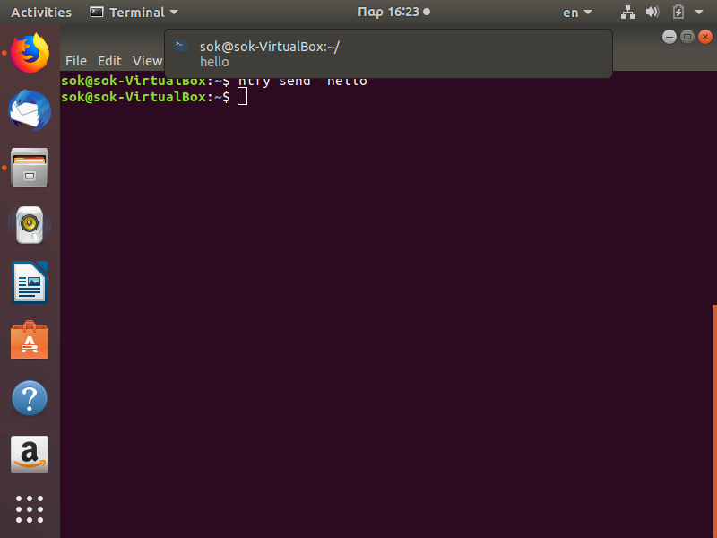

## Μάθημα: Τεχνολογία Λογισμικού Στ΄ Εξάμηνο
## Στοιχεία φοιτητή
### Ονοματεπώνυμο: Σωκράτης Καραουστάς
### ΑΜ: Π2017033

## Εργασία Ανάπτυξης
## Εργασία 1
### Try different terminals and shells

### Terminals
### Konsole Asciinema Link: https://asciinema.org/a/314863
### Tilda Asciinema Link: https://asciinema.org/a/314864

### Shell
### Fish Asciinema Link: https://asciinema.org/a/314547

Η βασική διαφορά ανάμεσα στο konsole και στο tilda είναι ότι το konsole έχει μενού το οποίο βοηθά τον χρήστη ενώ το tilda δεν έχει μενού και είναι σε full screen mode

### Εντολές που χρησιμοποίησα:

touch file

rm file

ls

man ls

sudo apt-get -f install konsole

sudo apt-get -f install tilda

## Εργασία 2
### Send notifications to your desktop-mobile
### Asciinema Link: https://asciinema.org/a/327936
 

## Εργασία 3
### Choose your stack
### Asciinema Link: https://asciinema.org/a/327941

## Εργασία 4
### Use the terminal as an IDE
### Asciinema Link: https://asciinema.org/a/327944

## Εργασία 5
### Set-up a system for python development
### Asciinema Link: https://asciinema.org/a/327955
