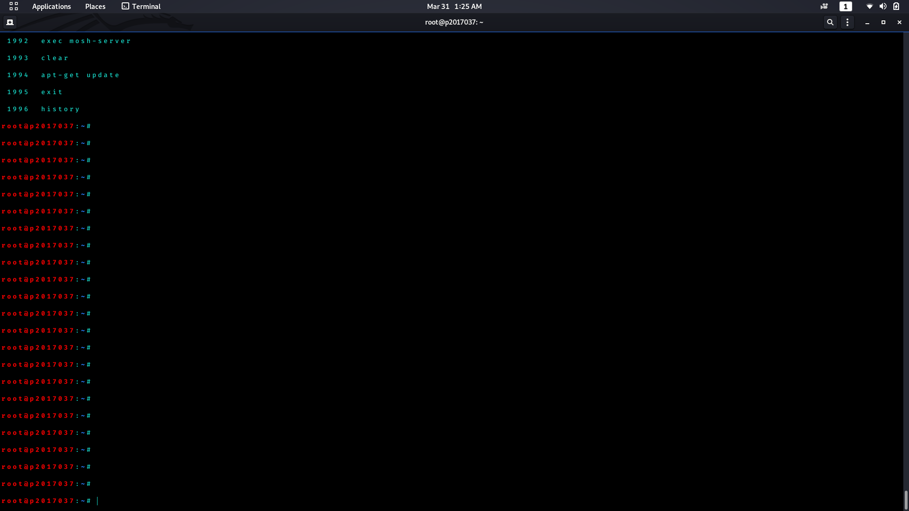
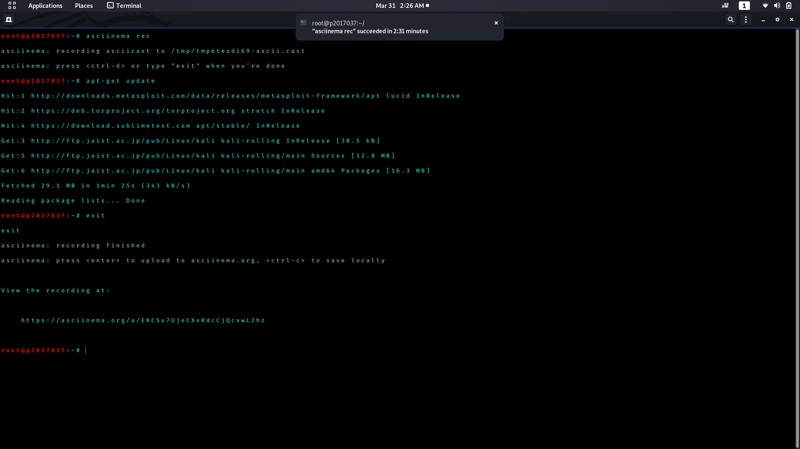

# Αντωνούλης Δημήτρης

## ΑΜ:Π2017037

## Παραδοτέα

### 1ο Παραδοτέο

* Assignment : try different terminals and shells

* Deliverables : repeat some of the previous exercises with a different terminal-shell and create a custom configuration that fits your needs

* Εργαλεία που χρησιμοποίησα: [mosh](https://mosh.org/)

Στο παρακάτω video δείχνω τη χρήση του mosh και κάνω ενημέρωση το λογισμικό του υπολογιστή μου απομακρυσμένα.

Link για το [video](https://vimeo.com/user111293037/review/402312386/61dbedc09d#)

**Φωτογραφία που δείχνει στα linux το history των εντολών που χρησιμοποίησα στο κινητό** 

### 2ο Παραδοτέο

* Assignment : performance monitoring

* Deliverables : monitor the performance of your python scripts and visualize them with colors and/or spark lines

* Σύνδεσμος στο [Asciinema](https://asciinema.org/a/9TcbaFQcZHnEK855VtqcsmwBd)

* Εργαλεία που χρησιμοποίησα: [hyperfine](https://github.com/sharkdp/hyperfine)

* Διαδικασία πρίν το benchmark: Αρχικά δημιούργησα δυο αρχεία το Quicksort.py και το Mergesort.py μέσα στα οποία γίνεται η quicksort και η mergesort αντιστοιχα οι οποίες είναι sorting python scripts στις οποίες έβαλα απο 20 τυχαίους αριθμούς στη κάθε μια να ταξινομήσουν.

### 3ο Παραδοτέο

* Assignment : send notifications to your desktop-mobile

* Deliverables : send a notifcation when a big task completes, eg download, compiling, etc

* Σύνδεσμος στο [Asciinema](https://asciinema.org/a/EKCSx7UjeCXxRdcCjQcxwL2hz)

* Εργαλεία που χρησιμοποίησα: [ntfy](https://github.com/dschep/ntfy/)

Εδω συνάντησα ενα πρόβλημα καθώς το ntfy μου στέλνει ειδοποίηση όταν τελειώνει το asciinema.Έρχεται ειδοποίηση όταν τελειώνει το record αλλα όχι η διεργασία που γίνεται μέσα στο record. Παρόλα αυτά χωρίς τη χρήση του asciinema μου έρχεται κανονικά ειδοποίηση οταν τελειώνει μια διεργασία.

**Φωτογραφία της ειδοποίησης που έρχεται στον υπολογιστή μόλις τελειώνει η διεργασία!** 
 

### 4ο Παραδοτέο

* Assignment : set-up a system for python development

* Deliverables : install and configure in a user folder a python project that is not available through the package manager

* Περιγραφή : Πρώτα εγκατέστησα το pipenv , δημιούρησα έναν καινούργιο φακελο μέσα στο οποίο ξεκίνησα με το virtual environment κάνωντας install διάφορα modules της python.Εδειξα τα Pipfile και Pipfile.lock,αλλα στο τέλος έτρεξα και την εντολή pipenv graph το οποίο δείχνει ενα δέντρο με τα dependencies που έχω εγκατεστημένα.

* Βίντεο στο [Asciinema](https://asciinema.org/a/jpmkb4biALfR7kjU7bJZrnnD3) 

* Εργαλεία που χρησιμοποίησα :
    * [pipenv](https://github.com/pypa/pipenv "pipenv")
   
* Prerequisites : pip , python3.

### 5ο Παραδοτέο

* Assignment : Use the terminal as an IDE

* Deliverables : Edit your files (e.g., cv, website, code, etc) in vim or emacs and compile it in a different panel or use a plug-in

* Σύνδεσμος στο [Asciinema](https://asciinema.org/a/Eu65QYKyfDuMGNqq7FZib8v5Q)

* Εργαλεία που χρησιμοποίησα: [neovim](https://github.com/neovim/neovim)

* Διαδικασία : Εκανα εγκατάσταση το neovim μαζι με τα plugins:

 * [python-syntax](https://github.com/vim-python/python-syntax "python-syntax")
 * [python-mode](https://github.com/python-mode/python-mode "python-mode")

 Στη συνέχεια εκτέλεσα ενα πρόγραμμα σε python για την επιδειξη της σωστής λειτουργίας.
 
 ### 6ο Παραδοτέο

* Assignment : configure a custom window manager

* Deliverables : try different wm and configure one to fit your needs

* Περιγραφή :Αρχικά κατέβασα και εγκατέστησα το OpenBox γιατί ειναι πολύ ελαφρύ και επίσης χρησιμοποιεί ελάχιστη μνήμη Ram. Διαπίστωσα οτι για οποιαδήποτε μικροαλλαγή θελεις να κάνεις συνήθως χρειάζεται να εγκαταστήσεις ενα προγραμματακι μικρό πράγμα που επιβεβαιώνει πόσο ελαφρύ είναι.Παρακάτω είναι ένα παράδειγμα 2 προγραμμάτων που κατέβασα το πρώτο για να βάλω φόντο καθώς ήταν σκέτο μαύρο οταν το πρωτοάνοιξα και το δεύτερο για να βγαλω screenshot.

* Εργαλεία που χρησιμοποίησα: 
[Openbox](http://openbox.org/wiki/Main_Page)
[scrot](https://github.com/dreamer/scrot)
[nitrogen](https://github.com/l3ib/nitrogen)

**Screenshot που προαναφέρθηκε!** 
 

    

## Συμμετοχικό Εκπαιδευτικό Υλικό

[Link της σελίδας του βιβλίου](https://dimitrisantonoulis.netlify.com/) 
[Link προσωπικού αποθετηρίου του βιβλίου](https://github.com/DimitrisAntonoulis/gr)

### A: Δύο νέες εικόνες με λεζάντα και με ελεύθερα πνευματικά δικαιώματα ή που επιτρέπουν εμπορική χρήση
Στο παραδοτέο αυτό πρόσθεσα 2 εικόνες, τις τοποθέτησα σε ανάλογα categories συμπλήρωσα μια λεζάντα και πρόσθεσα σχετικά tags. Οι φωτογραφίες αφορούν το Vr-headset και το Microphone.
