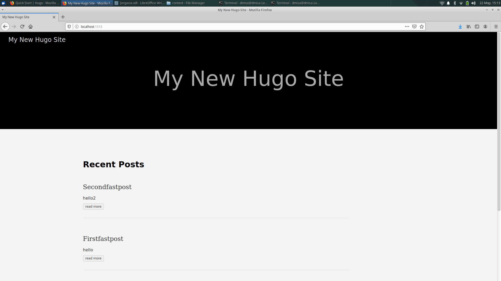
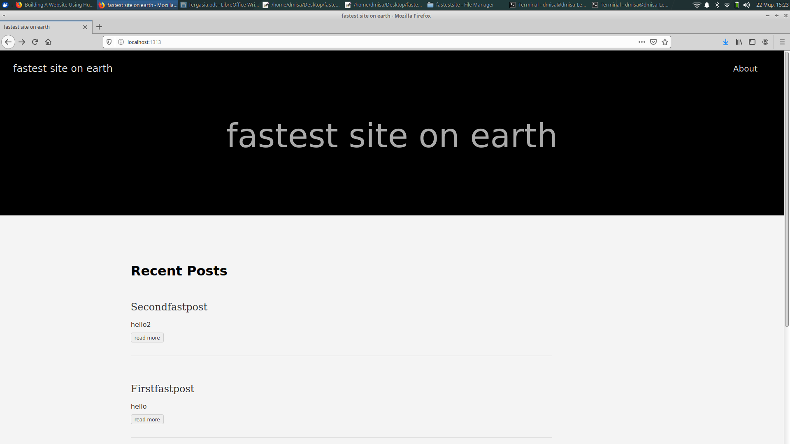
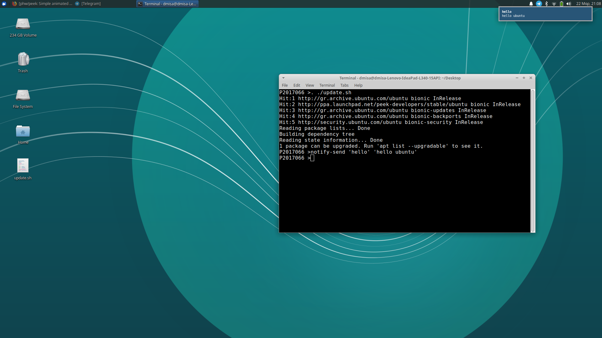
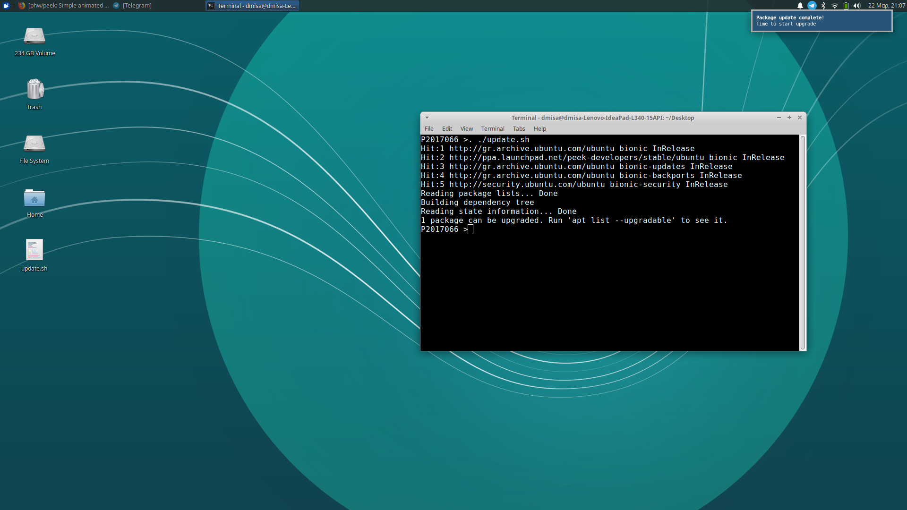
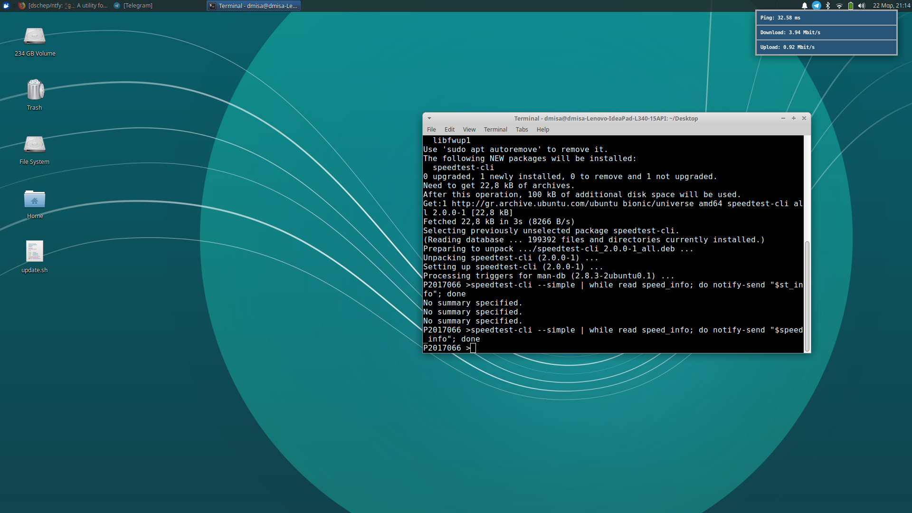
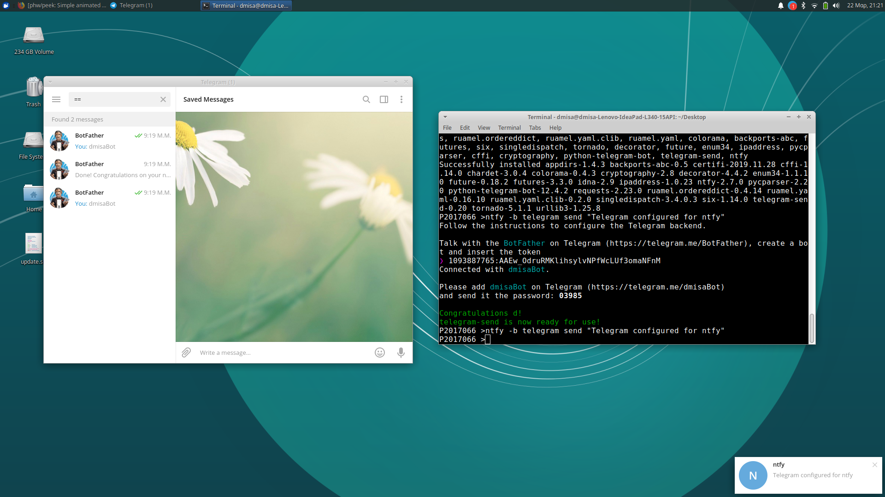
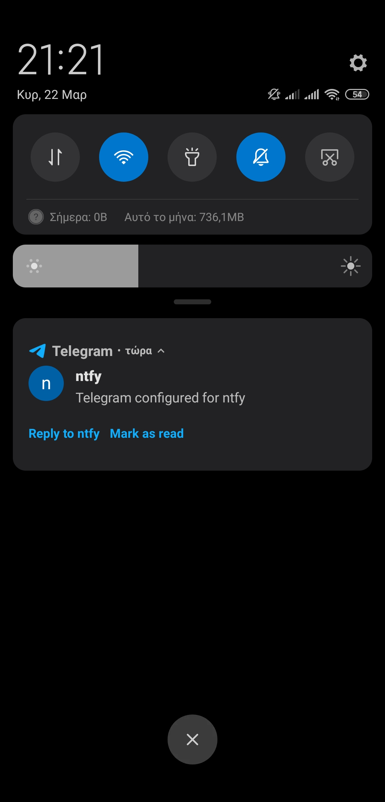
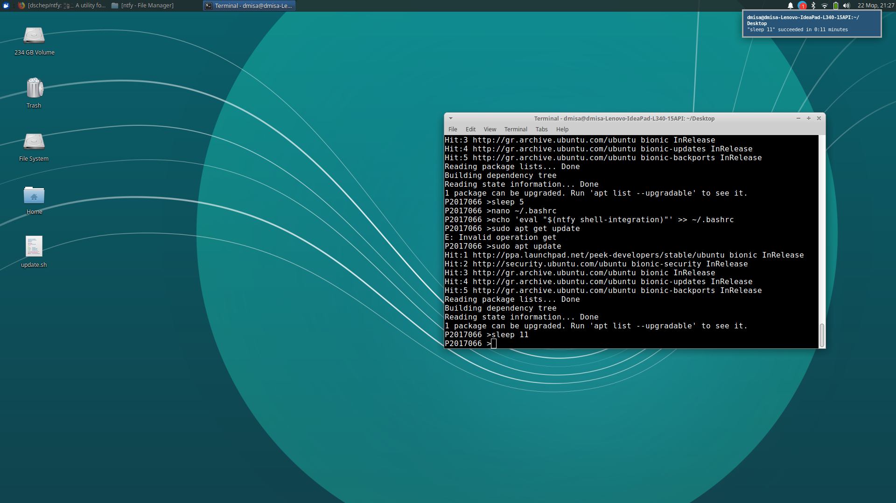

# Τεχνολογία Λογισμικού
## Μισαηλίδης Δημήτρης ΑΜ:Π2017066

## Εργασίες

## Πρώτη Εργασία

* title: try different terminals and shells
* deliverables: repeat some of the previous exercises with a different terminal-shell and create a custom configuration that fits your needs
* tools used: [fish shell](https://fishshell.com/), [oh-my-fish](https://github.com/oh-my-fish/oh-my-fish)
* prequisites: curl,git,jq
* asciinema: [link](https://asciinema.org/a/312395)
* description:
  * Για την διεκπεραίωση της εργασίας επέλεξα να χρησιμοποιήσω το **fish shell**, το οποίο προορίζεται για αρχάριους χρήστες του unix. Μετά από την εγκατάσταση του fish, δοκίμασα να κάνω μερικές απλές εργασίες από άλλα μαθήματα (check the weather + batch image conversion) και όπως παρατηρούμε οι εργασίες στο fish shell πραγματοποιούνται περίπου το ίδιο με το bash shell που έρχεται προεγκατεστημένο. Για την τροποποίηση του fish shell εγκατέστησα το **oh-my-fish**, το οποίο μας επιτρέπει να εγκαθιστούμε πακέτα και να τροποποιούμε την εμφάνιση του fish shell μας. Με το oh my fish άλλαξα το θέμα του shell και έπειτα εγκατέστησα το πακέτο weather το οποίο μας επιτρέπει να τσεκάρουμε τον καιρό. Συνεπώς, παρατηρούμε ότι με αυτό το πακέτο γίνεται η ίδια άσκηση με πριν με απλούστερο τρόπο μέσω του fish shell. Τέλος, δημιούργησα συναρτήσεις στον φάκελο `/.config/fish/functions/` που μπορούν να φανούν (σε εμένα προσωπικά) χρήσιμες. Πιο συγκεκριμένα, η συνάρτηση am αλλάζει το fish prompt με τον αριθμό μητρώου μου, ο οποίος χρειάζεται σε κάθε καταγραφή στο asciinema. Η συνάρτηση ip_addr εμφανίζει την τρέχουσα διεύθυνση ip, η συνάρτηση backup δημιουργεί ένα  αρχείο .bak για το backup ενός αρχείου (παίρνοντας ως είσοδο ένα αρχείο), η συνάρτηση dim χαμηλώνει την φωτεινότητα του υπολογιστή, ενώ η light την αυξάνει. Προφανώς υπάρχουν άπειροι τρόποι να τροποποιήσουμε τον fish shell για να αυξήσουμε την παραγωγικότητα μας και να φτάσουμε τις δυνατότητες του shell σε κορυφαίο επίπεδο. Οι εντολές που χρησιμοποίησα φαίνονται αναλυτικότερα στο asciinema record.

## Δεύτερη Εργασία

* title: create your own static site and blog generator
* deliverables: the generator should consider posts, pages, and templates
* tools used: [hugo](https://gohugo.io/) 
* prequisites: [brew](https://brew.sh/index_el)
* asciinema: [link](https://asciinema.org/a/312446)
* description: 
  * Για την δεύτερη εργασία, επέλεξα να χρησιμοποιήσω το εργαλείο hugo, έναν από τους γρηγορότερους και πιο δημοφιλείς static site generators (και opensource). Μετά την εγκατάστασή του μέσω του homebrew, δημιούργησα το site μου, διάλεξα ένα από τα templates που προσφέρει το hugo, δημιούργησα κάποια posts καθώς και μια σελίδα about. Δεν εμπλούτισα καθόλου τα posts ούτε έφτιαξα ένα χρήσιμο site για να μην τραβήξει πολύ το βιντεάκι στο asciinema. Με το εργαλείο hugo, μπορούν να δημιουργηθούν sites σε μερικά λεπτά! Οι εντολές φαίνονται στο asciinema αναλυτικα.
  
  **images** 
  *step1: Δημιουργία site* 
  *step2: Δημιουργία post* 
  *step3: Δημιουργία σελίδας about* 

## Τρίτη Εργασία

* title: send notifications to your desktop-mobile 
* deliverables: 	send a notifcation when a big task completes, eg download, compiling, etc
* tools used: [ntfy](https://github.com/dschep/ntfy), [speedtest-cli](https://www.speedtest.net/apps/cli)
* prequisites:pip,[telegram](https://telegram.org/) account and app(android+ubuntu)
* asciinema: [link](https://asciinema.org/a/312524)
* description:
  * Για την τρίτη εργασία χρησιμοποίησα το προτεινόμενο εργαλείο **ntfy** για την αποστολή ειδοποιήσεων στο desktop και mobile. To πρώτο βήμα ήταν η εγκατάστασή του μέσω pip. Aμέσως μετά δοκίμασα ότι λειτουργεί όντως στέλνοντας ένα μήνυμα hello σαν ειδοποίηση στο desktop **(Εικόνα_1)**. Έπειτα δημιούργησα ένα αρχείο, `update.sh`, το οποίο στην ουσία (με την εκτέλεσή του από το terminal) κάνει το update του συστήματος και μόλις τελειώσει το update ενημερώνει τον χρήστη **(Εικόνα_2)**. Για την περαιτέρω εξοικείωση με το ntfy, κατέβασα το εργαλείο **speedtest-cli** που μας δείχνει πληροφορίες για το δίκτυό μας . Με την εκτέλεση αυτού του εργαλείου, αφού γίνει pipe η έξοδός του στο ntfy, το ntfy μας ενημερώνει για τα αποτελέσματα του speedtest μέσω ειδοποίησης **(Εικόνα_3)**. Αφού το ntfy μας δίνει την δυνατότητα να στέλνουμε ειδοποιήσεις και στο κινητό, αποφάσισα να στείλω μια ειδοποίηση στο κινητό μέσω της εφαρμογής telegram που υπάρχει για ubuntu και android. Αφού γίνει το install του ntfy[telegram], πρέπει να γίνει αποστολή ενός μηνύματοος στον BotFather στο telegram έτσι ώστε να δημιουργήσουμε ένα δικό μας bot στο telegram και να μας δώσει το token του. **(Εικόνα_4)** Αφού γίνει αυτή η διαδικασία, μπορούμε να στείλουμε μέσω cli την ειδοποίηση που επιθυμούμε στο κινητό μας **(Eικόνα_5 Εικόνα_6)**. Τέλος, έγινε και shell integration του ntfy και κάθε φορά που μια εντολή περνάει τα 10s (default) εκτέλεσης εμφανίζεται σαν ειδοποίηση η επιτυχής/ανεπιτυχής εκτέλεση.**(Εικόνα_7)** 
  Εικόνα_1  
  Εικόνα_2  
  Εικόνα_3  
  
  Εικόνα_4  
  
  
  Εικόνα_5 
  
  Εικόνα_6 
  
  Εικόνα_7 
  
## Τέταρτη Εργασία

* title: configure a custom window manager
* deliverables: try different wm and configure one to fit your needs
* tools used: [i3](https://i3wm.org/),[playerctl](https://github.com/altdesktop/playerctl),feh
* prequisites: [brew](https://brew.sh/index_el)
* asciinema: [link1](https://asciinema.org/a/312462), [link2](https://asciinema.org/a/312474)
* description:
  * Επέλεξα να χρησιμοποιήσω τον window manager i3 καθώς είναι από τους πιο δημοφιλείς tilling window managers. Το πρώτο βήμα ήταν η εγκατάστασή του, και μετά από logout της τρέχουσας σύνδεσης άνοιξα τον i3. Έπειτα, επέλεξα το mod key καθώς και ο i3 δημιούργησε, με την έγκρισή μου, το config file. Η πρώτη αλλαγή που έκανα στον i3 είναι το key binding mod+shift+x για το κλείδωμα του i3. Έπειτα, μετά από αναζήτηση σε forums, κατάφερα να βρω την ενεργοποίηση των κουμπιών volume, ενεργοποίησης/απενεργοποίησης touchpad (για το λάπτοπ) και άλλων multimedia keys([πηγή](https://faq.i3wm.org/question/3747/enabling-multimedia-keys/?answer=3759#post-id-3759)). Έγινε και install του playerctl για τα κουμπιά play, stop, next, previous. Μετά, άλλαξα το wallpaper του συστήματος ώστε να μένει ανοιχτό πάντα (χρήση του πακέτου feh). Τέλος, δημιούργησα 2 workspaces, ένα για firefox και ένα για terminals. Στο workspace terminal ανοίγει το terminal ενώ στο firefox ανοίγει αυτόματα το firefox. Στο πρώτο record φαίνεται στο asciinema τo installation του i3, ενώ στο 2ο φαίνεται το configuration μέσα από τον i3.

## Πέμπτη Εργασία

* title:performance monitoring
* deliverables: monitor the performance of your python scripts and visualize them with colors and/or spark lines
* tools used: [hyperfine](https://github.com/sharkdp/hyperfine)
* prequisites: python 
* asciinema: [link](https://asciinema.org/a/312831) (3:40-6:40 εκτέλεση του bubblesort, μπορείτε να κάνετε skip)
* description:
  * Για την σύγκριση των python scripts (απλοί sorting αλγόριθμοι, οι οποίοι βρέθηκαν στο geeksforgeeks.org) δημιούργησα ένα python script το οποίο δημιουργεί ένα .txt αρχείο με 10000 τυχαίους αριθμούς. Μετά την εκτέλεσή του, δημιουργείται το .txt αρχείο που θέλουμε. Έπειτα επεξεργάζομαι τα αρχεία με τους sorting αλγόριθμους έτσι ώστε να "τραβάνε" τα δεδομένα του .txt αρχείου. Θεώρησα ότι για την δικαιότερη σύγκριση θα έπρεπε και οι δύο αλγόριθμοι να παίρνουν τα ίδια δεδομένα. Με την εκτέλεση του hyperfine, με 3 warmups για να είναι πιο ακριβή τα νούμερα, μας εμφανίζει στην οθόνη την σύγκριση, σε χρόνο εκτέλεσης των 2 script.
  
## Έκτη Εργασία

* title: set-up a system for python development
* deliverables: install and configure in a user folder a python project that is not available through the package manager
* tools used: [pipenv, virtualenv](https://docs.python-guide.org/dev/virtualenvs/)
* prequisites: pip,pip3,python,python3
* asciinema: [link](https://asciinema.org/a/312840)
* description:
  * Για την τελευταία εργασία, πρώτα έγινε η εγκατάσταση μέσω pip του pipenv, μετά έγινε ένας φάκελος με όνομα pyproj, ο οποίος θα περιέχει αργότερα ένα python project. Αφού μπούμε μέσα στον φάκελο pyproj, εγκαθιστούμε τα πακέτα τα οποία απαιτούνται για το project. Αυτό επιτυγχάνεται με την εντολή `pipenv install requests`. Έπειτα, δημιουργούμε ένα απλό python αρχείο με όνομα main.py και το επεξεργαζόμαστε με τέτοιο τρόπο έτσι ώστε να μας επιστρέφει την ip μας. Με το pipenv εκτελούμε το main.py επιτυχώς. Tέλος, εγκαθιστούμε το virtualenv το οποίο είναι ένα εργαλείο που μπορεί να δημιουργήσει Python environments. Στην ουσία δημιουργεί ένα φάκελο που περιέχει όλα τα απαραίτητα εκτελέσιμα αρχεία που χρησιμοποιούν τα πακέτα που θα χρειαστεί ένα python project. Στο asciinema γίνεται ένα demo για την δημιουργία φακέλου με τα εκτελέσιμα, την ενεργοποίηση και απενεργοποίηση του virtual environment.
