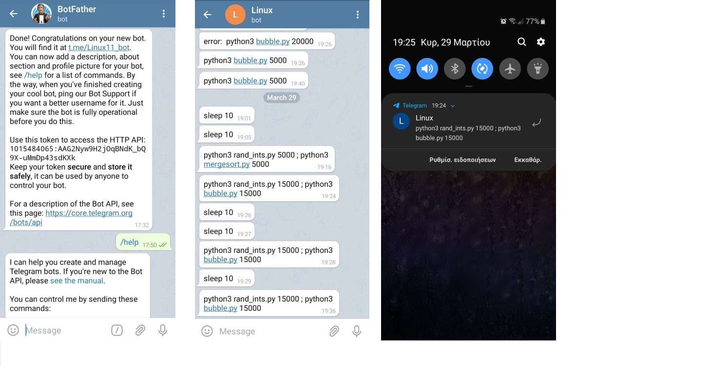
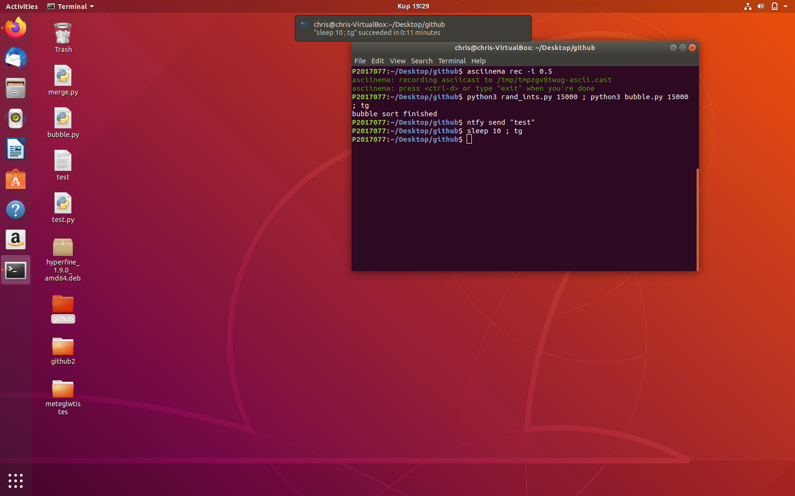

# Μάθημα: Τεχνολογία λογισμικού
## Ονοματεπώνυμο: Χριστόδουλος Καλογιάννης 
## ΑΜ: Π2017077
## Assignments 
### First assignment
#### Assignment: Performance monitoring
#### Deliverables: Monitor the performance of your python scripts and visualize them with colors and/or spark lines
#### [Link to Asciinema](https://asciinema.org/a/312500)
#### Description: 
  * Για την εργασία αυτή, αρχικά κατέβασα το εργαλείο [hyperfine](https://github.com/sharkdp/hyperfine) με την χρήση του οποίου κατάφερα να κάνω σύγκριση της απόδοσης 2 αλγορίθμων ταξινόμησης. Ειδικότερα, υλοποίησα σε δύο ξεχωριστά αρχεία τους αλγορίθμους **bubblesort** και **mergesort** σε γλώσσα προγραμματισμού python. Εκτός απο την υλοποίηση των αλγορίθμων όμως χρειάστηκε και η δημιουργία ενός τρίτου αρχείου με ένα script το οποίο ως ρόλο έχει την δημιουργία τυχαίων αριθμών σε ένα .txt έτσι ώστε οι αλγόριθμοι να ταξινομούν τους παραγώμενους τυχαίους αριθμούς. Στην συνέχεια, η σύγκιση των αλγορίθμων πραγματοποιήθηκε στο τερματικό με την εντολή  ```python3 rand_ints.py 5000 ; hyperfine 'python3 bubble.py 5000' 'python3 mergesort.py 5000' ```. Με αυτή την εντολή, αρχικά δημιουργείται ένα txt αρχείο με όνομα 5000 το οποίο έχει ως περιεχόμενο 5000 τυχαίους αριθμούς(κρίθηκε σωστό για την σύγκριση των αλγορίθμων να χρησιμοποιηθεί το ίδιο set αριθμών). Στην συνέχεια, η χρήση του ```;``` γίνεται για την εκτέλεση όλων των εντολών σε μία σειρά. Τέλος, με την λέξη ```hyperfine``` δίνονται ως οι δύο αλγόριθμοι καθώς και το όνομα του .txt απο το οποίο θα πάρουν ως input τους 5000 τυχαίους αριθμούς. Τα αποτελέσματα της σύγκρισης φαίνονται στο link του [Asciinema](https://asciinema.org/a/312500).
  
  
  
  
### Second assignment
#### Assignment: Send notifications to your desktop-mobile
#### Deliverables: Send a notifcation when a big task completes, eg download, compiling, etc
#### [Link to Asciinema](https://asciinema.org/a/314608)
#### Description: 
  * Για την εργασία αυτή, αρχικά κατέβασα το εργαλείο [ntfy](https://github.com/dschep/ntfy) με την χρήση του οποίου σου δίνεται η δυνατότητα να στέλνονται ειδοποιήσεις στο desktop αλλά και στο κινητό σου όταν ολοκληρώνοται εντολές που έχεις εκτελέσει απο το terminal. Αφού κάποιος κατεβάσει το [ntfy](https://github.com/dschep/ntfy), θα χρειαστεί να κάνει integration το shell μαζί του έτσι ώστε να στέλνονται αυτόματα οι ειδοποιήσεις μετά την ολοκλήρωση εντολών οι οποίες ξεπερνούν ένα συγκεκριμένο χρονικό όριο. Αυτό το πέτυχα με την εισαγωγή των εντολών ```echo 'eval "$(ntfy shell-integration)"'``` και ```alias tg='telegram-send "$([ $? = 0 ] && echo "" || echo "error: ") $(history|tail -n1|sed -e '\''s/^\s*[0-9]\+\s*//;s/[;&|]\s*tg$//'\'')"'``` στο αρχείο **~/.bashrc**.  Για την εκπόνηση της συγκεκριμένης εργασίας, δεν αρκεί μόνο το install του [ntfy](https://github.com/dschep/ntfy). Αναγκαία είναι και η εγκατάσταση μιας εφαρμογής στο κινητό στην οποία θα στέλνονται οι ειδοποιήσεις απο το terminal. Προτείνοται αρκετά 3rd party λογισμικά για τον σκοπό αυτό όπως για παράδειγα [pushbullet](https://pushbullet.com/), [pushjet](https://pushjet.io/) κλπ. Εγώ, χρησιμοποίησα την εφαρμογή [Telegram](https://telegram.org/). Για την αξιοποίηση του [Telegram](https://telegram.org/) χρειάστηκε να δημιουργίσω ένα **bot** μέσω του **bot father** και στην συνέχεια να το συνδέσω με το τερματικό μέσω ενός token που μου δώθηκε απο το bot. Για την αποστολή ειδοποίησης στο κινητό αρκεί να βάλεις μετά απο οποιαδήποτε εντολή το ```; tg``` το οποίο θα έχει ως αποτέλεσμα την αποστολή ειδοποίησης στο κινητό όταν ολοκληρωθεί η εντολή. Τέλος, για την καταγραφή του βίντεο στο [Asciinema](https://asciinema.org/a/314608) επέλεξα να τρέξω την εντολή ```python3 rand_ints.py 15000 ; python3 bubble.py 15000 ; tg ``` η οποία αρχικά θα παράγει ένα .txt αρχείο με 15000 τυχαίους αριθμούς τους οποίους θα λάβει ως input ο αλγόριθμος ταξινόμησης bubblesort και όταν ολοκληρωθεί θα στείλει ειδοποίηση το Desktop αλλά και το κινητό μου για το αν η εντολή ολοκληρώθηκε επιτυχώς η όχι. Παρακάτω φαίνονται screeshots απο τις ειδοποιήσεις στο desktop και mobile phone μου καθώς δεν ήταν δυνατή η καταγραφή τους μέσω του **asciinema**. 
  
~ screenshots στο κινητό μου με τον bot father και τις ειδοποιήσεις που στέλνονται στο bot μου όταν ολοκληρώνονται εντολές απο το terminal
  
 <br/>
 <br/>
 ~ screenshot στο desktop μου στο οποίο φαίνεται η ειδοποίηση μετά απο την ολοκλήρωση μιας εντολής στο terminal
  
  


### Third assignment
#### Assignment: Τry different terminals and shells
#### Deliverables: Repeat some of the previous exercises with a different terminal-shell and create a custom configuration that fits your needs
#### [Link to Asciinema](https://asciinema.org/a/314672)
#### Description: 
 * Στα πλαίσια υλοποίησης αυτής της εργασίας αποφάσησα να ασχοληθώ με το [Z shell](https://www.zsh.org/) σε συνδιασμό με το framework του το [ohmyzsh](https://github.com/ohmyzsh/ohmyzsh) για εγκατάσταση διαφόρων plugins αλλά και μορφοποίηση. Στόχος της εργασίας ήταν να ασχοληθούμε με ένα διαφορετικό shell κάνοντας πάνω σε αυτό configuration έτσι ώστε να μπορούμε να εργαστούμε πάνω σε αυτό με μεγαλύτερη άνεση ταχύτητα και ευκολία. Για την επίτευξη αυτών των στόχων έκανα install πλήθος plugins και στην συνέχεια τα αξιοποίησα μέσα στο ubuntu περιβάλλον μου καθώς επίσης και με την εκτέλεση κάποιων απο τις προηγούμενες εργασίες όπως **check the weather** και **fetch information**. Ειδικότερα, το πρώτο πράγμα που έκανα στο zsh shell μου ήταν να αλλάξω το theme σε κάτι που μου αρέσει οπτικά. Για να γίνει αυτό αρκεί να βρείς στο αρχείο **~/.zshrc** την εντολή ```ZSH_THEME``` στην οποία δίνεις ως παράμετρο το όνομα του theme της επιλογής σου(στην περιπτωσή μου το **blinks**). Υπάρχουν δεκάδες plugins στο ohmyfish τα οποία μπορούν να φανούν εξαιρετικά χρήσιμα. Εγώ επέλεξα τα εξής:
  * [autojump](https://github.com/wting/autojump)
  * [zsh-syntax-highlighting](https://github.com/zsh-users/zsh-syntax-highlighting/blob/master/INSTALL.md)
  * [thefuck](https://github.com/nvbn/thefuck)
  * [copydir](https://github.com/ohmyzsh/ohmyzsh/tree/master/plugins/copydir)
  * [copyfile](https://github.com/ohmyzsh/ohmyzsh/tree/master/plugins/copyfile)
  
  Βάση των παραπάνω plugins δείχνω στο [Asciinema](https://asciinema.org/a/314672) μέσα απο μια σειρά διεργασιών το πόσο με διευκολύνει η χρήση του [Z shell](https://www.zsh.org/). Για παράδειγμα το πόσο γρήγορα μπορώ να μετακινηθώ στα directories αντί να χρειάζεται να κάνω συνέχεια ```cd```(Στο βίντεο φένεται το πόσο γρήγορα προσπέρασα φακέλους φτάνοντας στο ζητούμενο directory με την χρήση του autojump). Mε τo plugin [copydir](https://github.com/ohmyzsh/ohmyzsh/tree/master/plugins/copydir) μου δίνεται η δυνατότητα να κάνω κατευθείαν copy στο clipboard του directory στο οποίο βρίσκομαι χωρίς να χρειαστεί να αναζητώ το εκάστοτε path χρονοτριβώντας. Με τηνν χρήση του [copyfile](https://github.com/ohmyzsh/ohmyzsh/tree/master/plugins/copyfile) δείχνω το πόσο εύκολα μπορώ να αντιγράψω τα περιεχόμενα ενός αρχείο στο clipboard κανοντάς τα paste οπουδήποτε επιθυμώ(στο βίντεο φαίνεται η αντιγραφή μιας απλής εντολής σε python απο ένα αρχείο σε ένα άλλο. Εξαιρετικά χρήσιμη μου φάνηκε επίσης και η δυνατότητα που σου δίνεται κάνοντας install το [thefuck](https://github.com/nvbn/thefuck) αφού όπως φαίνεται και στο βίντεο εάν κάνεις κάποιο συντακτικό λάθος σου προτείνεται κατευθείαν μια εκδοχή της εντολής που πιθανός ήταν αυτή που αρχικά ήθελες να πληκτρολογήσεις. Τέλος, όπως προανέφερα επέλεξα να κάνω και δύο προηγούμενες ασκήσεις. Στην πρώτη, έκανα χρήση της εντολής [wttr.in](https://github.com/chubin/wttr.in) βλέποντας στο τερματικό μου τον καιρό στις πόλεις corfu και rome. Στην δεύτερη έκανα χρήση της εντολής ```curl getnews.tech/corona``` έτσι ώστε να δω news στο τερματικό μου που αφορούν επίκαιρα θέματα όπως αυτό του corona virus.
  
  
  
  
### Fourth assignment
#### Assignment: Use the terminal as an IDE
#### Deliverables: Edit your files (e.g., cv, website, code, etc) in vim or emacs and compile it in a different panel or use a plug-in
#### [Link to Asciinema](https://asciinema.org/a/314620)
#### Description:
 * Για την υλοποίηση αυτής της εργασίας έκανα install το [neovim](https://github.com/neovim/neovim) σε συνδιασμό με κάποια plugins έτσι ώστε να είναι εφικτή η δυνατότητα χρήσης του terminal ως ένα **IDE**. Αποφάσισα να εγκαταστήσω plugins τα οποία θα μου επιτρέψουν να γράφω κώδικα σε python καθώς επίσης και να τον κάνω compile βλέποντας κάθε φορά είτε κάποιο error είτε το αποτέλεσμα του κώδικα αν δεν έχει κάποιο λογικό-συνακτικό λάθος. Τα plugins που έκανα install για αυτό τον σκοπό είναι τα εξής:
  * [python-mode](https://github.com/python-mode/python-mode)
  * [python-syntax](https://github.com/vim-python/python-syntax)
  
  Για να εγκαταστηθούν τα συγκεκριμένα plugins έπρεπε να μπώ στο αρχείο ```init.vim``` και να προσθέσω: ```Plug 'klen/python-mode'``` και ```Plug 'vim-python/python-syntax'``` εκτελόντας στην συνέχεια την εντολή ```InstallPlug```. Σε ότι αφορά το βίντεο στο [Asciinema](https://asciinema.org/a/314620) έδειξα την εκτέσεση ενός προγράμματος σε python γράφοντας την πρώτη φορά σωστά τον κώδικα και μια κάνοντας ένα συντακτικό λάθος δείχνοντας έτσι αντίστοιχα το σωστό αποτέλεσμα και στην συνέχεια το error βλέποντας έτσι την λειτουργία του terminal ως **IDE**.
  


### Fifth assignment
#### Assignment: Set-up a system for python development
#### Deliverables: Install and configure in a user folder a python project that is not available through the package manager
#### [Link to Asciinema](https://asciinema.org/a/324875)
#### Description:
 * Στην συγκεκριμένη εργασία, στόχος μου ήταν η δημιουργία μέσα σε ένα user folder ενός project το οποίο θα αξιοποιεί μία απο τις διαθέσιμες βιβλιοθήκες της python γράφοντας ένα script το οποίο δεν θα μπορεί να εκτελεστεί αν βρίσκεται σε διαφορετικό user folder λόγο της έλειψης των απαραίτητων dependencies αφού θα έχουν εγκατασταθεί μόνο στον αρχικό user folder(isolation). Για να πετύχω τα παραπάνω έκανα χρήση των εξής εργαλείων:
 
  * [pipenv](https://docs.python-guide.org/dev/virtualenvs/)(A dependency manager for Python projects)
  * [virtualenv](https://docs.python-guide.org/dev/virtualenvs/)(A tool to create isolated Python environments)
  * [psutil](https://pypi.org/project/psutil/)(A cross-platform library for retrieving information on running processes and system utilization)
  
 Ειδικότετρα, αφού δημιούργησα τον φάκελο με όνομα **firstfolder** μέσα στον οποίο θα υπάρχει το project εγκατέστησα εντός του το module [psutil](https://pypi.org/project/psutil/) με την εντολή ```pipenv install psutil```. Αφού εγκαταστάθηκε το psutil, έκανα χρήση της εντολής ```pipenv shell``` έτσι ώστε να ενεργοποιηθεί το virtualenv του συγκεκριμένου project. Στην συνέχεια, δημιούργησα ένα .py αρχείο μέσα στο οποίο έγγραψα κώδικα ο οποίος αξιοποιεί τις συναρτήσεις που προσφέρει το module psutil. Συγκεκριμένα, έκανα χρήση δύο συναρτήσεων. Η πρώτη, αφορά την κατηγορία **MEMORY FUNCTIONS** και επιστρέφει στατιστικά που σχετίζονται με την χρησιμότητα της μνήμης. Η δεύτερη, αφορά την κατηγορία **SYSTEM INFORMATION FUNCTIONS** και επιστρέφει τους χρήστες που είναι συνδεδεμένοι εκείνη την στιγμή στο μηχάνημα:
 
  1. ```psutil.virtual_memory()```
  2. ```psutil.users()```
  
 Αφού ολοκληρώθηκε η υλοποίηση του προγράμματος με όνομα pyscript.py, δοκίμασα να το εκτελέσω με χρήση της εντολής  ```python3 pyscript.py``` **εντός του αρχικού project**. Όπως φαίνεται και στο [Asciinema](https://asciinema.org/a/324875), το πρόγραμμα εκτελέστηκε κανονικά τυπώνοντας τα επιθυμητά αποτελέσματα στο termilal. Στην συνέχεια, με την εντολή ```exit``` αποχώρησα απο το περιβάλλον του project και κάνοντας χρήση του ```cd ..``` πήγα στο directory που βρίσκεται τοποθετημένος ο **firstfolder**. Εκεί, δημιούργησα ένα νέο φάκελο με όνομα **secondfolder** μέσα στον οποίο κάνοντας χρήση της εντολής ```cp ../firstfolder/*.py ./``` αντιγράφηκε το pyscript.py του **firstfolder**. Τέλος, δοκίμασα να τρέξω εκεί το pyscript.py αλλά όπως φαίνεται και στο βίντεο έβγαλε error σύμφωνα με το οποίο δεν αναγνωρίζεται το [psutil](https://pypi.org/project/psutil/) καθώς αυτό έχει εγκατασταθεί μόνο στο πρώτο μας project εντός του φακέλου **firstfolder**. Με αυτό τον τρόπο πετύχαμε τον επιθυμητό μας στόχο ο οποίος ήταν το isolation.
 
 


## Συμμετοχικό εκπαιδευτικό υλικό
#### [Προσωπικό link βιβλίου](https://chriskalo.netlify.com/)
#### [Προσωπικό αποθετήριο](https://github.com/chriskalo/gr)
  * Για την εργασία συμμετοχικού εκπαιδευτικού υλικού επέλεξα να ασχοληθώ με τα **παραδοτέα Α και Β**. Ειδικότερα, σε ότι έχει να κάνει με το **Α** παραδοτέο βρήκα δύο εικόνες με ελεύθερα πνευματικά δικαιώματα μέσω του [wikimedia](https://commons.wikimedia.org/wiki/Main_Page). Η πρώτη εικόνα αφορά το [VirtualBox](https://www.virtualbox.org/) της oracle και η δεύτερη την πλατφόρμα [SourceForge](https://sourceforge.net/). Παρακάτω δίνονται τα link των δύο εικόνων που οδηγούν στο αποθετηριό μου καθώς αντίστοιχα και μέσα στην ιστοσελίδα του βιβλίου :
  
 **VirtualBox**
  * https://github.com/chriskalo/gr/blob/master/_gallery/virtualbox.md
  * https://chriskalo.netlify.com/gallery/virtualbox/
 
 **SourceForge**
  * https://github.com/chriskalo/gr/blob/master/_gallery/sourceforge.md
  * https://chriskalo.netlify.com/gallery/sourceforge/
 
 Σε ότι έχει να κάνει με το **Β** παραδοτέο βρήκα ένα διαδραστικό παράδειγμα απο την σελίδα του [codepen](https://codepen.io/) το οποίο παρέχει στον χρήστη ένα terminal σε γλώσσα προγραμματισμού python το οποίο δίνει την δυνατότητα να δώσεις κάποιες εντολές έχοντας με αυτόν τον τρόπο μία μικρή ιδέα για το πώς είναι να εργάζεσαι με ένα τερματικό. Παρακάτω δίνεται τα link του διαδραστικού παραδείγματος που οδηγούν στο αποθετήριο μου καθώς αντίστοιχα και μέσα στην ιστοσελίδα του βιβλίου:
 
 **HTML5 Web Terminal**
  * https://github.com/chriskalo/gr/blob/master/_remix/web-terminal.md
  * https://chriskalo.netlify.com/remix/web-terminal/
 
