#               `Τεχνολογία Λογισμικού`
##         *ΛΑΖΑΡΟΣ ΠΑΠΑΝΙΚΟΛΑΟΥ : AM Π2017085*
###     ΕΠΙΒΛΕΠΩΝ ΔΙΔΑΣΚΩΝ : ΧΩΡΙΑΝΟΠΟΥΛΟΣ ΚΩΝΣΤΑΝΤΙΝΟΣ

------------------------------------------------------------
#                  `Τελικη Αναφορα`

*ΓΙΑ ΤΗΝ ΠΡΑΓΜΑΤΟΠΟΙΗΣΗ ΤΩΝ ΕΡΓΑΣΙΩΝ ΧΡΕΙΑΣΤΗΚΕ ΝΑ ΠΡΑΓΜΑΤΟΠΟΙΗΘΟΥΝ ΠΟΛΛΕΣ ΕΓΚΑΤΑΣΤΑΣΕΙΣ ΔΙΑΦΟΡΩΝ TOOLS, ΧΡΗΣΙΜΑ ΓΙΑ ΤΗΝ ΕΡΓΑΣΙΕΣ, ΤΑ ΟΠΟΙΑ ΘΑ ΑΝΑΦΕΡΘΟΥΝ ΣΥΝΟΠΤΙΚΑ ΣΤΟ ΤΕΛΟΣ ΤΗΣ ΑΝΑΦΟΡΑΣ. ΕΠΙΣΗΣ ΧΡΕΙΑΣΤΗΚΕ ΝΑ ΓΙΝΕΙ INSTALL ΤΟ VM ME ΤΟ ΛΕΙΤΟΥΡΓΙΚΟ UBUNTU KAI KALI LINUX.ΓΙΑ ΤΗΝ ΠΡΑΓΜΑΤΟΠΟΙΗΣΗ ΟΛΩΝ ΤΩΝ ΕΡΓΑΣΙΩΝ ΧΡΕΙΑΣΤΗΚΕ ΝΑ ΚΑΝΩ ΑΡΚΕΤΕΣ ΕΓΚΑΤΑΣΤΑΣΕΙΣ ΔΙΑΦΟΡΩΝ ΕΡΓΑΛΕΙΩΝ. ΕΝΔΕΙΚΤΙΚΑ ΘΑ ΤΙΣ ΑΝΑΛΥΣΩ . ΣΥΓΚΕΚΡΙΜΕΝΑ ΧΡΕΙΑΣΤΗΚΕ ΝΑ ΚΑΝΩ INSTALLA TO ASCIINEMA STA LINUX ME SUDO APT-GET INSTALL ASCIINEMA KAI ASCIINEMA REC ΓΙΑ RECORD. ΕΠΕΙΤΑ ΧΡΕΙΑΣΤΗΚΕ ΝΑ ΚΑΝΩ ΑΡΚΕΤΕΣ ΕΓΚΑΤΑΣΤΑΣΕΙΣ ΟΠΩΣ SUDO APT-GET INSTALL ΔΙΑΦΟΡΩΝ ΕΡΓΑΛΕΙΩΝ. ΕΠΕΙΤΑ ΕΧΟΥΜΕ SUDO APT INSTALL CURL, SUDO APT INSTALL GCALCLI SUDO APT INSTALL PYTHON3-CRYPTOGRAPHY PYTHON3-BS4, GIT CLONE HTTPS://GITHUB.COM/JARUN/BUKU, SUDO APT INSTALL GOOGLER SUDO APT INSTALL DDGR, SUDO APT INSTALL YOUUTBE-DL, SUDO APT UPDATE, SUDO APT INSTALL SOFTWARE-PROPERTIES-COMMON SUDO APT UPGRADE, SUDO APT INSTALL TRANSMISSION-GTK TRANMSISSION-DAEMON. ΓΙΑ ΤΗΝ ΔΙΕΚΠΑΙΡΩΣΗ ΤΗΣ ΕΡΓΑΣΙΑΣ YOUTUBE-DL ΧΡΕΙΑΣΤΗΚΕ ΝΑ ΧΡΗΣΙΜΟΠΟΙΗΣΩ ΤΟ 2ο OS KALI LINUX ΔΙΟΤΙ ΣΤΑ UBUNTU ΜΟΥ ΕΒΓΑΖΕ ΠΡΟΒΛΗΜΑ ΓΙΑ ΤΗΝ ΕΚΔΟΣΗ ΤΗΣ PYTHON ΚΑΙ ΔΕΝ ΜΠΟΡΟΥΣΑ ΝΑ ΤΟ ΛΥΣΩ, ΕΝΩ ΕΚΑΝΑ ΟΛΑ ΤΑ UPDATE ΚΑΙ ΔΟΚΙΜΑΣΑ ΚΑΙ ΠΑΛΑΙΟΤΕΡΗ ΕΚΔΟΣΗ KALI. ΕΝΑ ΑΛΛΟ ΕΡΓΑΛΕΙΟ ΠΟΥ ΧΡΕΙΑΣΤΗΚΕ ΕΓΚΑΤΑΣΤΑΣΗ ΕΙΝΑΙ ΤΟ WGET "HTTPS://GITHUB.COM/SHARKDP/PASTEL/REALESES/DOWNLOAD/V0.8.0/PASTEL_0.8.0_AMD64.DEB64, SUDO DPKG -I PASTEL_0.8.0_AMD64.DEB SUDO PIP3 INSTALL NTFY, SUDO APT-GET INSTALL LIBDBUS-GLIB-1-DEV LIBDBUS-1-DEV, PIP3 INSTALL --USER DBUS-PYTHON, EVAL"$(NTFY SHELL-INTEGRATION),EXPORT AUTO_NTFY_DONE_IGNORE="VIM SCREEN MELD*

#              `ΕΡΓΑΣΙΕΣ ΓΡΑΜΜΗΣ ΕΝΤΟΛΩΝ`

##                 **ΕΡΓΑΣΙΕΣ HCI**

##                 ( ΠΡΩΤΗ ΕΡΓΑΣΙΑ )

### `*assignments*` : Set up the main dependencies and demostrate your base system.

### `*deliverables*` : Change your command prompt with your student ID ,list your dot files,display your shell configuration file and display system information (hardware + software).

### `*references*` : Cheat tldr ls less nano source PS1 neofetch

### `*ΠΕΡΙΓΡΑΦΗ ΕΡΓΑΣΙΑΣ*` 
                             ΑΡΧΙΚΑ ΓΙΑ ΝΑ ΑΛΛΑΞΩ ΤΟ COMMAND PROMPT ΜΕ ΤΟΝ ΑΜ ΜΟΥ ΧΡΕΙΑΖΕΤΑΙ ΝΑ ΧΡΗΣΙΜΟΠΟΙΗΣΩ ΤΗΝ ΕΝΤΟΛΗ PS1="P2017085 :".
                             ΕΠΕΙΤΑ ΓΙΑ ΝΑ ΚΑΝΩ LIST DOT ΤΑ FILES ΜΟΥ ΧΡΕΙΑΖΕΤΑΙ ΝΑ ΕΚΤΕΛΕΣΩ ΤΙς ΠΑΡΑΚΑΤΩ ΕΝΤΟΛΕΣ ΣΤΟ TERMINAL ΟΠΩΣ ΓΙΑ ΠΑΡΑΔΕΙΓΜΑ
                             LS-A ΓΙΑ ΝΑ ΔΩ ΤΑ ΚΡΥΦΑ ΑΡΧΕΙΑ ΣΤΟΥΣ ΦΑΚΕΛΟΥΣ ΠΟΥ ΕΧΩ.ΓΙΑ ΤΟ SHELL CONFIGURATION ΧΡΕΙΑΖΕΤΑΙ ΝΑ ΤΥΠΩΣΩ ΤΙΣ ΕΝΤΟΛΕΣ
                             LS -ALL ΓΙΑ ΟΛΑ ΤΑ FILES ΚΑΘΩΣ ΘΑ ΒΡΙΣΚΟΜΑΙ ΣΤΟ ROOT PAGE ΔΗΛΑΔΗ ΣΤΟ CD.. .ΓΙΑ ΝΑ ΕΚΤΥΠΩΣΩ ΤΟ HARDWARE ΚΑΙ SOFTWARE
                             ΣΥΣΤΗΜΑ ΤΟΥ ΥΠΟΛΟΓΙΣΤΗ ΜΟΥ ΧΡΕΙΑΖΕΤΑΙ ΝΑ ΤΥΠΩΣΩ ΤΙΣ ΕΝΤΟΛΕΣ INXI -FXZ ΓΙΑ ΝΑ ΜΟΥ ΕΜΦΑΝΙΣΕΙ ΠΛΗΡΟΦΟΡΙΕΣ ΤΟΥ ΣΥΣΤΗΜΑΤΟΣ ΤΗΣ
                             ΜΠΑΤΑΡΙΑΣ, ΤΟΥ ΕΠΕΞΕΡΓΑΣΤΗ, ΤΗΣ GPU, ΤΟΥ ΗΧΟΥ, ΤΩΝ ΟΔΗΓΩΝ ΕΓΚΑΤΑΣΤΑΣΗΣ, ΚΑΘΩΣ ΚΑΙ ΤΟΥ ΔΙΚΤΟΥ. ΓΙΑ ΠΛΗΡΟΦΟΡΙΕΣ ΤΟΥ CPU
                             ΧΡΗΣΙΜΟΠΟΙΩ ΤΗΝ ΕΝΤΟΛΗ LSCPU ΚΑΙ ΓΙΑ ΝΑ ΔΩ ΠΟΙΟΝ ΕΠΕΞΕΡΓΑΣΤΗ ΧΡΗΣΙΜΟΠΟΙΩ ΣΤΟΝ ΥΠΟΛΟΓΙΣΤΗ, ΣΥΜΠΛΗΡΩΝΩ ΤΗΝ ΕΝΤΟΛΗ LSHW -C CPU
                             ΓΙΑ ΤΗΝ ΜΝΗΜΗ, ΤΟΥΣ ΔΙΣΚΟΥΣ, ΤΟ ΔΙΚΤΥΟ ΚΑΙ ΤΟ SOFTWARE ΧΡΗΣΙΜΟΠΟΙΩ ΤΙΣ ΕΝΤΟΛΕΣ LSHW -SHORT -C MEMORY, LSHW -SHORT -C DISK
                             ,LSBLK (TO LIST ALL DISKS), IFCONFIG, LSHW -C NETWORK ΚΑΙ ΤΕΛΟΣ SUDO DMIDECODE -T BIOS, UNAME -A.

### `*ENTOLES BHMA-BHMA*` 
                            (1) PS1="P2017085 :"
                            (2) ls -a
                            (3) nano .bashrc
                            (4) ls -all
                            (5) cd..
                            (6) ls -al
                            (7) inxi -Fxz
                            (8) lscpu, sudo lshw -C cpu
                            (9) sudo lshw -short -C memory
                            (10) sudo lshw -short -C disk
                            (11) lsblk
                            (12) ifconfig
                            (13) sudo lshw -C network
                            (14) sudo dmidecode -t bios
                            (15) uname -a

###  `*EIKONES*` 
   
   
   
   
   
   
   
   
   
   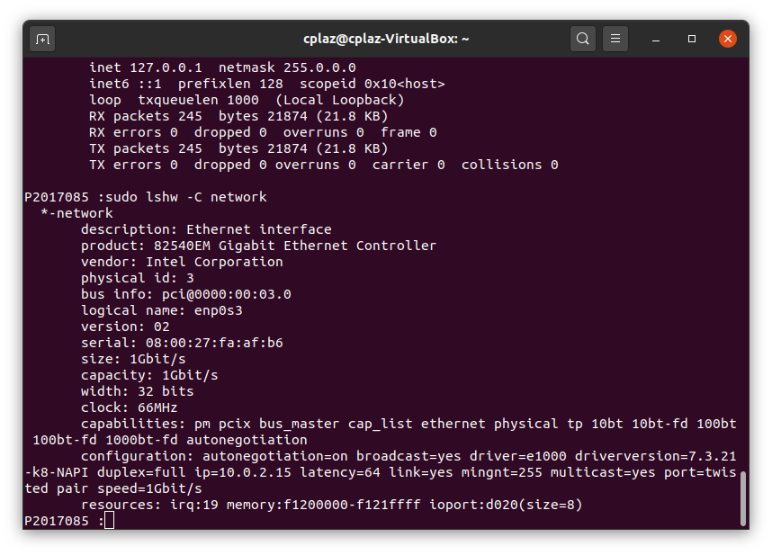
   
   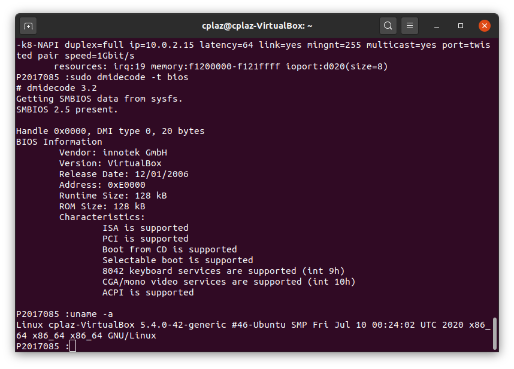
  
   
   
                  

# My Asciinema

* **link εργασίας: https://asciinema.org/a/354975
* **link εργασίας: 

-------------------------------------------------------------------------------------------------------------

##                 ( ΔΕΥΤΕΡΗ ΕΡΓΑΣΙΑ )

### `*assignments*` : Get familiar with basic commands, reading documentation and editing files.

### `*deliverables*` : Browse and view files on your system.

### `*references*` : man vim ranger lf bash guide error correction

### `*ΠΕΡΙΓΡΑΦΗ ΕΡΓΑΣΙΑΣ*` 
                             ΑΡΧΙΚΑ ΧΡΗΣΙΜΟΠΟΙΩ ΤΗΝ ΕΝΤΟΛΗ LS ΓΙΑ ΝΑ ΚΑΝΩ LIST ΟΛΑ ΤΑ FILES ΤΟΥ DIRECTORY ΠΟΥ ΒΡΙΣΚΟΜΑΙ 
                             ΕΚΕΙΝΗ ΤΗΝ ΣΤΙΓΜΗ. ΓΙΑ ΝΑ ΔΩ ΣΕ ΠΟΙΟ DIRECTORY ΒΡΙΣΚΟΜΑΙ ΧΡΗΣΙΜΟΠΟΙΩ ΤΗΝ ΕΝΤΟΛΗ PWD ΚΑΘΩΣ
                             ΜΟΥ ΒΓΑΖΕΙ ΤΟΝ ΣΥΓΚΕΚΡΙΜΕΝΟ PATH. ΓΙΑ ΝΑ ΚΑΝΩ ΜΕΤΑΒΑΣΗ ΣΕ ΕΝΑ FILE Ή ΝΑ ΑΝΟΙΞΩ ΕΝΑ ΑΡΧΕΙΟ 
                             ΧΡΗΣΙΜΟΠΟΙΩ ΤΗΝ ΕΝΤΟΛΗ CD.

### `*ENTOLES BHMA-BHMA*` 
                            (1) PS1="P2017085 :"
                            (2) pwd
                            (3) ls
                            (4) cd cplaz
                            (5) cd Desktop
                            (6) cd ks (my folder)
                            (7) cd ..
                            (8) cd /home/cplaz/Desktop/ks
                            

###  `*EIKONES*` 
   
   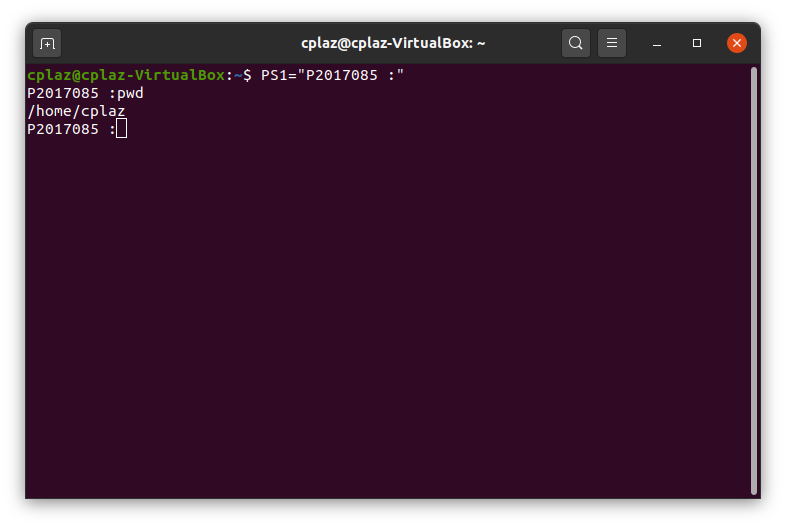
   
   
   
   
                  

# My Asciinema

* **link εργασίας: https://asciinema.org/a/355059
* **link εργασίας: 

---------------------------------------------------------------------------------------------------------

##                 ( ΤΡΙΤΗ ΕΡΓΑΣΙΑ )

### `*assignments*` : Become productive with a todo list.
### `*deliverables*` : Create a listo of dotos, edit, delete and check some of them.

### `*references*` : toso.txt todo.txt-cli task

### `*ΠΕΡΙΓΡΑΦΗ ΕΡΓΑΣΙΑΣ*` 
                             ΑΡΧΙΚΑ ΧΡΗΣΙΜΟΠΟΙΩ ΤΗΝ ΕΝΤΟΛΗ CAT > FILE.TXT ΓΙΑ ΤΗΝ ΔΗΜΙΟΥΡΓΙΑ ΕΝΟΣ FILE
                             ΣΤΟΝ ΦΑΚΕΛΟ ΠΟΥ ΘΕΛΩ ΚΑΙ ΠΡΟΣΘΕΤΟΝΤΑΣ ΤΗΝ .(DOT) ΜΠΡΟΣΤΑ ΑΠΟ ΤΟ FILE ΔΗΜΙΟΥΡΓΩ 
                             ΕΝΑ HIDDEN FILE. ΓΙΑ ΝΑ ΚΑΝΩ EDIT ΕΝΑ FILE ΧΡΗΣΙΜΟΠΟΙΩ ΤΗΝ ΕΝΤΟΛΗ ΝΑΝΟ ΚΑΙ ΓΙΑ 
                             ΝΑ ΔΩ ΤΟ ΝΕΟ ΠΕΡΙΕΧΟΜΕΝΟ ΧΡΗΣΙΜΟΠΟΙΩ ΤΗΝ ΕΝΤΟΛΗ CAT FILE.TXT. ΓΙΑ ΝΑ ΔΙΑΓΡΑΨΩ ΤΟ 
                             ΠΕΡΙΕΧΟΜΕΝΟ ΤΟΥ ΑΡΧΕΙΟΥ ΠΟΥ ΒΡΙΣΚΟΜΑΙ ΧΡΗΣΙΜΟΠΟΙΩ ΤΗΝ ΕΝΤΟΛΗ > FILE.ΤΧΤ. ΓΙΑ ΝΑ
                             ΔΙΑΓΡΑΨΩ ΕΝΤΕΛΩΣ ΤΟ ΑΡΧΕΙΟ ΠΟΥ ΘΕΛΩ ΧΡΗΣΙΜΟΠΟΙΩ ΤΗΝ ΕΝΤΟΛΗ RM TEST.ΤΧΤ.

### `*ENTOLES BHMA-BHMA*` 
                            (1) PS1="P2017085 :"
                            (2) cat > test.txt
                            (3) cat test.txt
                            (4) cat > .test1.txt
                            (5) cat .text1.txt
                            (6) nano test.txt
                            (7) rm test.txt
                          

###  `*EIKONES*` 
   
   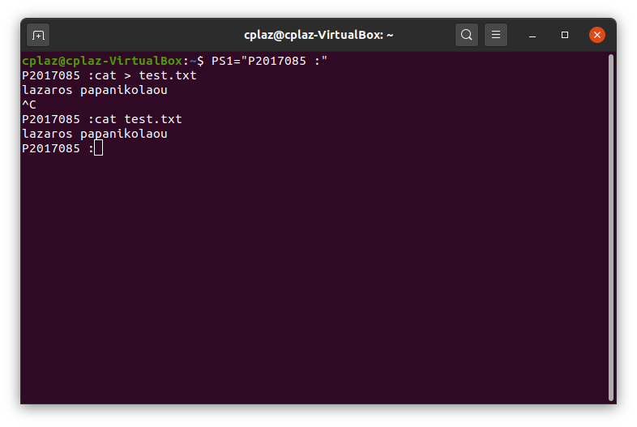
   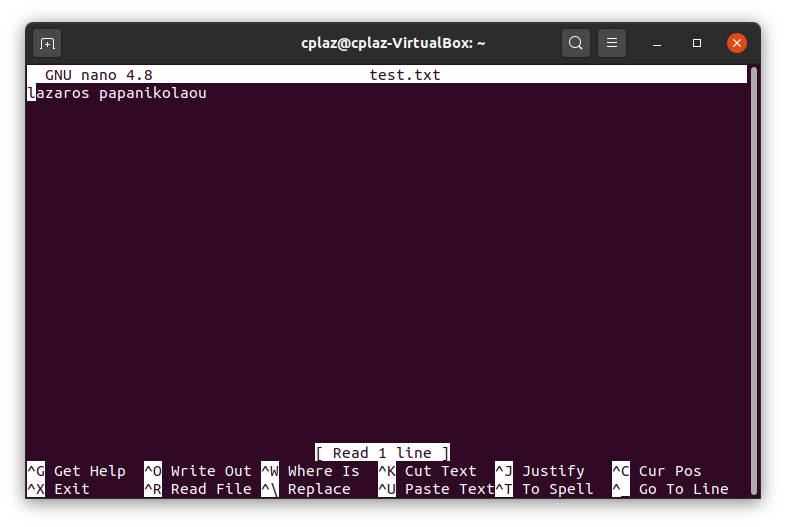
   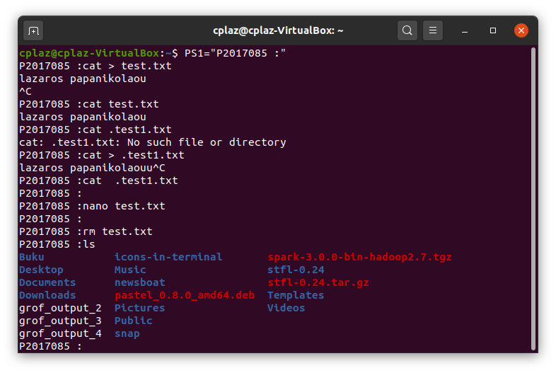
 
  
   

# My Asciinema

* **link εργασίας: https://asciinema.org/a/355144
* **link εργασίας: 

---------------------------------------------------------------------------------------------------------

##                 ( ΤΕΤΑΡΤΗ ΕΡΓΑΣΙΑ )

### `*assignments*` : Text editors and plugins for code highlighting and autocompetetion.

### `*deliverables*` : edit the vm or the shell configuration file

### `*references*` : vim

### `*ΠΕΡΙΓΡΑΦΗ ΕΡΓΑΣΙΑΣ*` 
                             ΓΙΑ ΝΑ ΚΑΝΩ EDIT ΜΕ ΤΟ VIM ΑΡΧΙΚΑ ΧΡΕΙΑΖΕΤΑΙ ΝΑ ΚΑΝΩ ΕΝΑ INSTALL ΔΗΛΑΔΗ 
                             APT GET INSTALL VIM. ΕΠΕΙΤΑ ΓΙΑ ΝΑ ΕΠΙΛΕΞΩ ΤΟ FILE ΠΟΥ ΘΕΛΩ ΝΑ ΚΑΝΩ EDIT
                             ΜΕ ΤΗΝ ΕΝΤΟΛΗ VIM TEST.TXT.

### `*ENTOLES BHMA-BHMA*` 
                            (1) PS1="P2017085 :"
                            (2) vim test.txt
                            (3) w (for save)
                            (4) ctr-z (for exit)
                          

###  `*EIKONES*` 
   
   

  

# My Asciinema

* **link εργασίας: https://asciinema.org/a/355147
* **link εργασίας: 

---------------------------------------------------------------------------------------------------------

##                 ( ΠΕΜΠΤΗ ΕΡΓΑΣΙΑ )

### `*assignments*` : surf the web

### `*deliverables*` : create a new elvi

### `*references*` : surfraw

### `*ΠΕΡΙΓΡΑΦΗ ΕΡΓΑΣΙΑΣ*` 
                             ΓΙΑ ΤΗΝ ΠΡΑΓΜΑΤΟΠΟΙΗΣΗ ΤΗΣ ΕΡΓΑΣΙΑΣ ΧΡΕΙΑΖΕΤΑΙ ΑΡΧΙΚΑ ΝΑ ΚΑΝΩ INSTALL
                             TO TOOL DPKG ΜΕ ΤΗΝ ΕΝΤΟΛΗ SUFO APT INSTALL DPKG. ΕΠΕΙΤΑ ΚΑΘΩΣ ΒΡΙΣΚΟΜΑΙ 
                             ΣΤΟ PATH ΤΟΥ DESKTOP ΚΑΝΩ LS ΓΙΑ ΝΑ ΚΑΝΩ LIST ΤΑ ΑΡΧΕΙΑ ΚΑΙ ΕΠΕΙΤΑ ΧΡΗΣΙΜΟΠΟΙΩ
                             ΤΗΝ ΕΝΤΟΛΗ DPKG -L SURFRAW ΓΙΑ ΝΑ ΑΝΟΙΞΩ ΤΟ ΜΕΝΟΥ ΤΟΥ WEB. ΧΡΗΣΙΜΟΠΟΙΩ ΤΗΝ ΕΝΤΟΛΗ
                             /USR/LIB/SURFRAW/YOUTUBE ΓΙΑ ΝΑ ΕΙΣΕΛΘΩ ΣΤΟ ΣΥΓΚΕΚΡΙΜΕΝΟ SITE. ΕΠΕΙΤΑ ΧΡΗΣΙΜΟΠΟΙΩ ΤΟ PATH 
                             ΚΑΙ ΚΑΝΩ LS ΚΑΙ ΦΤΙΑΧΝΩ ΤΟ ΦΑΚΕΛΟ ELVI ΜΕ ΤΗΝ ΕΝΤΟΛΗ SUDO MKDIR ELVI. ΕΠΕΙΤΑ 
                             ΜΕΣΑ ΑΠΟ ΤΟΝ ΦΑΚΕΛΟ ELVI ΜΕΤΟΝΟΜΑΖΩ ΜΕΣΩ VIM ΤΟ YOUTUBE ΣΕ ΔΙΚΟ ΜΟU SITE ΤΟΥ 
                             MANNED.ORG ΜΕ ΤΗΝ ΟΝΟΜΑΣΙΑ MANNED. ΓΙΑ ΝΑ ΓΙΝΕΙ ΑUΤΟ ΧΡΗΣΙΜΟΠΟΙΩ ΚΑΙ ΤΗΝ ΕΝΤΟΛΗ
                             SUDO CHMOD +X MANNED.
                             

### `*ENTOLES BHMA-BHMA*` 
                            (1) PS1="P2017085 :"
                            (2) cd Desktop
                            (3) ls
                            (4) dpkg -L surfraw
                            (5) cat /usr/lib/surfraw/google
                            (6) cd /usr/lib/surfraw
                            (7) ls
                            (8) sudo mkdir elvi
                            (9) ls
                            (10) cd elvi
                            (11) sudo cp /usr/lib/surfraw/google manned
                            (12) ls
                            (13) sudo chmod +x manned
                            (14) ls
                            (15) vim manned (edit in vim)
                            
                            

###  `*EIKONES*` 
   
   
   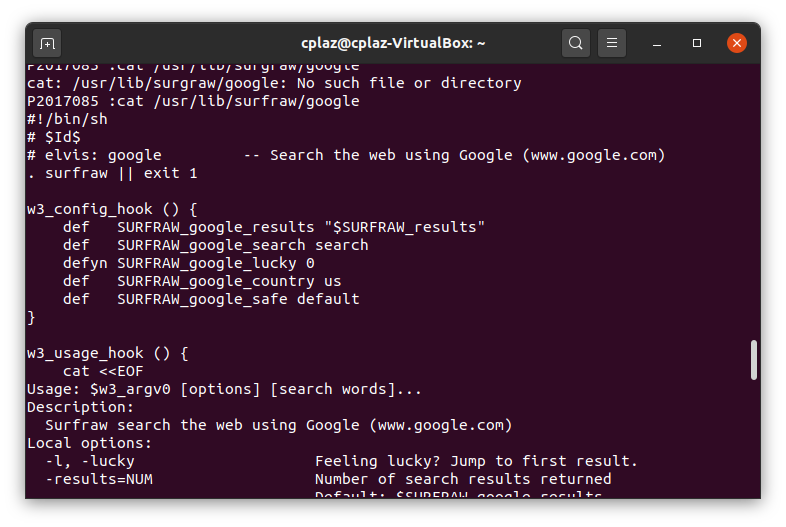
   
   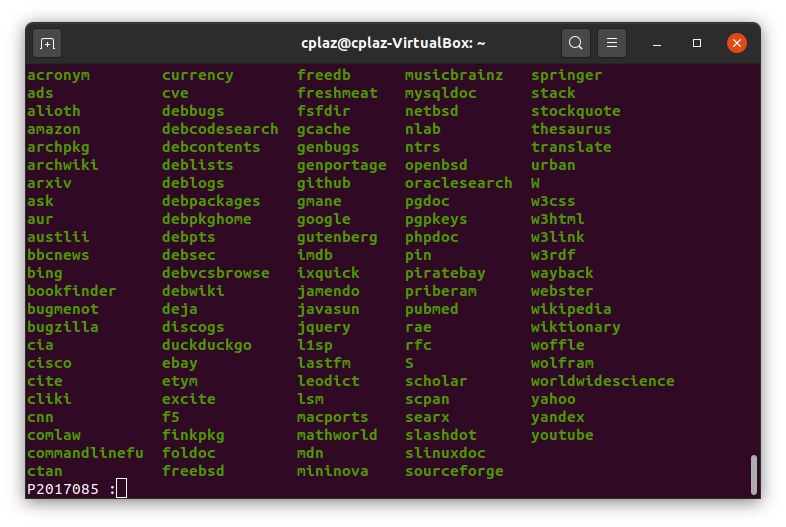
   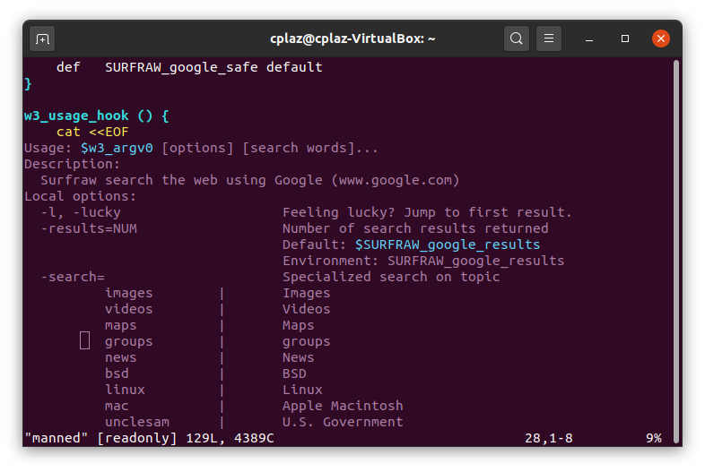
   
   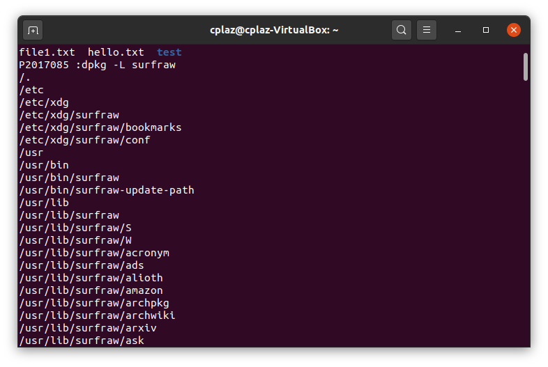
   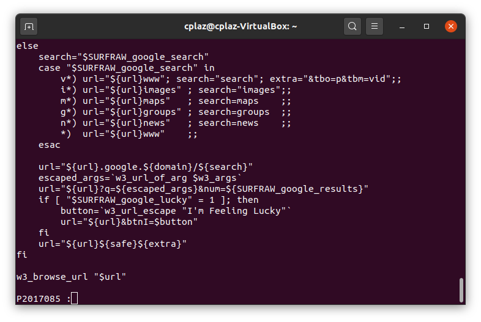
   

  

# My Asciinema

* **link εργασίας: https://asciinema.org/a/355232
* **link εργασίας: 

-------------------------------------------------------------------------------------------------------------

##                 **ΕΡΓΑΣΙΕΣ CSCW**

-------------------------------------------------------------------------------------------------------------

##                 ( ΠΡΩΤΗ ΕΡΓΑΣΙΑ )

### `*assignments*` : Check the weather.

### `*deliverables*` : Fetch the weather forecast for your home city and one more city that you want to travel to.

### `*references*` : wttr.

### `*ΠΕΡΙΓΡΑΦΗ ΕΡΓΑΣΙΑΣ*` 
                             ΑΡΧΙΚΑ ΚΑΝΩ INSTALL ΤΟ TOOL CURL ΚΑΙ ΕΠΕΙΤΑ ΓΡΑΦΩ ΤΗΝ ΕΝΤΟΛΗ CURL 
                             WATTR .IN/LARISA ΓΙΑ ΝΑ ΜΟΥ ΕΜΦΑΝΙΣΕΙ ΤΟΝ ΚΑΙΡΟ ΣΤΗΝ ΛΑΡΙΣΑ ΚΑΘΩΣ 
                             ΚΑΙ ΤΗΝ ΓΕΩΓΡΑΦΙΚΗ ΤΟΥ ΘΕΣΗ.

### `*ENTOLES BHMA-BHMA*` 
                            (1) PS1="P2017085 :"
                            (2) curl wttr.in/larisa
                            (3) curl wttr.in/49100
                            (4) curl wttr.in/Germany
                          

###  `*EIKONES*`
   
   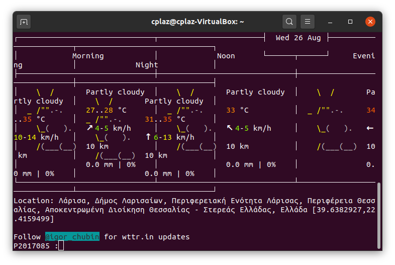
   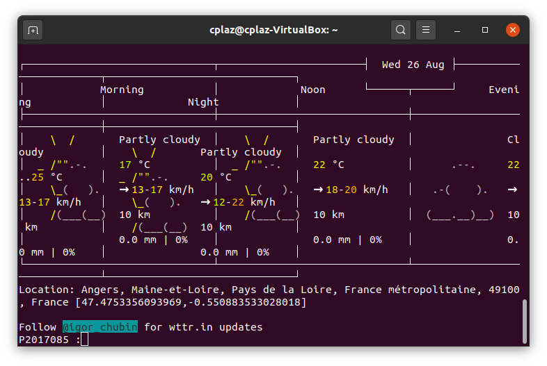
   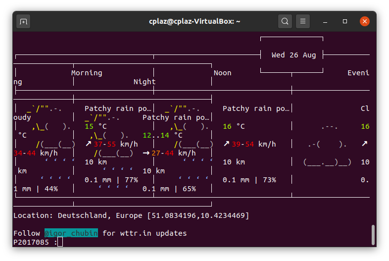
   
  
   
   
 

# My Asciinema

* **link εργασίας: https://asciinema.org/a/355233
* **link εργασίας: 

-------------------------------------------------------------------------------------------------------------

##                 ( ΔΕΥΤΕΡΗ ΕΡΓΑΣΙΑ )

### `*assignments*` : Fetch information.

### `*deliverables*` : Read the business news.

### `*references*` : awesome-console-services.

### `*ΠΕΡΙΓΡΑΦΗ ΕΡΓΑΣΙΑΣ*` 
                             ΓΙΑ ΤΗΝ ΟΛΟΚΛΗΡΩΣΗ ΤΗΣ ΕΡΓΑΣΙΑΣ ΧΡΕΙΑΖΕΤΑΙ ΝΑ ΧΡΗΣΙΜΟΠΟΙΗΣΩ ΤΗΝ ΕΝΤΟΛΗ CURL
                             GETNEWS.TECH/WORLD+CUP ΕΤΣΙ ΩΣΤΕ ΝΑ ΑΝΑΝΕΩΣΕΙ ΤΙΣ ΝΕΟΤΕΡΕΣ ΕΙΔΗΣΕΙΣ ΠΟΥ 
                             ΥΠΑΡΧΟΥΝ ΣΤΟΝ ΚΟΣΜΟ.

### `*ENTOLES BHMA-BHMA*` 
                            (1) PS1="P2017085 :"
                            (2) curl wttr.in/larisa
                            (3) curl wttr.in/49100
                            (4) curl wttr.in/Germany
                          

###  `*EIKONES*` 
   
   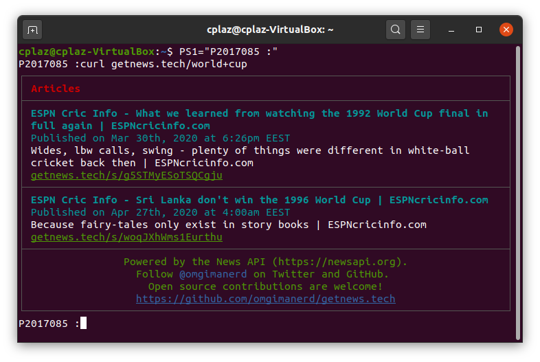
   
   
  
   
   
 

# My Asciinema

* **link εργασίας: https://asciinema.org/a/355234
* **link εργασίας: 

-------------------------------------------------------------------------------------------------------------

##                 ( ΤΡΙΤΗ ΕΡΓΑΣΙΑ )

### `*assignments*` : Manage your bookmarks.

### `*deliverables*` : add, search, and visit a bookmark to your favorite site.

### `*references*` : buku

### `*ΠΕΡΙΓΡΑΦΗ ΕΡΓΑΣΙΑΣ*` 
                             ΓΙΑ ΤΗΝ ΠΡΑΓΜΑΤΟΠΟΙΗΣΗ ΤΗΣ ΕΡΓΑΣΙΑΣ ΧΡΕΙΑΖΕΤΑΙ ΑΡΧΙΚΑ ΝΑ ΚΑΝΩ INSTALL ΜΕΡΙΚΑ TOOLS
                             ΠΟΥ ΕΙΝΑΙ ΑΠΑΡΑΙΤΗΤΑ. ΕΠΕΙΤΑ ΜΕΤΑΒΑΙΝΩ ΣΤΟ BUKU FOLDER ΚΑΙ ΜΕ ΤΗΝ ΕΝΤΟΛΗ BUKU -A URL
                             ΚΑΝΩ BOOKMARK ΤΟ LINK ΤΟΥ SITE ΠΟΥ ΘΕΛΩ ΝΑ ΕΠΙΣΚΕΦΤΩ ΟΠΩΣ ΓΙΑ ΠΑΡΑΔΕΙΓΜΑ ΓΙΑ ΤΟ 
                             FACEBOOK ΚΑΝΩ BUKU -A FACEBOOK.COM. ΕΠΕΙΤΑ ΓΙΑ ΝΑ MΕΤΑΒΩ ΣΤΟ ΣΥΓΚΕΚΡΙΜΕΝΟ SITE ΠΟΥ 
                             ΕΧΩ ΚΑΝΕΙ BOOKMARK ΤΟ URL, ΓΡΑΦΩ ΤΗΝ ΕΝΤΟΛΗ BUKU -U (NUMBER) ΟΠΟΥ (NUMBER) ΕΙΝΑΙ Ο
                             ΑΡΙΘΜΟΣ ΚΑΤΑ ΤΟΥ ΟΠΟΙΟΥ ΥΠΟΔΕΙΚΝΥΕΙ ΤΗΝ ΣΕΙΡΑ ΠΟΥ ΕΧΕΙ ΤΟ ΚΑΘΕ URL.

### `*ENTOLES BHMA-BHMA*` 
                            (1) PS1="P2017085 :"
                            (2) curl wttr.in/larisa
                            (3) curl wttr.in/49100
                            (4) curl wttr.in/Germany
                          

###  `*EIKONES*` 
   
   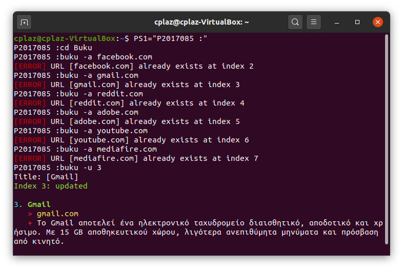
   
   
  
   
   
 

# My Asciinema

* **link εργασίας: https://asciinema.org/a/355239
* **link εργασίας: 

-------------------------------------------------------------------------------------------------------------

##                 ( ΤΕΤΑΡΤΗ ΕΡΓΑΣΙΑ )

### `*assignments*` : Search the web from the terminal.

### `*deliverables*` : Create aliases for common searches such as dictionary definition.

### `*references*` : googler, ddgr.

### `*ΠΕΡΙΓΡΑΦΗ ΕΡΓΑΣΙΑΣ*` 
                             ΓΙΑ ΤΗΝ ΠΡΑΓΜΑΤΟΠΟΙΗΣΗ ΤΗΣ ΕΡΓΑΣΙΑΣ ΧΡΕΙΑΖΕΤΑΙ ΝΑ ΚΑΝΩ INSTALL ΔΥΟ ΣΥΓΚΕΚΡΙΜΕΝΑ TOOLS.
                             ΕΠΕΙΤΑ ΣΤΟ TERMINAL ΧΡΗΣΙΜΟΠΟΙΩ ΤΗΝ ΕΝΤΟΛΗ GOOGLER BITCOIN ΓΙΑ ΝΑ ΜΟΥ ΒΓΑΛΕΙ ΑΠΟΤΕΛΕΣΜΑΤΑ Η
                             GOOGLE ΣΧΕΤΙΚΑ ΜΕ ΤΟ BITCOIN ΑΠΟ ΤΗΝ ΓΡΑΜΜΗ ΑΝΑΖΗΤΗΣΗΣ. ΣΕ ΠΕΡΙΠΤΩΣΗ ΠΟΥ ΠΛΗΚΤΡΟΛΟΓΗΣΩ ΤΟΝ ΑΡΙΘΜΟ 1, 
                             ΚΑΘΩΣ ΕΧΕΙ ΝΑ ΕΠΙΛΕΞΩ ΚΑΠΟΙΑ ΝΟΥΜΕΡΑ, ΤΟΤΕ ΑΥΤΟΜΑΤΩΣ ΘΑ ΜΕ ΒΓΑΛΕΙ ΣΤΗΝ GOOGLE ΜΕ ΤΗΝ ΣΥΓΚΕΚΡΙΜΕΝΗ
                             ΑΝΑΖΗΤΗΣΗ ΠΟΥ ΕΧΩ ΕΠΙΛΕΞΕΙ.

### `*ENTOLES BHMA-BHMA*` 
                            (1) PS1="P2017085 :"
                            (2) googler bitcoin
                            (3) 2
                            
                          

###  `*EIKONES*` 
   
   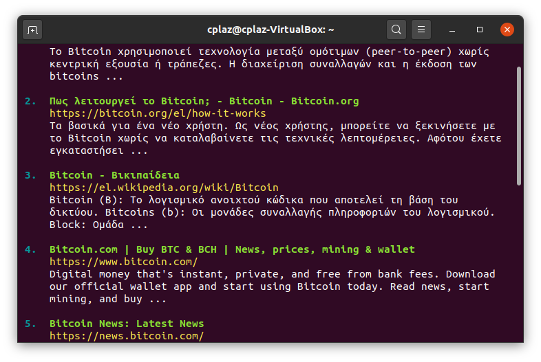
   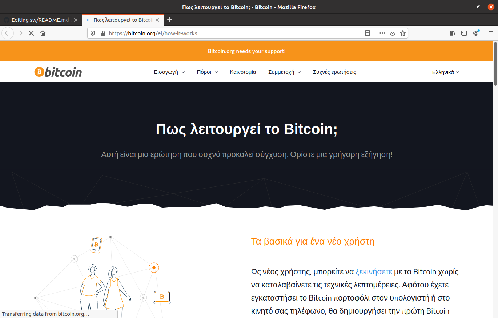
   
   
  
   
   
 

# My Asciinema

* **link εργασίας: https://asciinema.org/a/355244
* **link εργασίας: 

-------------------------------------------------------------------------------------------------------------

##                 **ΕΡΓΑΣΙΕΣ MULTIMEDIA-INFORMATION VISUALIZATION**

-------------------------------------------------------------------------------------------------------------

*ΓΙΑ ΤΗΝ ΠΡΑΓΜΑΤΟΠΟΙΗΣΗ ΤΗΣ ΣΥΓΚΕΚΡΙΜΕΝΗΣ ΕΡΓΑΣΙΑΣ ΧΡΕΙΑΣΤΗΚΕ ΝΑ ΧΡΗΣΙΜΟΠΟΙΗΣΩ ΔΙΑΦΟΡΕΤΙΚΟ ΛΕΙΤΟΥΡΓΙΚΟ ΣΥΣΤΗΜΑ ΚΑΘΩ ΥΠΗΡΞΕ
ΕΝΑ ΤΕΧΝΙΚΟ ΛΑΘΟΣ ΜΕ ΤΗΝ ΕΓΚΑΤΑΣΤΑΣΗ ΤΟΥ YOUTUBE-DL. ΕΤΣΙ ΧΡΗΣΙΜΟΠΟΙΗΣΑ ΤΑ KALI LINUX.*

##                 ( ΠΡΩΤΗ ΕΡΓΑΣΙΑ )

### `*assignments*` : Donwload mp3.

### `*deliverables*` : Search, download and play (with the terminal) your favorite song of the mounth from youtube.

### `*references*` : youtube-dl, mpv

### `*ΠΕΡΙΓΡΑΦΗ ΕΡΓΑΣΙΑΣ*` 
                             ΓΙΑ ΤΗΝ ΠΡΑΓΜΑΤΟΠΟΙΗΣΗ ΤΗΣ ΕΡΓΑΣΙΑΣ ΧΡΕΙΑΖΕΤΑΙ ΝΑ ΚΑΝΩ ΕΓΚΑΤΑΣΤΑΣΗ ΤΟ YOUTUBE-DL
                             TOOL ΜΕ ΤΗΝ ΕΝΤΟΛΗ SUDO CURL -L HTTPS://YT-DL.ORG/DOWNLOADS/LATEST/YOUTUBE-DL
                             -O /USR/LOCAL/BIN/YOUTUBE-DL ΚΑΙ ΜΕ ΤΗΝ ΕΝΤΟΛΗ SUDO CHMOD A+RX /USR/LOCAL/BIN
                             /YOUTUBE-DL. ΜΕ ΤΗΝ ΕΝΤΟΛΗ YOUTUBE-DL -U ΕΛΕΓΧΟΥ ΤΗΝ ΝΕΟΤΕΡΗ ΕΚΔΟΣΗ ΠΟΥ ΕΧΕΙ. 
                             ΕΠΕΙΤΑ ΜΕ ΤΗΝ ΕΝΤΟΛΗ YOUTUBE-DL -X <URL> ΚΑΝΩ DOWNLOAD ΜΟΝΟ ΤΟΝ ΗΧΟ ΕΝΩΣ ΤΡΑΓΟΥΔΙΟΥ
                             ΠΟΥ ΘΕΛΩ ΝΑ ΚΑΤΕΒΑΣΩ ΑΠΟ ΤΟ YOUTUBE.

### `*ENTOLES BHMA-BHMA*`
                            (1) PS1="P2017085 :"
                            (2) youtube-dl -x <url>
                           
                          

###  `*EIKONES*` 
   
   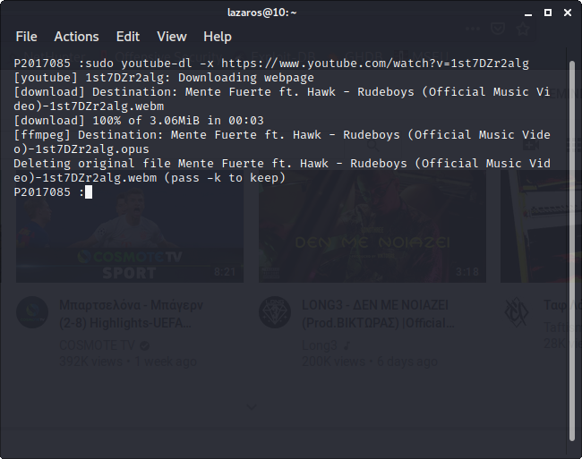
   
   
 

# My Asciinema

* **link εργασίας: https://asciinema.org/a/355246
* **link εργασίας: 

-------------------------------------------------------------------------------------------------------------

##                 ( ΔΕΥΤΕΡΗ ΕΡΓΑΣΙΑ )

### `*assignments*` : Manage torrent files.

### `*deliverables*` : Search and download a torrent.

### `*references*` : torque transmission-cli.

### `*ΠΕΡΙΓΡΑΦΗ ΕΡΓΑΣΙΑΣ*` 
                             ΓΙΑ ΤΗΝ ΠΡΑΓΜΑΤΟΠΟΙΗΣΗ ΤΗΣ ΕΡΓΑΣΙΑΣ ΧΡΕΙΑΣΤΗΚΕ ΑΡΧΙΚΑ ΝΑ ΚΑΝΩ INSTALL
                             REPOSITORIES, ΚΑΘΩΣ ΕΚΑΝΑ ΚΑΙ UPGRADE ΤΟ ΣΥΣΤΗΜΑ ΜΕ ΝΕΟΤΕΡΕΣ ΕΚΔΟΣΕΙΣ.
                             ΣΧΕΤΙΚΑ ΜΕ ΤΗΝ ΕΡΓΑΣΙΑ, ΑΡΧΙΚΑ ΧΡΕΙΑΣΤΗΚΕ ΝΑ ΠΡΟΣΘΕΣΩ ΤΟ REPOSITORY
                             TOY TRANSMISSION ΣΤΟ ΛΟΓΙΣΜΙΚΟ, ΜΕ ΤΗΝ ΕΝΤΟΛΗ SUDO ADD-APT-REPOSITORY
                             PPA:TRANSMISSIONBT/PPA. ΕΠΕΙΤΑ ΚΑΝΩ INSTALL TRANSMISSION-GTK
                             TRANSMISSION-CLI TRANSMISSION-COMMON TRANSMISSION-DAEOMON. ΕΠΕΙΤΑ ΓΙΑ
                             ΝΑ ΑΛΛΑΞΩ ΤΟΝ ΚΩΔΙΚΟ ΤΟΥ TRANSMISSION ΚΑΙ ΤΟ ΟΝΟΜΑ ΧΡΗΣΤΗ ΤΟΥ HOST, 
                             ΧΡΕΙΑΖΕΤΑΙ ΝΑ ΣΤΑΜΑΤΗΣΩ ΤΗΝ ΔΙΕΡΓΑΣΙΑ ΤΗΣ ΥΠΗΡΕΣΙΑΣ ΤΟΥ TRANSMISSION
                             ΜΕ ΤΗΝ ΕΝΤΟΛΗ SUDO SERVICE TRANSMISSION-DAEMON STOP. ΕΠΕΙΤΑ, ΜΕ ΤΗΝ
                             ΕΝΤΟΛΗ SUDO NANO/VAR/LIB/TRANSMISSION-DAEMON/INFO/SETTINGS JSON
                             ΜΠΟΡΩ ΝΑ ΑΛΑΞΩ ΤΟΝ ΚΩΔΙΚΟ ΚΑΙ ΤΟ ΟΝΟΜΑ ΧΡΗΣΤΗ ΚΑΙ ΝΑ ΒΑΛΩ ΔΙΚΑ ΜΟΥ.
                             ΕΠΕΙΤΑ ΑΝΟΙΓΩ ΞΑΝΑ ΤΗΝ ΥΠΗΡΕΣΙΑ ΤΟΥ TRANSMISSION ΜΕ ΤΗΝ ΕΝΤΟΛΗ
                             SUDO SERVICE TRANSMISSION-DAEMON START ΚΑΙ ΚΑΝΩ LOGIN ΜΕ ΤΟΥΣ ΠΡΟΣΩΠΙΚΟΥΣ
                             ΜΟΥ ΚΩΔΙΚΟΥΣ ΣΤΗΝ ΔΙΕΥΘΥΝΣΗ HTTP:127.0.01:9091/TRANSMISSION. ΚΑΝΩ ΑΝΑΖΗΤΗΣΗ
                             ΜΕΣΩ PIRATEBAY Ή ΚΑΠΟΙΟ ΑΛΛΟ SITE ΓΙΑ ΝΑ ΚΑΤΕΒΑΣΩ ΤΟ TORRENT ΠΟΥ ΕΠΙΘΥΜΩ ΚΑΙ 
                             ΚΑΝΩ COPY PASTE TO LINK TOY TORRENT STO TRANSMISSION WEB INTERFACE ΑΠΟ ΤΗΝ ΕΦΑΡΜΟΓΗ
                             TRANSMISSION.

### `*ENTOLES BHMA-BHMA*` 
                            (1) PS1="P2017085 :"
                            (2) sudo nano /var/lib/transmission-daemon/info/settings.json
                            (3) sudo service transmission-daeomn start
                            (4) sudo service transmission-daeomn stop
                            (5) clear
                           
                          

###  `*EIKONES*`
   
   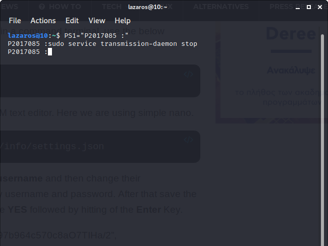
   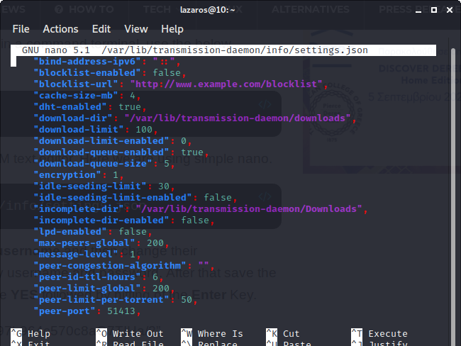
   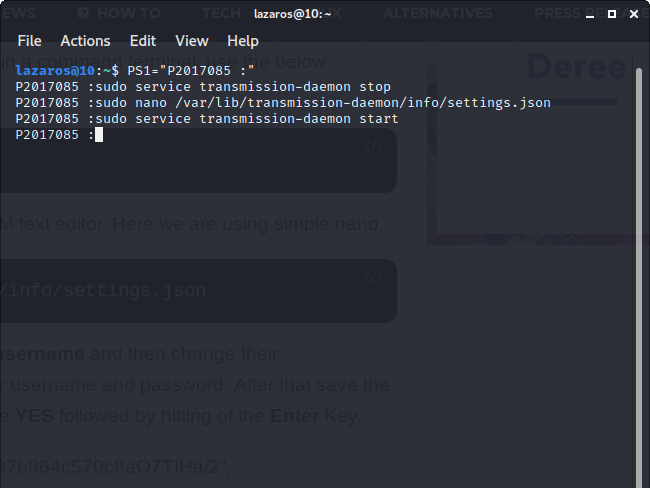
   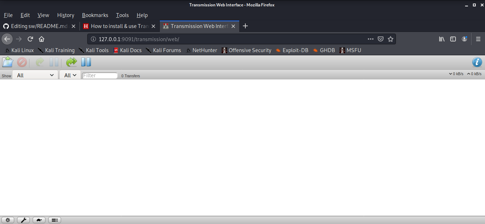
   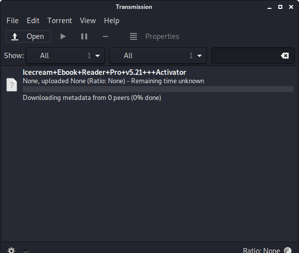
   
   
   
 

# My Asciinema

* **link εργασίας: https://asciinema.org/a/355395
* **link εργασίας: 

-------------------------------------------------------------------------------------------------------------

##                 ( ΤΡΙΤΗ ΕΡΓΑΣΙΑ )

### `*assignments*` : Use color to improve your cli tools.

### `*deliverables*` : Print colorized text from a shell script in order to make it more beautiful-usable

### `*references*` : pastel

### `*ΠΕΡΙΓΡΑΦΗ ΕΡΓΑΣΙΑΣ*` 
                             ΓΙΑ ΤΗΝ ΠΡΑΓΜΑΤΟΠΟΙΗΣΗ ΤΗΣ ΕΡΓΑΣΙΑΣ ΧΡΕΙΑΖΕΤΑΙ ΝΑ ΚΑΝΩ INSTALL ΟΡΙΣΜΕΝΑ 
                             TOOLS ΟΠΩΣ ΤΟ WGET "HTTPS://GITHUB.COM/SHARKDP/PASTEL/RELEASES/DOWNLOAD/V0.8.0
                             /PASTEL_0.8.0_AMD64.DEB" ΚΑΙ SUDO DPKG -I PASTEL_0.8.0_AMD64.DEB
                             ΣΤΗΝ ΣΥΝΕΧΕΙΑ ΜΕ ΤΗΝ ΕΝΤΟΛΗ PASTEL COLOR "RGB (...,....,...)" ΤΥΠΩΝΕΙ ΤΟ 
                             ΧΡΩΜΑ ΠΟΥ ΕΠΙΛΕΞΑΜΕ ΜΕ ΟΡΙΣΜΕΝΕΣ ΠΛΗΡΟΦΟΡΙΕΣ. ΜΕ ΤΗΝ ΕΝΤΟΛΗ PASTEL FORMAT NAME HEX
                             COLOΡ ΜΑΣ ΤΥΠΩΝΕΙ ΤΟ ΧΡΩΜΑ ΠΑΝΩ ΣΕ ΠΡΟΤΑΣΗ ΠΟΥ ΜΟΙΑΖΕΙ ΤΟ ΧΡΩΜΑ.

### `*ENTOLES BHMA-BHMA*` 
                            (1) PS1="P2017085 :"
                            (2) pastel color "rgb()"
                            (3) pastel format name hex color
                           
                          

###  `*EIKONES*` 
   
   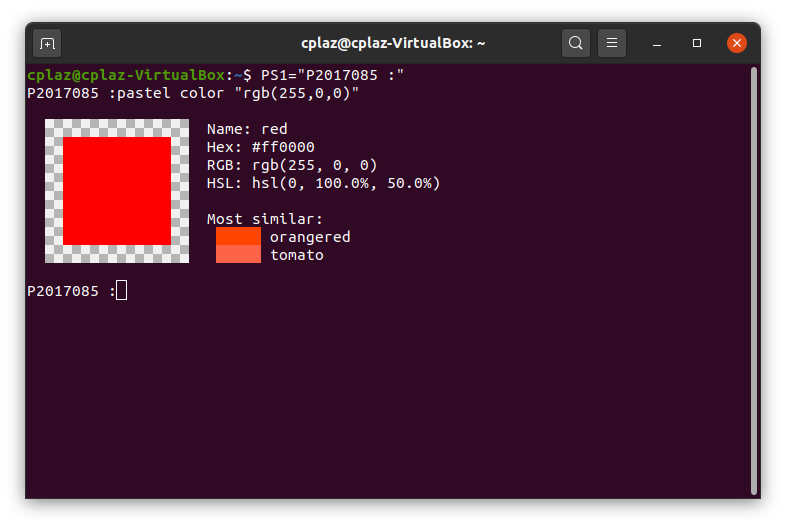
   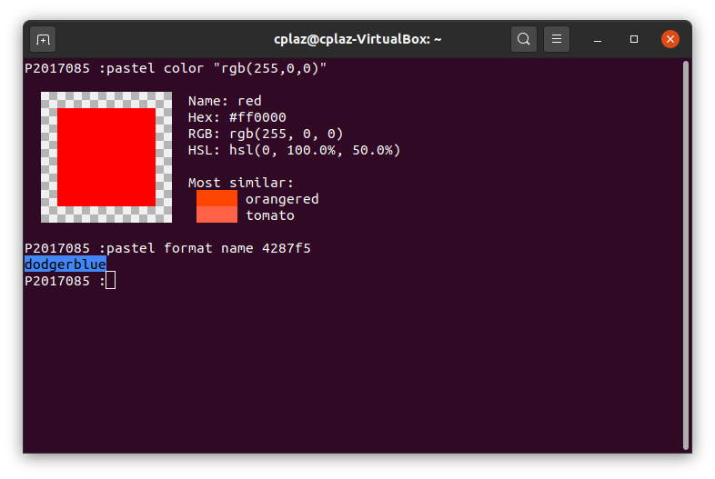
   
   
 

# My Asciinema

* **link εργασίας: https://asciinema.org/a/355672
* **link εργασίας: 

-------------------------------------------------------------------------------------------------------------

##                 **ΕΡΓΑΣΙΕΣ SOFTWARE**

-------------------------------------------------------------------------------------------------------------

##                 ( ΠΡΩΤΗ ΕΡΓΑΣΙΑ )

### `*assignments*` : Send notification to your desktop-mobile.

### `*deliverables*` : Send a notificationwhen a big task completes,eg download,compiling etc.

### `*references*` : ntfy.

### `*ΠΕΡΙΓΡΑΦΗ ΕΡΓΑΣΙΑΣ*` 
                             ΓΙΑ ΤΗΝ ΠΡΑΓΜΑΤΟΠΟΙΗΣΗ ΤΗΣ ΕΡΓΑΣΙΑΣ ΧΡΗΣΙΜΟΠΟΙΗΣΑ ΑΡΧΙΚΑ ΟΡΙΣΜΕΝΑ TOOLS
                             ΓΙΑ INSTALL ΟΠΩΣ WGET "HTTPS://GITHUB.COM/SHARKDB/PASTEL/REALEASES/DOWNLOAD
                             /V0.8.0/PASTEL_0.8.0_AMD64.DEB" SUDO PIP3 INSTALL NTFY, SUDO APT-GET INSTALL LIBDBUS-GLIB-1-DEV
                             LIBDBUS-1-DEV, PIP3 INSTALL --USER DBUS-PYTHON, EVAL"$(NTFY SHELL-INTEGRATION)"
                             EXPORT AUTO_NTFY_DONE_IGNORE="VIM SCREEN MELD". ΑΡΧΙΚΑ ΓΙΑ ΝΑ ΣΤΕΙΛΩ ΕΝΑ ΜΗΝΥΜΑ ΚΑΙ 
                             ΝΑ ΜΟΥ ΕΜΦΑΝΙΣΤΕΙ ΣΤΗΝ ΕΠΙΦΑΝΕΙΑ ΕΡΓΑΣΙΑΣ ΧΡΗΣΙΜΟΠΟΙΩ ΤΝ ΕΝΤΟΛΗ NTFY SEND "TEST NTFY".

### `*ENTOLES BHMA-BHMA*` 
                            (1) PS1="P2017085 :"
                            (2) ntfy send "this is test"
                            (3) ntfy -t 'lazaros send "hello"
                            (4) ntfy den ":wink:" emoji ":joy:"
                          

###  `*EIKONES*` 
   
   
   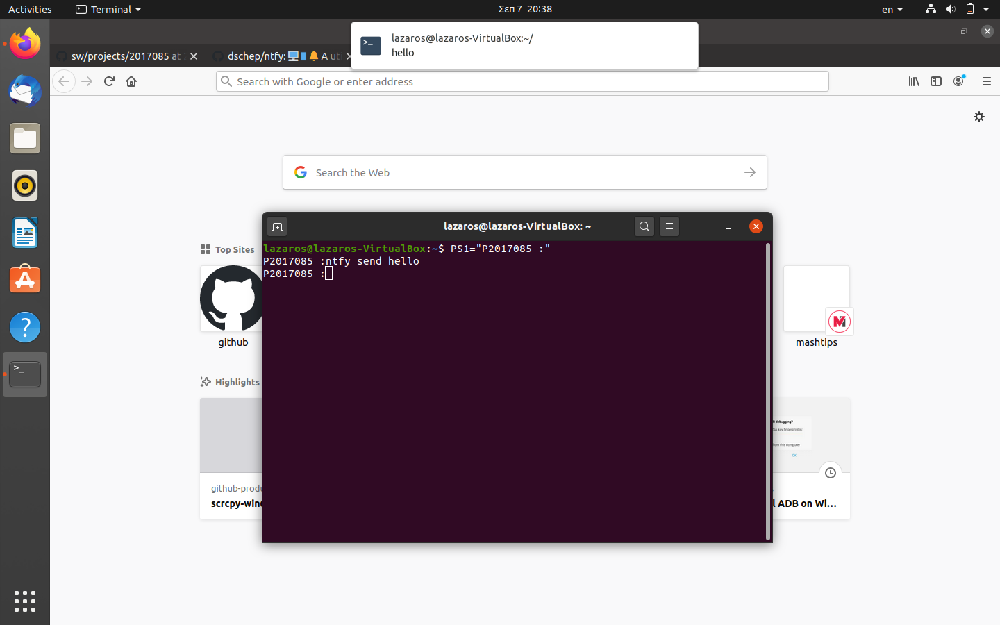
   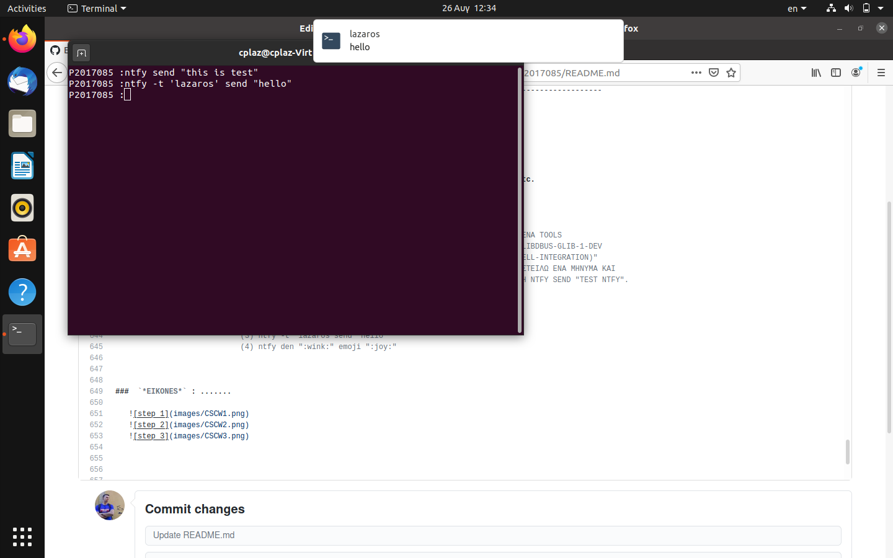
   
  
   
   
 

# My Asciinema

* **link εργασίας: https://asciinema.org/a/355677
* **link εργασίας: 

-------------------------------------------------------------------------------------------------------------

                          

## ΣΥΜΜΕΤΟΧΙΚΟ ΥΛΙΚΟ
### `ΠΡΟΣΩΠΙΚΟ ΑΠΟΘΕΤΗΡΙΟ`
* link:* https://github.com/lazarospapanikolaou/gr/tree/2017085
### Εκανα τις εργασιες 1Β,1Γ του συμμετοχικου υλικου καθως βρισκονται στο καταλληλο repository αναρτημενες. Το πρωτο παραδειγμα απεικονιζει ενα διαδραστικο αριθμητηριο που επιτρεπει τον χρηστη να εισαγει καπποιες τιμες πραγματοποιοντας αριθμητικες πραξεις ενω το δευτερο παραδειγμα απεικονιζει μια ιστορικη αναδρομη στα λειτουργικα συστηματα και στην εξελιξη τους χρονο με τον χρονο.
* link1:* https://github.com/lazarospapanikolaou/gr/blob/2017085/_remix/interactive-calculator.md (1Β)
* link2:* https://github.com/lazarospapanikolaou/gr/blob/2017085/_case-study/OS%20systems.md (1Γ)
