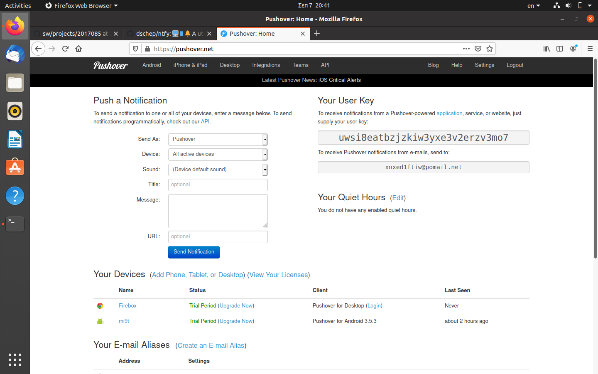
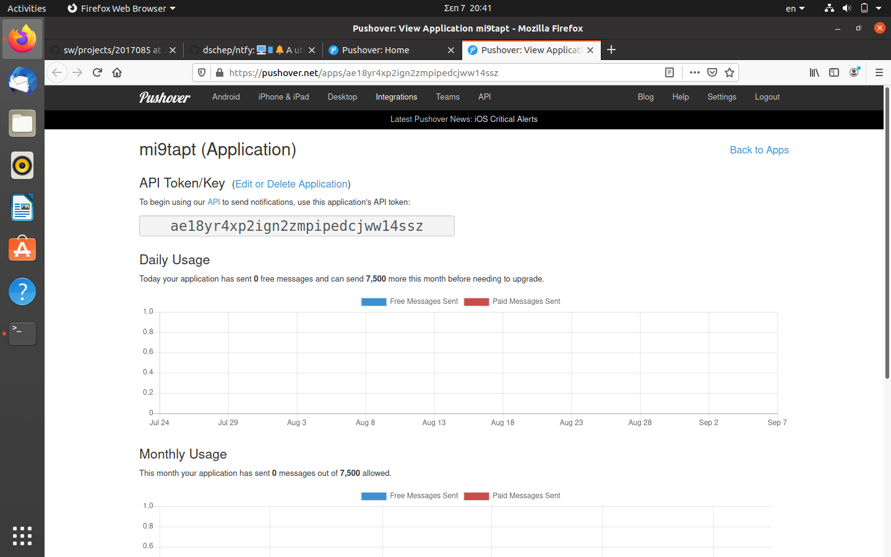
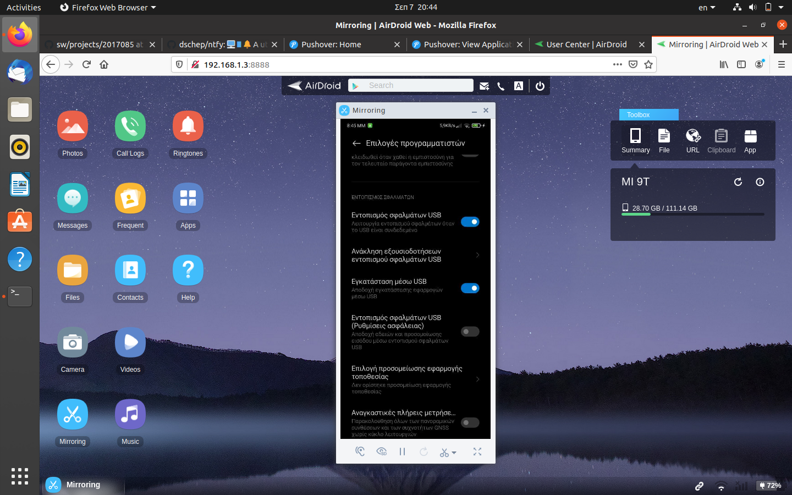
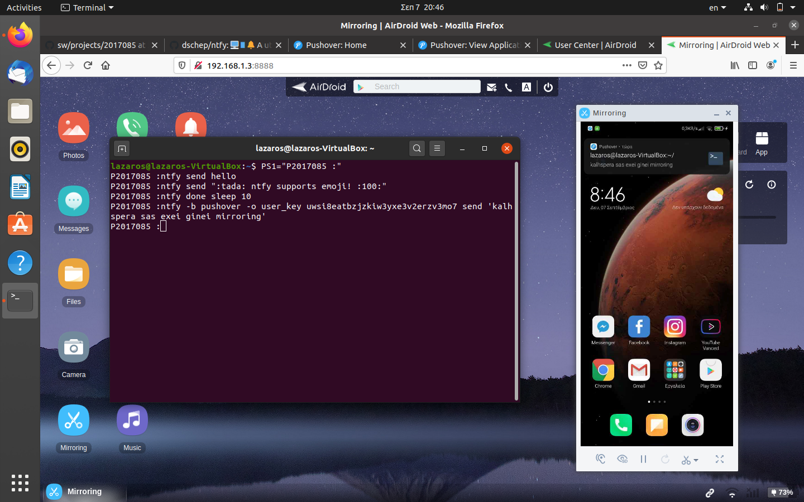

#               `Τεχνολογία Λογισμικού`
##         *ΛΑΖΑΡΟΣ ΠΑΠΑΝΙΚΟΛΑΟΥ : AM Π2017085*
###     ΕΠΙΒΛΕΠΩΝ ΔΙΔΑΣΚΩΝ : ΧΩΡΙΑΝΟΠΟΥΛΟΣ ΚΩΝΣΤΑΝΤΙΝΟΣ

------------------------------------------------------------
#                  `Τελικη Αναφορα`

*ΓΙΑ ΤΗΝ ΠΡΑΓΜΑΤΟΠΟΙΗΣΗ ΤΩΝ ΕΡΓΑΣΙΩΝ ΧΡΕΙΑΣΤΗΚΕ ΝΑ ΠΡΑΓΜΑΤΟΠΟΙΗΘΟΥΝ ΠΟΛΛΕΣ ΕΓΚΑΤΑΣΤΑΣΕΙΣ ΔΙΑΦΟΡΩΝ TOOLS, ΧΡΗΣΙΜΑ ΓΙΑ ΤΗΝ ΕΡΓΑΣΙΕΣ, ΤΑ ΟΠΟΙΑ ΘΑ ΑΝΑΦΕΡΘΟΥΝ ΣΥΝΟΠΤΙΚΑ ΣΤΟ ΤΕΛΟΣ ΤΗΣ ΑΝΑΦΟΡΑΣ. ΕΠΙΣΗΣ ΧΡΕΙΑΣΤΗΚΕ ΝΑ ΓΙΝΕΙ INSTALL ΤΟ VM ME ΤΟ ΛΕΙΤΟΥΡΓΙΚΟ UBUNTU KAI KALI LINUX.ΓΙΑ ΤΗΝ ΠΡΑΓΜΑΤΟΠΟΙΗΣΗ ΟΛΩΝ ΤΩΝ ΕΡΓΑΣΙΩΝ ΧΡΕΙΑΣΤΗΚΕ ΝΑ ΚΑΝΩ ΑΡΚΕΤΕΣ ΕΓΚΑΤΑΣΤΑΣΕΙΣ ΔΙΑΦΟΡΩΝ ΕΡΓΑΛΕΙΩΝ. ΕΝΔΕΙΚΤΙΚΑ ΘΑ ΤA ΑΝΑΛΥΣΩ . ΣΥΓΚΕΚΡΙΜΕΝΑ ΧΡΕΙΑΣΤΗΚΕ ΝΑ ΚΑΝΩ INSTALL TO ASCIINEMA STA LINUX ME SUDO APT-GET INSTALL ASCIINEMA KAI ASCIINEMA REC ΓΙΑ RECORD. ΕΠΕΙΤΑ ΧΡΕΙΑΣΤΗΚΕ ΝΑ ΚΑΝΩ ΑΡΚΕΤΕΣ ΕΓΚΑΤΑΣΤΑΣΕΙΣ ΟΠΩΣ SUDO APT-GET INSTALL ΔΙΑΦΟΡΩΝ ΕΡΓΑΛΕΙΩΝ. ΕΠΕΙΤΑ ΕΧΟΥΜΕ SUDO APT INSTALL CURL, SUDO APT INSTALL GCALCLI SUDO APT INSTALL PYTHON3-CRYPTOGRAPHY PYTHON3-BS4, GIT CLONE HTTPS://GITHUB.COM/JARUN/BUKU, SUDO APT INSTALL GOOGLER SUDO APT INSTALL DDGR, SUDO APT INSTALL YOUUTBE-DL, SUDO APT UPDATE, SUDO APT INSTALL SOFTWARE-PROPERTIES-COMMON SUDO APT UPGRADE, SUDO APT INSTALL TRANSMISSION-GTK TRANMSISSION-DAEMON. ΕΝΑ ΑΛΛΟ ΕΡΓΑΛΕΙΟ ΠΟΥ ΧΡΕΙΑΣΤΗΚΕ ΕΓΚΑΤΑΣΤΑΣΗ ΕΙΝΑΙ ΤΟ WGET "HTTPS://GITHUB.COM/SHARKDP/PASTEL/REALESES/DOWNLOAD/V0.8.0/PASTEL_0.8.0_AMD64.DEB64, SUDO DPKG -I PASTEL_0.8.0_AMD64.DEB SUDO PIP3 INSTALL NTFY, SUDO APT-GET INSTALL LIBDBUS-GLIB-1-DEV LIBDBUS-1-DEV, PIP3 INSTALL --USER DBUS-PYTHON, EVAL"$(NTFY SHELL-INTEGRATION),EXPORT AUTO_NTFY_DONE_IGNORE="VIM SCREEN MELD.ΤΕΛΟΣ ΧΡΕΙΑΣΤΗΚΕ ΝΑ ΔΗΜΙΟΥΡΓΗΣΩ ΛΟΓΑΡΙΑΣΜΟ ΣΤΟ ASCIINEMA ΓΙΑ ΝΑ ΚΑΝΩ RECORD ΤΙΣ ΑΣΚΗΣΕΙΣ ΜΟΥ.ΧΡΕΙΑΣΤΗΚΕ ΝΑ ΔΗΜΙΟΥΡΓΗΣΩ ΛΟΓΑΡΓΙΑΣΜΟ ΣΕ PUSHOVER KAI AIRDROID ΓΙΑ ΝΑ ΚΑΝΩ MIRROR ΤΗΝ ΕΠΙΦΑΝΕΙΑ ΕΡΓΑΣΙΑΣ ΤΟΥ ΚΙΝΗΤΟΥ ΜΟΥ ANDROID ΓΙΑ ΝΑ ΔΕΙΞΩ ΣΥΝΟΠΤΙΚΑ ΤΟ ΜΗΝΥΜΑ ΠΟΥ ΕΡΧΕΤΑΙ ΜΕ ΕΝΤΟΛΗ ΤΗΣ CMD ΜΕΣΩ PUSHOVER KAI NTFY.*

-------------------------------------------------------------------------------------------------------------

##                 **ΕΡΓΑΣΙΕΣ SOFTWARE**

-------------------------------------------------------------------------------------------------------------

##                    ( ΠΡΩΤΗ ΕΡΓΑΣΙΑ )

### `*assignments*` : Send notification to your desktop-mobile.

### `*deliverables*` : Send a notificationwhen a big task completes,eg download,compiling etc.

### `*references*` : ntfy.

### `*ΠΕΡΙΓΡΑΦΗ ΕΡΓΑΣΙΑΣ*` 
                             ΓΙΑ ΤΗΝ ΠΡΑΓΜΑΤΟΠΟΙΗΣΗ ΤΗΣ ΕΡΓΑΣΙΑΣ ΧΡΗΣΙΜΟΠΟΙΗΣΑ ΑΡΧΙΚΑ ΟΡΙΣΜΕΝΑ TOOLS ΓΙΑ INSTALL ΟΠΩΣ WGET "HTTPS://GITHUB.COM/SHARKDB/PASTEL
                             /REALEASES/DOWNLOAD /V0.8.0/PASTEL_0.8.0_AMD64.DEB" SUDO PIP3 INSTALL NTFY, SUDO APT-GET INSTALL LIBDBUS-GLIB-1-DEV LIBDBUS-1-DEV, 
                             PIP3 INSTALL --USER DBUS-PYTHON, EVAL"$(NTFY SHELL-INTEGRATION)" EXPORT AUTO_NTFY_DONE_IGNORE="VIM SCREEN MELD". ΑΡΧΙΚΑ ΓΙΑ ΝΑ ΣΤΕΙΛΩ 
                             ΕΝΑ ΜΗΝΥΜΑ ΚΑΙ ΝΑ ΜΟΥ ΕΜΦΑΝΙΣΤΕΙ ΣΤΗΝ ΕΠΙΦΑΝΕΙΑ ΕΡΓΑΣΙΑΣ ΧΡΗΣΙΜΟΠΟΙΩ ΤΝ ΕΝΤΟΛΗ NTFY SEND "TEST NTFY". ΓΙΑ ΝΑ ΠΡΟΧΩΡΗΣΩ ΜΕΣΩ PUSHOVER 
                             ΧΡΕΙΑΣΤΗΚΕ ΩΣΤΟΣΟ ΝΑ ΚΑΝΩ ΚΑΙ ΜΕΡΙΚΕΣ ΑΛΛΑΓΕΣ ΣΤΟ .BASHRC ME THN ΕΝΤΟΛΗ NANO ~/.BASHRC ΚΑΙ ΧΡΕΙΑΣΤΗΚΕ ΝΑ ΠΡΟΣΘΕΣΩ ΤΟ API TOKEN  ΤΗΣ 
                             ΣΥΣΚΕΥΗΣ ΚΑΙ USER KEY ΤΟΥ ΛΟΓΑΡΙΑΣΜΟΥ ΜΟΥ ΣΤΟ PUSHOVER  ΓΙΑ ΝΑ ΜΠΟΡΕΣΩ ΝΑ ΣΤΕΛΝΩ ΕΙΔΟΠΟΙΗΣΕΙΣ ΣΤΟ ΚΙΝΗΤΟΥ ΜΟΥ. ΕΠΕΙΤΑ ΧΡΕΙΑΣΤΗΚΕ ΝΑ 
                             ΣΥΝΔΕΣΩ ΤΟ ΚΙΝΗΤΟ ΜΕ USB , ΝΑ ΓΙΝΩ ΠΡΟΓΡΑΜΜΑΤΙΣΤΗΣ ΚΑΙ ΝΑ ΚΑΝΩ USB DEBUG ΕΤΣΙ ΩΣΤΕ ΝΑ ΕΠΙΤΡΕΨΩ ΜΕΣΩ ΤΟΥ ΥΠΟΛΟΓΙΣΤΗ ΝΑ ΚΑΝΩ ΑΛΛΑΓΕΣ 
                             ΣΤΟ ΚΙΝΗΤΟ ΜΟΥ. ΕΠΕΙΤΑ ΜΕ ΤΗΝ ΕΦΑΡΜΟΓΗ AIRDROID ΕΠΕΤΡΕΨΑ ΤΟΝ ΥΠΟΛΟΓΙΣΤΗ ΝΑ ΚΑΝΕΙ MIRROR TO ΚΙΝΗΤΟ ΜΟΥ ΚΑΙ ΝΑ ΣΤΕΛΝΩ ΕΙΔΟΠΟΙΗΣΕΙΣ ΜΕ        
                             ΤΟ TOOL PUSHOVER.

### `*ENTOLES BHMA-BHMA*` 
                            (1) PS1="P2017085 :"
                            (2) ntfy send "geia sas"
                            (3) ntfy -t 'lazaros' send "hello"
                            (4) ntfy done sleep 10
                            (5) ntfy -b pushover -o user_key uwsi8eatbzjzkiw3yxe3v2erzv3mo7 send "kalhspera sas exei ginei mirroring"
                          

###  `*EIKONES*` 
   
   
   
   
   
   
   
   
   
   
  
   
   
 

# My Asciinema

* **link εργασίας: https://asciinema.org/a/358234
                   

-------------------------------------------------------------------------------------------------------------

                          

##                    ( ΔΕΥΤΕΡΗ ΕΡΓΑΣΙΑ )

### `*assignments*` : Try different terminals and shells.

### `*deliverables*` : Repeat some of the previous exercises with a different terminal-shell and create a custom configuration that fits your needs.

### `*references*` : st, mosh, zsh ,fish ,https://kifarunix.com/install-and-setup-zsh-and-oh-my-zsh-on-ubuntu-20-04/, https://opensource.com/article/18/9/tips-            productivity-zsh

### `*ΠΕΡΙΓΡΑΦΗ ΕΡΓΑΣΙΑΣ*` 
                           ΓΙΑ ΤΗΝ ΠΡΑΓΜΑΤΟΠΟΙΗΣΗ ΤΗΣ ΕΡΓΑΣΙΑΣ ΑΡΧΙΚΑ ΕΓΚΑΤΕΣΤΗΚΑ ΤΑ SHELL ΠΟΥ ΘΕΛΩ ΝΑ ΧΡΗΣΙΜΟΠΟΙΗΣΩ ΟΠΩΣ ΓΙΑ ΠΑΡΑΔΕΙΓΜΑ ΤΟ ZSH/OH-MY-ZSH ΚΑΙ ΤΟ    
                           CSH/TCSH. ΤΑ ΕΓΚΑΤΕΣΤΗΣΑ ΜΕ ΤΙΣ ΕΝΤΟΛΕΣ apt install zsh, sh -c "$(curl -fsSL https://raw.githubusercontent.com/robbyrussell/oh-my-
                           zsh/master/tools/install.sh)" , sudo apt install csh ΑΝΤΙΣΤΟΙΧΑ ΑΛΛΑ ΑΡΧΙΚΑ ΧΡΕΙΑΣΤΗΚΕ ΝΑ ΚΑΝΩ ΕΓΚΑΤΑΣΤΑΣΗ ΟΡΙΜΣΕΝΑ TOOLS ΟΠΩΣ apt 
                           install wget curl git -y ΓΙΑ ΝΑ ΓΙΝΟΥΝ ΟΙ ΕΓΚΑΤΑΣΤΑΣΕΙΣ ΤΩΝ SHELL. ΕΠΕΙΤΑ ΧΡΕΙΑΣΤΗΚΕ ΝΑ ΚΑΝΩ ΑΛΛΑΓΕΣ ΣΤΟ VIM ΓΙΑ ΤΟ ΘΕΜΑ ΠΟΥ ΘΑ 
                           ΧΡΗΣΙΜΟΠΟΙΗΣΩ ΤΗΣ ΣΥΜΒΟΛΛΟΣΕΙΡΑΣ ΜΕ ΤΗΝ ΕΝΤΟΛΗ vim $HOME/.zshrc. ΕΠΕΙΤΑ ΕΚΑΝΑ INSTALL wget https://github.com/romkatv/powerlevel10k-
                           media/raw/master/MesloLGS%20NF%20Regular.ttf, wget https://github.com/romkatv/powerlevel10k-media/raw/master/MesloLGS%20NF%20Bold.ttf, 
                           wget https://github.com/romkatv/powerlevel10k-media/raw/master/MesloLGS%20NF%20Italic.ttf, wget https://github.com/romkatv
                           /powerlevel10k-media/raw/master/MesloLGS%20NF%20Bold%20Italic.ttf ΕΤΣΙ ΩΣΤΕ ΝΑ ΕΧΩ ΠΛΗΘΩΡΑ ΘΕΜΑΤΩΝ ΣΤΟ ZSHRC ΚΑΙ ΝΑ ΜΠΟΡΩ ΝΑ ΑΛΛΑΞΩ ΤΟ 
                           COMMAND PROMT ΟΠΩΣ ΕΓΩ ΘΕΛΩ. ΤΕΛΟΣ ΓΙΑ ΤΟ CSH/TCSH ΙΣΧΟΥΝ ΑΚΡΙΒΩΣ ΤΑ ΙΔΙΑ ΠΡΑΓΜΑΤΑ. ΣΤΟ ASCIINEMA  ΔΕΝ ΘΑ ΔΕΙΞΩ ΤΗΝ ΔΙΑΔΙΚΑΣΙΑ ΑΛΛΑΓΗ 
                           COMMAND PROMT ΑΛΛΑ ΘΑ ΠΑΙΞΩ ΛΙΓΟ ΜΕ ΤΑ SHELLS  ΜΕ ΒΑΣΙΚΕΣ ΕΝΤΟΛΕΣ.
                             

### `*ENTOLES BHMA-BHMA*` 
                            (1) PS1="P2017085 :"
                            (2) pwd
                            (3) ls
                            (4) cd Desktop
                            (5) cat > test.txt 
                            (6) cat test.txt
                            (7) rm test.txt
                            (8) bash or csh or zsh
                          

###  `*EIKONES*` 
   
   
   
   
   
   
   
   
   
   
  
   
   
 

# My Asciinema

* **link εργασίας: https://asciinema.org/a/358441
                   

-------------------------------------------------------------------------------------------------------------

## ΣΥΜΜΕΤΟΧΙΚΟ ΥΛΙΚΟ
### `ΠΡΟΣΩΠΙΚΟ ΑΠΟΘΕΤΗΡΙΟ`
* link:* https://github.com/lazarospapanikolaou/gr/tree/2017085
### Εκανα τις εργασιες 1Β,1Γ του συμμετοχικου υλικου καθως βρισκονται στο καταλληλο repository αναρτημενες. Το πρωτο παραδειγμα απεικονιζει ενα διαδραστικο αριθμητηριο που επιτρεπει τον χρηστη να εισαγει καπποιες τιμες πραγματοποιοντας αριθμητικες πραξεις ενω το δευτερο παραδειγμα απεικονιζει μια ιστορικη αναδρομη στα λειτουργικα συστηματα και στην εξελιξη τους χρονο με τον χρονο.
* link1:* https://github.com/lazarospapanikolaou/gr/blob/2017085/_remix/interactive-calculator.md (1Β)
* link2:* https://github.com/lazarospapanikolaou/gr/blob/2017085/_case-study/OS%20systems.md (1Γ)
