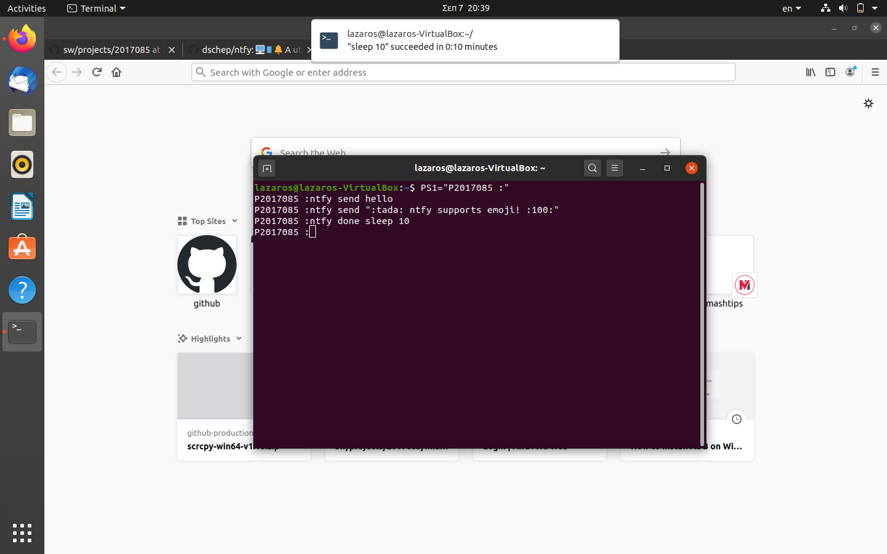

#               `Τεχνολογία Λογισμικού`
##         *ΛΑΖΑΡΟΣ ΠΑΠΑΝΙΚΟΛΑΟΥ : AM Π2017085*
###     ΕΠΙΒΛΕΠΩΝ ΔΙΔΑΣΚΩΝ : ΧΩΡΙΑΝΟΠΟΥΛΟΣ ΚΩΝΣΤΑΝΤΙΝΟΣ

------------------------------------------------------------
#                  `Τελικη Αναφορα`

*ΓΙΑ ΤΗΝ ΠΡΑΓΜΑΤΟΠΟΙΗΣΗ ΤΩΝ ΕΡΓΑΣΙΩΝ ΧΡΕΙΑΣΤΗΚΕ ΝΑ ΠΡΑΓΜΑΤΟΠΟΙΗΘΟΥΝ ΠΟΛΛΕΣ ΕΓΚΑΤΑΣΤΑΣΕΙΣ ΔΙΑΦΟΡΩΝ TOOLS, ΧΡΗΣΙΜΑ ΓΙΑ ΤΗΝ ΕΡΓΑΣΙΕΣ, ΤΑ ΟΠΟΙΑ ΘΑ ΑΝΑΦΕΡΘΟΥΝ ΣΥΝΟΠΤΙΚΑ ΣΤΟ ΤΕΛΟΣ ΤΗΣ ΑΝΑΦΟΡΑΣ. ΕΠΙΣΗΣ ΧΡΕΙΑΣΤΗΚΕ ΝΑ ΓΙΝΕΙ INSTALL ΤΟ VM ME ΤΟ ΛΕΙΤΟΥΡΓΙΚΟ UBUNTU KAI KALI LINUX.ΓΙΑ ΤΗΝ ΠΡΑΓΜΑΤΟΠΟΙΗΣΗ ΟΛΩΝ ΤΩΝ ΕΡΓΑΣΙΩΝ ΧΡΕΙΑΣΤΗΚΕ ΝΑ ΚΑΝΩ ΑΡΚΕΤΕΣ ΕΓΚΑΤΑΣΤΑΣΕΙΣ ΔΙΑΦΟΡΩΝ ΕΡΓΑΛΕΙΩΝ. ΕΝΔΕΙΚΤΙΚΑ ΘΑ ΤΙΣ ΑΝΑΛΥΣΩ . ΣΥΓΚΕΚΡΙΜΕΝΑ ΧΡΕΙΑΣΤΗΚΕ ΝΑ ΚΑΝΩ INSTALLA TO ASCIINEMA STA LINUX ME SUDO APT-GET INSTALL ASCIINEMA KAI ASCIINEMA REC ΓΙΑ RECORD. ΕΠΕΙΤΑ ΧΡΕΙΑΣΤΗΚΕ ΝΑ ΚΑΝΩ ΑΡΚΕΤΕΣ ΕΓΚΑΤΑΣΤΑΣΕΙΣ ΟΠΩΣ SUDO APT-GET INSTALL ΔΙΑΦΟΡΩΝ ΕΡΓΑΛΕΙΩΝ. ΕΠΕΙΤΑ ΕΧΟΥΜΕ SUDO APT INSTALL CURL, SUDO APT INSTALL GCALCLI SUDO APT INSTALL PYTHON3-CRYPTOGRAPHY PYTHON3-BS4, GIT CLONE HTTPS://GITHUB.COM/JARUN/BUKU, SUDO APT INSTALL GOOGLER SUDO APT INSTALL DDGR, SUDO APT INSTALL YOUUTBE-DL, SUDO APT UPDATE, SUDO APT INSTALL SOFTWARE-PROPERTIES-COMMON SUDO APT UPGRADE, SUDO APT INSTALL TRANSMISSION-GTK TRANMSISSION-DAEMON. ΓΙΑ ΤΗΝ ΔΙΕΚΠΑΙΡΩΣΗ ΤΗΣ ΕΡΓΑΣΙΑΣ YOUTUBE-DL ΧΡΕΙΑΣΤΗΚΕ ΝΑ ΧΡΗΣΙΜΟΠΟΙΗΣΩ ΤΟ 2ο OS KALI LINUX ΔΙΟΤΙ ΣΤΑ UBUNTU ΜΟΥ ΕΒΓΑΖΕ ΠΡΟΒΛΗΜΑ ΓΙΑ ΤΗΝ ΕΚΔΟΣΗ ΤΗΣ PYTHON ΚΑΙ ΔΕΝ ΜΠΟΡΟΥΣΑ ΝΑ ΤΟ ΛΥΣΩ, ΕΝΩ ΕΚΑΝΑ ΟΛΑ ΤΑ UPDATE ΚΑΙ ΔΟΚΙΜΑΣΑ ΚΑΙ ΠΑΛΑΙΟΤΕΡΗ ΕΚΔΟΣΗ KALI. ΕΝΑ ΑΛΛΟ ΕΡΓΑΛΕΙΟ ΠΟΥ ΧΡΕΙΑΣΤΗΚΕ ΕΓΚΑΤΑΣΤΑΣΗ ΕΙΝΑΙ ΤΟ WGET "HTTPS://GITHUB.COM/SHARKDP/PASTEL/REALESES/DOWNLOAD/V0.8.0/PASTEL_0.8.0_AMD64.DEB64, SUDO DPKG -I PASTEL_0.8.0_AMD64.DEB SUDO PIP3 INSTALL NTFY, SUDO APT-GET INSTALL LIBDBUS-GLIB-1-DEV LIBDBUS-1-DEV, PIP3 INSTALL --USER DBUS-PYTHON, EVAL"$(NTFY SHELL-INTEGRATION),EXPORT AUTO_NTFY_DONE_IGNORE="VIM SCREEN MELD.ΤΕΛΟΣ ΧΡΕΙΑΣΤΗΚΕ ΝΑ ΔΗΜΙΟΥΡΓΗΣΩ ΛΟΓΑΡΙΑΣΜΟ ΣΤΟ ASCIINEMA ΓΙΑ ΝΑ ΚΑΝΩ RECORD ΤΙΣ ΑΣΚΗΣΕΙΣ ΜΟΥ.

-------------------------------------------------------------------------------------------------------------

##                 **ΕΡΓΑΣΙΕΣ SOFTWARE**

-------------------------------------------------------------------------------------------------------------

##                 ( ΠΡΩΤΗ ΕΡΓΑΣΙΑ )

### `*assignments*` : Send notification to your desktop-mobile.

### `*deliverables*` : Send a notificationwhen a big task completes,eg download,compiling etc.

### `*references*` : ntfy.

### `*ΠΕΡΙΓΡΑΦΗ ΕΡΓΑΣΙΑΣ*` 
                             ΓΙΑ ΤΗΝ ΠΡΑΓΜΑΤΟΠΟΙΗΣΗ ΤΗΣ ΕΡΓΑΣΙΑΣ ΧΡΗΣΙΜΟΠΟΙΗΣΑ ΑΡΧΙΚΑ ΟΡΙΣΜΕΝΑ TOOLS
                             ΓΙΑ INSTALL ΟΠΩΣ WGET "HTTPS://GITHUB.COM/SHARKDB/PASTEL/REALEASES/DOWNLOAD
                             /V0.8.0/PASTEL_0.8.0_AMD64.DEB" SUDO PIP3 INSTALL NTFY, SUDO APT-GET INSTALL LIBDBUS-GLIB-1-DEV
                             LIBDBUS-1-DEV, PIP3 INSTALL --USER DBUS-PYTHON, EVAL"$(NTFY SHELL-INTEGRATION)"
                             EXPORT AUTO_NTFY_DONE_IGNORE="VIM SCREEN MELD". ΑΡΧΙΚΑ ΓΙΑ ΝΑ ΣΤΕΙΛΩ ΕΝΑ ΜΗΝΥΜΑ ΚΑΙ 
                             ΝΑ ΜΟΥ ΕΜΦΑΝΙΣΤΕΙ ΣΤΗΝ ΕΠΙΦΑΝΕΙΑ ΕΡΓΑΣΙΑΣ ΧΡΗΣΙΜΟΠΟΙΩ ΤΝ ΕΝΤΟΛΗ NTFY SEND "TEST NTFY".

### `*ENTOLES BHMA-BHMA*` 
                            (1) PS1="P2017085 :"
                            (2) ntfy send "this is test"
                            (3) ntfy -t 'lazaros send "hello"
                            (4) ntfy den ":wink:" emoji ":joy:"
                          

###  `*EIKONES*` 
   
   
   
   
   
  
   
   
 

# My Asciinema

* **link εργασίας: https://asciinema.org/a/355677
* **link εργασίας: 

-------------------------------------------------------------------------------------------------------------

                          

## ΣΥΜΜΕΤΟΧΙΚΟ ΥΛΙΚΟ
### `ΠΡΟΣΩΠΙΚΟ ΑΠΟΘΕΤΗΡΙΟ`
* link:* https://github.com/lazarospapanikolaou/gr/tree/2017085
### Εκανα τις εργασιες 1Β,1Γ του συμμετοχικου υλικου καθως βρισκονται στο καταλληλο repository αναρτημενες. Το πρωτο παραδειγμα απεικονιζει ενα διαδραστικο αριθμητηριο που επιτρεπει τον χρηστη να εισαγει καπποιες τιμες πραγματοποιοντας αριθμητικες πραξεις ενω το δευτερο παραδειγμα απεικονιζει μια ιστορικη αναδρομη στα λειτουργικα συστηματα και στην εξελιξη τους χρονο με τον χρονο.
* link1:* https://github.com/lazarospapanikolaou/gr/blob/2017085/_remix/interactive-calculator.md (1Β)
* link2:* https://github.com/lazarospapanikolaou/gr/blob/2017085/_case-study/OS%20systems.md (1Γ)
