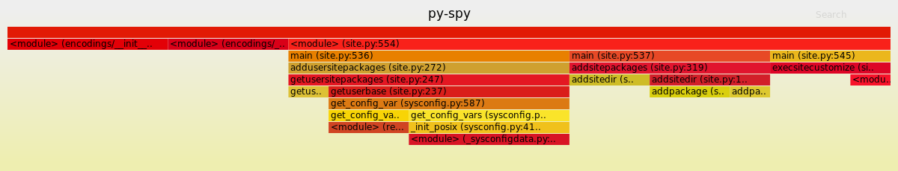

### ΟΝΟΜΑΤΕΠΏΝΥΜΟ: ΑΡΓΥΡΩ ΜΑΡΙΟΛΗ
### ΑΜ: Π2017089
### ΕΜΑΙL: p17mari@ionio.gr, argiromar7@gmail.com

## ΕΡΓΑΣΙΕΣ:

### ΕΡΓΑΣΙΑ 1Η: [set-up continuous integration](https://github.com/p17mari/mycv.github.io/edit/master/README.md)
Σε αυτήν την εργασία κληθήκαμε να κάνουμε μια στατική σελίδα για το βιογραφικό μας.Θα είμαι ειλικρινής το πιο δύσκολο κομμάτι ήταν να βρώ κάτι να γράψω μέσα καθώς δεν έχω προυπηρεσία και δεν έχω σημαντικά επιτεύματα να δείξω. Επιπλέον δεν έχω σημαντικά αρχεία -όπως απολυτήριο λυκείου και σεμινάρια- περασμένα στον υπολογιστή μου και κατα την διάρκεια του COVID-19 ήταν αδύνατο να τα ανεβάσω.Αλλά η μορφή που έχουν τα github pages μου άρεσε πολύ οπότε σίγουρα θα επιστρέψω σε αυτά στο μέλλον.

### ΕΡΓΑΣΙΑ 2Η: try different terminals and shells ([part one](https://asciinema.org/a/328538),[part two](https://asciinema.org/a/328540))
Το shell που δοκίμασα είναι το fish. Το ότι συμπλήρωνε εντολές για εμένα -παρότι χρήσιμο- θα ήθελα να το αποφύγω για να μπορέσω να μάθω τις εντόλες καλύτερα. Εαν αυτός είναι σωστός τρόπος μάθησης ή αν απλά με καθυστερεί είναι κάτι που θα ανακαλύψω στην πορεία του εξαμήνου. Δεν γνώριζα τι να αλλάξω στο config αρχείο οπότε άλλαξα το μήνυμα υποδοχής σε κενό.Εφόσον βρώ μια άλλη χρήση που θα ήθελα να αλλάξει θα το προσθέσω εδω.
### ΕΡΓΑΣΙΑ 3Η:configure a custom window manager ([part one](https://asciinema.org/a/328072),[part two](https://asciinema.org/a/328075),[part three](https://asciinema.org/a/328078))

### ΕΡΓΑΣΙΑ 4Η:  use the terminal as an IDE ([part one](https://asciinema.org/a/327120),[part two](https://asciinema.org/a/327337))
Για αυτήν την εργασία χρησιμοποιήσα το spacevim. Αφού το κατέβασα έδειξα πώς μπορείς να ανοίξεις και να επεξεργαστείς ένα απλό πρόγραμμα Hello World. Το μόνο εμπόδιο που συνάντησα είναι ότι το vim δεν ήταν responsive για λίγη ώρα και δεν με άφηνε να επεξεργαστώ το πρόγραμμα, αλλά δεν το ξανασυνάντησα αυτό το πρόβλημα οπότε υποθέτω ότι απλά ο υπολογιστής ήταν στάσιμος εκείνη την μία φορά που μου έτυχε αυτό το θέμα.

### ΕΡΓΑΣΙΑ 5Η:[set-up a system for python development](https://asciinema.org/a/325932)
Το link αυτής της εργασίας ήταν από τα λίγα που δεν χρειαζόταν να αναζητήσω επιπλέον βήματα κατα το  installation του συστήματος. Πρέπει απλά να επαινέσω πόσο πλήρης και ξεκάθαρη ήταν η πηγή με αναλυτικά βήματα και τα σωστά dependencies.Απλά εξαιρετικό.
### ΕΡΓΑΣΙΑ 6Η: [send notifications to your desktop-mobile](https://asciinema.org/a/325966)
### ΕΡΓΑΣΙΑ 7Η: create your own static site and blog generator([part one](https://asciinema.org/a/328559))
### ΕΡΓΑΣΙΑ 8Η: try different operating systems in the emulator ([part one](https://asciinema.org/a/328543))
### ΕΡΓΑΣΙΑ 9Η: create an agent for news([part one](https://asciinema.org/a/328554),[part two](https://asciinema.org/a/328557))

### ΕΡΓΑΣΙΑ 10Η: [performance monitoring](https://asciinema.org/a/328546)

py-spy
### ΕΡΓΑΣΙΑ 11Η: create a docker image for your development stack([part one](https://asciinema.org/a/328558))
