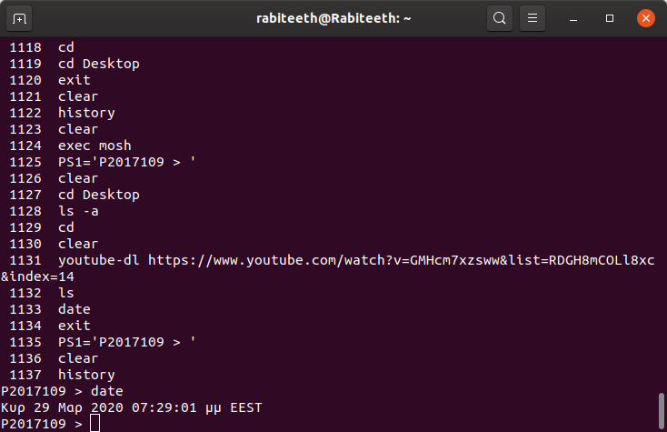
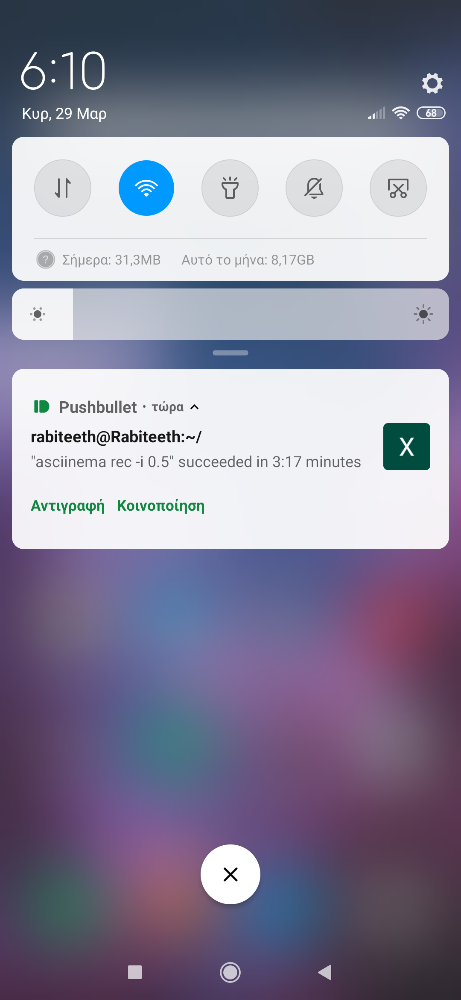

# Κοτρώτσιος Χρήστος

## ΑΜ:Π2017109

## Παραδοτέα

### 1ο Παραδοτέο

* Assignment : performance monitoring

* Deliverables : monitor the performance of your python scripts and visualize them with colors and/or spark lines

* Σύνδεσμος στο [Asciinema](https://asciinema.org/a/314571)

* Εργαλία που χρησιμοποίησα: [hyperfine](https://github.com/sharkdp/hyperfine)

* Diadikasia prin to benchmark: Arxika xrhsimopoihsa ena python script (randgenerator.py) gia thn dhmiourgia enws sunolou arithmwn me eisodo pou ginetai apo ton xrhsth kai sthn synexeia tous apothikefsa se ena Random.txt. Sthn synexeia mesw twn heap.py kai selection.py ta opoia einai sorting python scripts ekana taksinomish to plh8os twn arithmwn tou Random.txt. Ta arxeia auta vriskontai sto [apothethrio](https://github.com/chriskotrotsios/python-sorting-scripts)

### 2ο Παραδοτέο

* Assignment : try different terminals and shells

* Deliverables : repeat some of the previous exercises with a different terminal-shell and create a custom configuration that fits your needs

* Εργαλία που χρησιμοποίησα: [mosh](https://mosh.org/)

Sto parakatw video deixnw thn xrhsh tou mosh apo kinhto kai xrhsimopoiw to youtube-dl gia na katevasw tragoudi.

Link gia to [video](https://vimeo.com/401915913#)

**Fwtografia pou deixnei sta linux to history twn entolwn pou xrhsimopoihsa sto kinhto** 

### 3ο Παραδοτέο

* Assignment : send notifications to your desktop-mobile

* Deliverables : send a notifcation when a big task completes, eg download, compiling, etc

* Σύνδεσμος στο [Asciinema](https://asciinema.org/a/314576)

* Εργαλία που χρησιμοποίησα: [ntfy](https://github.com/dschep/ntfy/)

Den mporesa na kanw to ntfy na stelnei eidopoihsh otan teleiwnei mia ergasia oso kanw record me to asciinema. Erxetai eidopoihsh otan teleiwnei to record alla oxi gia ergasies pou ginontai mesa sto record.

**Fwtografia pou deixnei to mhnuma pou erxetai sto kinhto otan teleiwnei mia ergasia** 

### 4ο Παραδοτέο

* Assignment : use the terminal as an IDE

* Deliverables : edit your files (e.g., cv, website, code, etc) in vim or emacs and compile it in a different panel or use a plug-in

Sto parakatw video pou vrisketai sto asciinema xrhsimopoiw to nvim gia na grapsw se python ena random number generator script pou to plh8os twn ari8mwn ka8orizetai apo to input tou xrhsth.
* Σύνδεσμος στο [Asciinema](https://asciinema.org/a/314626)

* Εργαλία που χρησιμοποίησα: [Neovim](https://github.com/neovim/neovim)

Arxika katevasa to nvim text editor kai sthn synexeia tou evala ta pluggins 1) 2) gia na mporei na kanei compile kwdika se python kai epeita prosthesa ta 3) 4) gia custom configuration tou nvim.

### 5ο Παραδοτέο

* Assignment : set-up a system for python development

* Deliverables : install and configure in a user folder a python project that is not available through the package manager

Perigrafh: Arxika eftia3a ena directory mesa sto opoio ekana install diafora tools ths python mesw tou virtualenv kai sthn synexeia egkatesthsa to library "requessts" kai etre3a ena main.py pou xrhisimopoiei to library auto
* Σύνδεσμος στο [Asciinema](https://asciinema.org/a/314715)

* Εργαλία που χρησιμοποίησα: [Virtualenv](https://docs.python-guide.org/dev/virtualenvs/)

## Συμμετοχικό Εκπαιδευτικό Υλικό

[Link της σελίδας του βιβλίου](https://chriskotrotsios.netlify.com) 
[Link προσωπικού αποθετηρίου του βιβλίου](https://github.com/chriskotrotsios/gr)

### A: Δύο νέες εικόνες με λεζάντα και με ελεύθερα πνευματικά δικαιώματα ή που επιτρέπουν εμπορική χρήση
Στο παραδοτέο αυτό πρόσθεσα 2 εικόνες, τις τοποθέτησα σε ανάλογα categories συμπλήρωσα μια λεζάντα και πρόσθεσα σχετικά tags. Οι φωτογραφίες αφορούν το Google Translate και την κονσόλα Nintendo Wii
