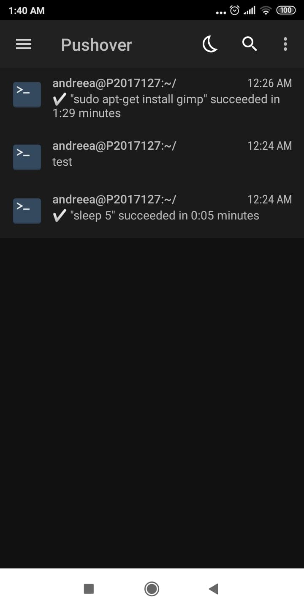

## Ονοματεπώνυμο: Radu Andreea Maria 
## AM:2017127
## Assignments:

## Αssignment 1:
Send notifications to your desktop-mobile
### Deliverables:
send a notifcation when a big task completes, eg download, compiling, etc
### Description:  [Αsciinema](https://asciinema.org/a/F6zLAmAcIhabfKyGGsPUkW9kk)
Για την εκτέλεση της εργασίας κατέβασα το εργαλείο ntfy στο terminal μου με την εντολή sudo pip install ntfy. Έπειτα κατέβασα την εφαρμογή Pushover στο κινητό μου και μετά έστειλα notifications στο κινητό μου τρέχοντας τής ακόλουθες εντολές στο terminal μου:

htfy  -b pushover-o user_key(+key που έλαβα όταν κατέβασα την εφαρμογή Pushover στο κινητό μου) done sudo apt-get install gimp   -Όταν τελείωσε η εκτέλεση της εντολής στο terminal έλαβα μια εντόπιση στο κινητό για την επιτυχία της εντολής και ο χρόνος που χρειάστηκε να εκτέλεση την συγκεκριμένη εντολή.

htfy  -b pushover-o user_key(+key Pushover)  send test  --Όταν τελείωσε η εκτέλεση της εντολής στο terminal έλαβα μια εντόπιση στο κινητό με το text που περιλαμβανόταν στην εντολή 

htfy  -b pushover-o user_key(+key Pushover) done sleep 5  --Όταν τελείωσαν τα 5 δευτερόλεπτα που περιλαμβανόταν στην εντολή έλαβα μια εντόπιση στο κινητό για την επιτυχία της εντολής

## Αssignment 2:
performance monitoring
### Deliverables:
monitor the performance of your python scripts and visualize them with colors and/or spark lines
### Description:[Αsciinema](https://asciinema.org/a/B7rse1qw9F5Zr9yKWCk9EHjZU)
Για αυτήν την εργασία χρησιμοποίησα προφίλ εγγραφής py-spy σε ένα αρχείο χρησιμοποιώντας την εντολή εγγραφής. Δημιούργησα ένα flame graph  της διαδικασίας python με record command.

### Αssignment 3:
programmable voice
#### Deliverables:
deploy an application that forwards a call depending on a white- and black- list of phone numbers
#### Description:  [Αsciinema](https://asciinema.org/a/22YYFW21dBUjQbiIm6lP4jlnI)
Για αυτή την εργασία πρώτα δημιούργησα ένα account στο Twilio ώστε να αποκτήσω το account sid και το auth token και ένα subaccount να μπορώ να χρησιμοποιήσω ένα αριθμό τηλεφώνου που δεν είναι προσωπικό μου αριθμό. Στην συνέχεια μέσα από το terminal κατέβασα το εργαλείο twilio χρησιμοποιώντας την εντολή pip install twilio και brew tap twilio/brew && brew install twilio. Δημιούργησα αρχεία σε γλώσσα python για authentication, make a call χρησιμοποιώντας τα δικά μου account sid και auth token και send sms και τα έτρεξα στο terminal .
 

### Αssignment 4:
set-up a system for python development
#### Deliverables:
install and configure in a user folder a python project that is not available through the package manager
#### Description:  [Αsciinema](https://asciinema.org/a/FoxtCcxrFtXoRyxpOkjHDBK4Y)
Στόχος της εργασίας είναι ανάπτυξη ανεξάρτητων python projects. Δημιουργία ενός environment και εγκατάσταση εντός αυτού psutil module, και συγγραφή κώδικα . Μετα έγινε αντιγραφή του κώδικα σε άλλο φάκελο και φαίνεται πως ο κώδικας δεν μπορεί να εκτελεστεί γιατι δεν έχει το απαιτούμενο module, παρά το γεγονός πως στον πρώτο φάκελο υπήρχε.
 pip install --user pipenv

### Αssignment 5:
create an agent for news
#### Deliverables:
the demo should display the new content added on a news web site
#### Description:  [Αsciinema](https://asciinema.org/a/XzmJxj5PdNlxafsPxm3RV86cE)
Στόχος της εργασίας είναι δημιουργία ενός agent που εκτελεί αυτόματα αυτοματοποιημένες εργασίες(tasks)
Το πρώτο βήμα ήταν να κάνω fork στο git repository του huginn,μετά να συνδεθώ σε μια βάση SQL,

### Αssignment 6:
use the terminal as an IDE
#### Deliverables:
edit your files (e.g., cv, website, code, etc) in vim or emacs and compile it in a different panel or use a plug-in
#### Description:[Αsciinema](https://asciinema.org/a/M0jei4vV2Zl24sewCwxURMwCI)

### Αssignment 7:
try different terminals and shells
#### Deliverables:
repeat some of the previous exercises with a different terminal-shell and create a custom configuration that fits your needs
#### Description:[Αsciinema](https://asciinema.org/a/5ApN3jWcDUebnNKdWr2uJGpjQ)

### Αssignment 8:
create notifications on your sever
#### Deliverables:
send notifications on important server events
#### Description:  [Αsciinema](https://asciinema.org/a/1Ray0CCDtmBhyVkpTsAs6eyEK)

### Αssignment 9:
set-up continuous integration
#### Deliverables:
build and deploy your static site and your cv dynamically every time you make a small change in the source files
#### Description:  [Αsciinema](https://asciinema.org/a/1Ray0CCDtmBhyVkpTsAs6eyEK)

### Αssignment 10:
choose your stack
#### Deliverables:
set-up a set of cli tools with minimal dependencies and a software licence that allows commercial use and selling
#### Description:  [Αsciinema]()

### Συμμετοχικό εκπαιδευτικό υλικό - 1

Το αποθετήριο της ιστοσελίδας του μαθήματος είναι στο παρακάτω [link](https://github.com/mibook/gr)
Η ιστοσελίδα βιβλίου του μαθήματος είναι στο παρακάτω [link.](https://www.mibook.org/)
To προσωπικό αποθετήριο της ιστοσελίδας του μαθήματος είναι στο παρακάτω [link.](https://github.com/p17rant/gr)
H προσωπική ιστοσελίδα βιβλίου του μαθήματος είναι στο παρακάτω [link.](https://p17rant.github.io/gr/)
Για την εκπόνηση της άσκησης προσθέσαμε στην παρακάτω [ενότητα](https://p17rant.github.io/gr/gallery/) την εικόνα [1](https://github.com/P17rant/gr/blob/gh-pages/images/375px-Xerox_Alto.jpg) και την εικόνα [2.](https://github.com/mibook/gr)

