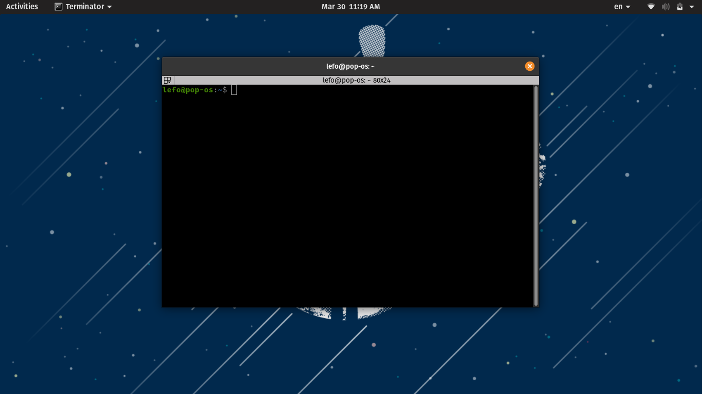
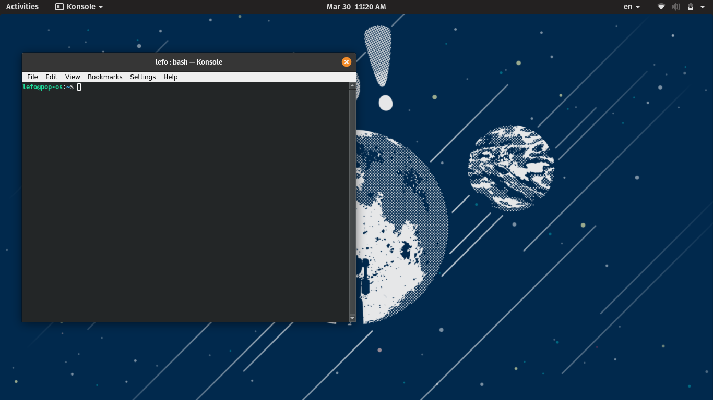
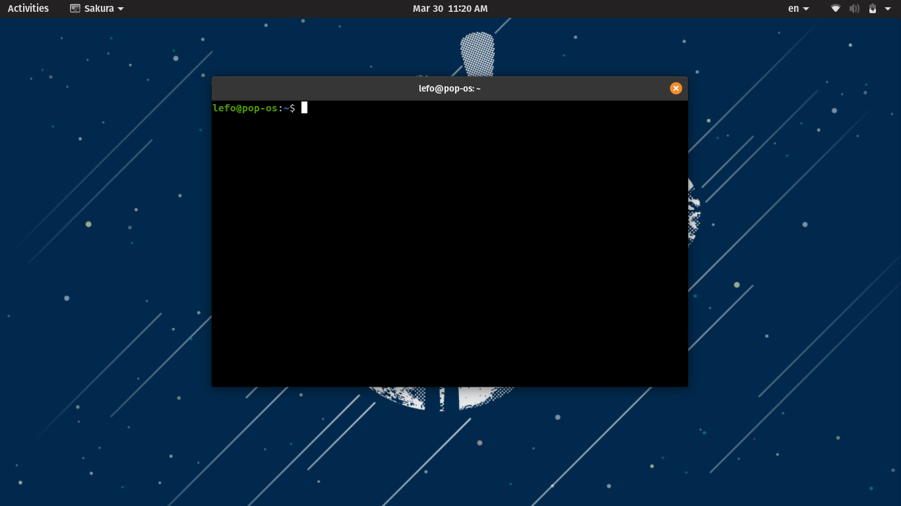
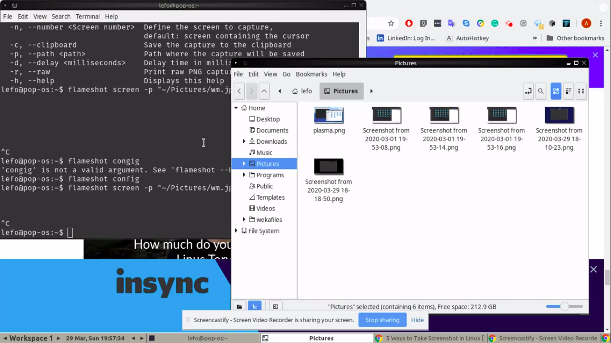
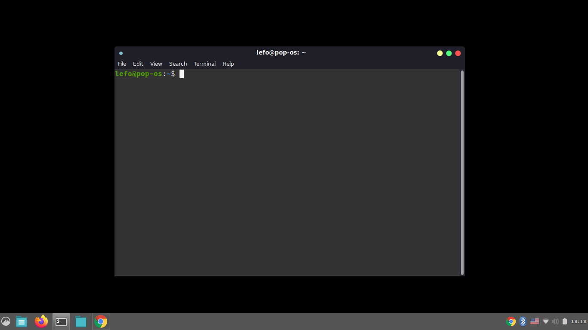
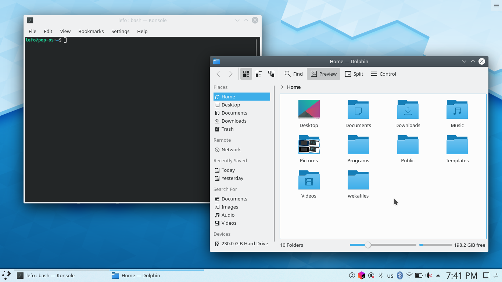
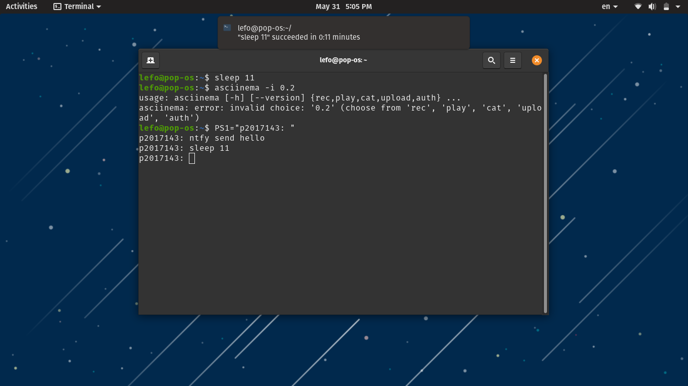
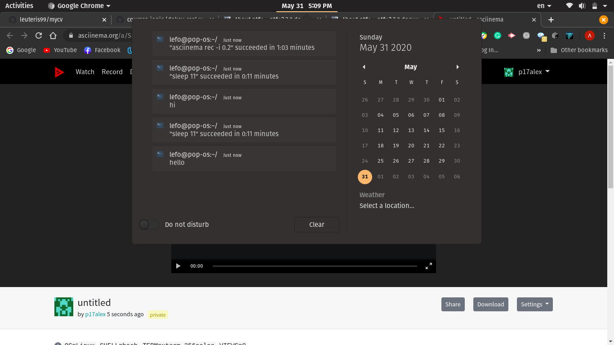

# Αναφορά
##### Μάθημα: Τεχνολογίες Λογισμικού
##### Ονοματεπώνυμο: Ελευθέριος Αλεξίου
##### Α.Μ.: Π2017143
##### Προφίλ Github: https://github.com/leuteris99  
Να επισημανω οτι η εργασία είχαι γίνει για την εξεταστική του Μαϊου αλλά δεν είχαι βαθμολογιθεί τότε.

## Συμμετοχικό Eκπαιδευτικό Yλικό
Αποθετήριο  αντιγράφου βιβλίου: https://github.com/leuteris99/gr/tree/p2017143
### Α) Προσθεσε Λεζαντες
- [android emulation](https://github.com/leuteris99/gr/blob/p2017143/_gallery/android-emulation.md)
- [windows10x](https://github.com/leuteris99/gr/blob/p2017143/_gallery/windows10x.md)

### B) Διαδραστικό Παράδειγμα
- [Audio Visualizer](https://github.com/leuteris99/gr/blob/p2017143/_remix/Audio-Visualizer.md)
- [Right Click Context Menu](https://github.com/leuteris99/gr/blob/p2017143/_remix/Right-Click-Context.md)

### Γ) Βιογραφιά
- [Tim Berners Lee](https://github.com/leuteris99/gr/blob/p2017143/_biography/timbl.md)

## Ασκήσεις
- [set-up continuous integration](https://github.com/leuteris99/mycv)  
Εργαλία: Gihub, travis  
Στο asciinema φαίνετε το git push που κανει triger το travis που κάνει build την σελίδα mycv.  

- try different terminals and shells  
Εργαλεία: ksh, zsh, bash, konsole, sakura, terminator  
Τα παραπάνω terminals και shells χρησιμοποιήθηκαν, τα terminals φαίνονται στις φωτογραφίες καθώς δεν γινόταν να τα αλλάξώ απο το shell. Στο asciicast φαίνονται τα shells.  
  
  
  

- configure a custom window manager  
Εργαλεία: fluxbox, menu, plasma,cinnamon  
Το menu χρησιμοποιήθηκε για την εγκατασταση του fluxbox. Tα fluxbox , plasma και cinnamon ειναι τα WM που χρησιμοποιησά και φένονται στις φώτογραφίες απο κάτω. Στο asciicast φέναιτε η εγκατάσταση του fluxbox.  
  

- use the terminal as an IDE  
Εργαλεία: nano, gcc  
Το nano χρησιμοποιήθικε για την επεξεργασία του κώδικα και ο gcc για το compile του κώδικα.  

- set-up a system for python development  
Εργαλεία: virtual environment, python3  

- send notifications to your desktop-mobile  
Εργαλεία: ntfy  
Στο asciicast φεναιτε πως χρησιμοποιώ το ntfy για να στέλνω notification και πως αυτόματα με ενημερώνει όταν τελιώσει μια μεγάλη εργασία.  
Όταν στέλνω hi:  
  
Όταν τελιώνει μια μεγάλη διεργασία:  
  
Ειδοποιήσοις απο το ntfy:  
  

- try different operating systems in the emulator  
Εργαλεία: docker, ubuntu, archlinux  
Χρησιμοποιώ το docker και τρέχω μέσα σε container διάφορα λειτουργικα μέσω terminal. Στο asciicast φένονται το ubuntu και το archlinux.  

- performance monitoring  
Εργαλεία: hyperfine  
To hyperfine ειναι το προγραμμα που θα κάνει το monitoring του προγράμματος που θα του δόσω.Το warmup χρησιμοποιήται για να εκτελεστεί το script 5 φορές πριν ξεκινίσει το benchmarking.  
Μετα με το runs το τρέχει 20 φορές και το κάνει monitor.  
Με την επιλογη style έβαλα το full για να διακρινονται οι πληροφοριες στα αποτελέσματα με διάφορα χρώματα.  
Τελος, το έκανα να αποθηκεύση τα αποτελέσματα του benchmark σε 1 markdown αρχείο.  

## Βιβλιογραφία
- https://en.wikipedia.org/wiki/Tim_Berners-Lee
- https://www.programiz.com/python-programming/examples/shuffle-card
- https://github.com/sharkdp/hyperfine
- https://ntfy.readthedocs.io/en/latest/
- https://travis-ci.org/
- https://stackoverflow.com/questions/15718649/how-to-publish-a-website-made-by-node-js-to-github-pages
