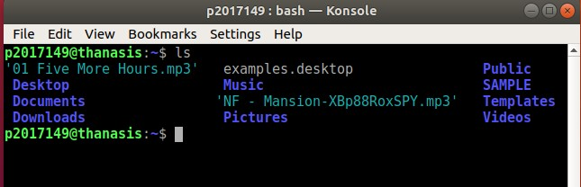
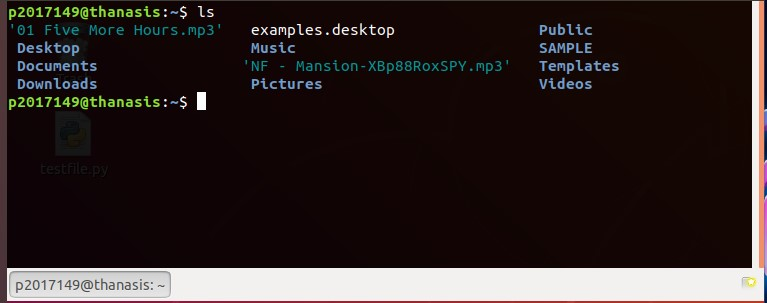

# ΙΟΝΙΟ ΠΑΝΕΠΙΣΤΗΜΙΟ, ΤΜΗΜΑ ΠΛΗΡΟΦΟΡΙΚΗΣ 
## ΜΑΘΗΜΑ:
### Τεχνολογία Λογισμικού

## Στοιχεία φοιτητή  
### Αθανάσης Παπαπέτρου
### ΑΜ: Π2017149

## Συμμετοχικό περιεχόμενο

ERROR 1: https://i.gyazo.com/34c591adf37d1a71676cc0a78601252a.png

ERROR 2: https://i.gyazo.com/9dbd83e64807bb8123e791be5427930a.png

Εικόνα 1 Caption: https://i.gyazo.com/0c3bc0e6b943ebccd0c1852f15b5c44f.png

Εικόνα 2 Caption: https://i.gyazo.com/550c719134fa29ebe3c56ba075465e0c.png

Εικόνα 1: https://i.gyazo.com/8e45446f3a1d2af143a44430c25c78a8.png

Εικόνα 2: https://i.gyazo.com/dd9065d61fec67985b01926bcebf9835.png

## Eργασία 1:
send notifications to your desktop-mobile

ntfy

## Eργασία 2:
Try different terminals and shells

konsole

Guake

 	
## Hyperfine 

https://asciinema.org/a/GWMc5M69HSJlXEXbBAEHtxXcf
