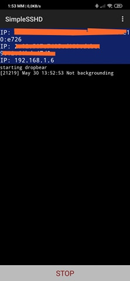
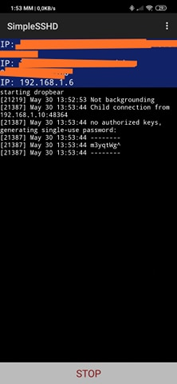

# Σιδεράς Γεώργιος , (AM = Π2017164)

## Ασκήσεις Terminal : 

### 1η Άσκηση : 

* Assignment : send notifications to your desktop-mobile.

* Deliverables : send a notifcation when a big task completes, eg download, compiling, etc.  

* Σύνδεσμος των εντολών στο [Asciinema](https://asciinema.org/a/312457 "asciinema") 

* Screenshot απο το κινητό για την εμφάνηση της ειδοποίησης 

* Εργαλεία που χρησιμοποίησα :
    * [notify(ntfy)](https://github.com/dschep/ntfy/ "ntfy")

* Εφαρμογη για το κινητο : 

    * [Pushbullet](https://www.pushbullet.com "Pushbullet")

* Περιγραφή : Αρχικά κατέβασα το ntfy με την εντολή ```$sudo pip3 install ntfy ```
και πρόσθεσα ως extra dependencies το pid και το pushbullet με τις εντολές ```$pip3 install ntfy[pid]``` ```$pip3 install ntfy[pushbullet]```Στην συνέχεια κατεβασα το app για το smartphone pushbullet και εκανα εγραφη και σύνδεση , έπειτα πήγα -> settings -> account και μετα πατησα να μου δωσει ενα access token.Στο termina δημιουργησα ενα αρχειο με την εντολη 
```$sudo nano ~/.ntfy.yml```και μέσα έγραψα : 
```
backends:
    - pushbullet
pushbullet:
    access_token: o.QTyuazAvmXQE9pp0D8eDCiRcayFigQ21ο
 ```
(οπου στο acces token εβαλα αυτο που πηρα απο την εφαρμογη.)
Με αυτην την τροποποιηση στο αρχειο καθε φορα που τρεχεις την εντολη ```$ntfy send "Notifictaion" ```θα πέρνει ως όρισμα -b το pushbullet και ως -o το access_token: o.QTyuazAvmXQE9pp0D8eDCiRcayFigQ21ο . Μετα με την εντολη ```$eval "$(ntfy shell-integration -f -L 30)" ```καθε φορα που τελειωνει μια εντολη που τρεχει πανω απο 30s στελνει μηνυμα , η επιλογη -f λεει οτι στειλε ακομα και αν ο terminal τρεχει στο background και -L μετα απο ποσο χρονο αν τρεχει μια εντολη να στελνει μηνημα.

* Σχόλια : Δυστυχώς η ανακοίνωση που μου ήρθε στο κινητό ήταν για το πότε τελείωσε η πρώτη εντολή που στην περιπτωσή μας ήταν η ```$asciinema rec ``` αλλά αν έτρεχα κάποια έντολη χώρις να προηγείτε η rec θα μου την εμφάνιζε κανονικά στο κινητό.
___
### 2η Άσκηση : 

* Assignment : performance monitoring

* Deliverables : monitor the performance of your python scripts and visualize them with colors and/or spark lines   

* Περιγραφή : Βρήκα και τροποποίησα δύο python scripts για να καλύπτουν τις ανάγκες της εργασίας απο το διαδίκτυο τα οποία κάνουν brute force σε έναν δωσμένο κωδικό (το πρώτο κάνει χρήση λεξικού ενώ το δεύτερο όχι). Στην συνεχεια , έτρεξα την εντολή ```$hyperfine -i --prepare 'sync; echo 3 | sudo tee /proc/sys/vm/drop_caches' bruteforce1.py bruteforce2.py ```
όπου το ```-i``` βοηθάει στο να αγνόει τυχόν αποτυχίες του script και το ```--prepare 'sync; echo 3 | sudo tee /proc/sys/vm/drop_caches'``` καθαρίζει την cache για να μην υπάρξουν παραβολές , και τελος τα δυο scripts που θέλω να συγκρίνω.

* Σύνδεσμος των εντολών στο [Asciinema](https://asciinema.org/a/312537 "asciinema") 

* Τα scripts που χρησιμοποίησα : [Script_01](https://github.com/geosideras/My_ionio_university_repository/blob/master/Python_Scripts/bruteforce1.py) [Script_02](https://github.com/geosideras/My_ionio_university_repository/blob/master/Python_Scripts/bruteforce2.py)

* Εργαλεία που χρησιμοποίησα :
    * [Hyperfine](https://github.com/sharkdp/hyperfine "Hyperfine")
___

### 3η Άσκηση : 

* Assignment : try different terminals and shells

* Deliverables : repeat some of the previous exercises with a different terminal-shell and create a custom configuration that fits your needs   

* Περιγραφή : Κατέβασα και εγκατέστησα τον z shell , έπειτα κατέβασα την προέκταση oh-my-zsh για να μπορώ να τον τροποποιήσω και να τον προσαρμόσω στα συμφέροντα μου. Πέρασα το θέμα angnoster το οποίο είναι πολύ χρήσιμο για άτομα που χειρίζονται πολύ το git , περασα το z για να μεταπηδάω directories και να πηγαίνω στο προορισμό μου πιο γρήγορα, το fuck για αμα κάνω μικρά λάθοι στις εντολές μου , το οποίο μου βγάζει πιθανά suggestions και το autosuggestions το οποίο πρωτού γράψω μια εντολή μου βγάζει μια προτεινόμενη εντολή την οποία και μπορώ να επιλέξω με τα navigation keys. Μερικές χρήσιμες πληροφοριες που παρέχει το terminal μου τώρα είναι : 
* Ο κεραυνος που βγαζει στα αριστερα του user το οποιο προσδιορίζει αν είμαι root. 
* Το X είναι οτι η προηγούμενη εντολή που έτρεξα απέτυχε. 
* Άμα μπω σε ενα dir το οποίο είναι git repository το βγάζει με άλλο χρωμα . 
* Πρασινο αν δεν έχουν γίνει αλλαγές 
* Κίτρινο αν εχουν γινει αλλαγές και δεν έχει γίνει το commit. 
* Καθώς επίσης μέσα σε αυτό το καρτελάκι γράφει το όνομα του branch που βρίσκομαι 

* Όλα αυτα μπορούμε να τα δούμε στο demo εντολών του [Asciinema](https://asciinema.org/a/312545 "asciinema") 

* Εργαλεία που χρησιμοποίησα :
    * [ZSH](https://github.com/ohmyzsh/ohmyzsh/wiki/Installing-ZSH "zsh")
    * [oh-my-zsh](https://github.com/ohmyzsh/ohmyzsh "ohmyzsh")
    * [zsh-autosuggestions](https://github.com/zsh-users/zsh-autosuggestions "autosuggestions")
    * [agnoster-zsh-theme](https://github.com/agnoster/agnoster-zsh-theme "agnoster")
    * [z - jump around](https://github.com/rupa/z "Z")
    * [thefuck](https://github.com/nvbn/thefuck "thefuck")
 ___

 ### 4η Άσκηση : 

* Assignment : set-up a system for python development

* Deliverables : install and configure in a user folder a python project that is not available through the package manager

* Περιγραφή : Αφού εγκατέστησα το pipenv , άνοιξα ένα καινούργιο dir μέσα στο οποίο άρχησα να φτιάχνω το virtual environment κάνωντας install διάφορα modules της python. Στην συνέχεια έδειξα τα περιεχόμενα του ```Pipefile``` και του ```Pipefile.lock``` τα οποία περιέχουν ότι έχω εγκαταστήσει , και τις εκδόσεις τους. 'Επειτα , αφού έτρεξα το shell μου με τις αλλαγές με την ετνολή ```$pipenv shell ``` άνοιξα ενα python3 shell και προσπάθησα να κάνω import ενα module το οποίο δεν υπήρχε και έβγαλε σφάλμα για να δείξω πως λειτουργεί. Βέβαια, στην συνέχεια αφού το εγκατέστησα και έτρεξα python3 shell έκανα κανονικά το import.

* Σύνδεσμος των εντολών στο [Asciinema](https://asciinema.org/a/314613 "asciinema") 

* Εργαλεία που χρησιμοποίησα :
    * [pipenv](https://github.com/pypa/pipenv "pipenv")
   
* Prerequisites : pip , python3.
    
___
    
  ### 5η Άσκηση : 

* Assignment : use the terminal as an IDE

* Deliverables : edit your files (e.g., cv, website, code, etc) in vim or emacs and compile it in a different panel or use a plug-in

* Περιγραφή : 'Εφερα' τον vim στα μέτρα και στις ανάγκες μου ώστε να τρέχει σαν IDE της python. Πιο συγκεκριμένα , κατεβασα τον vundler ο οποίος είναι vim plug-in manager  και στην συνέχεια κατέβασα διάφορα plugs-in , δηλαδή έκανα τον vim να προβάλει το αποτέλεσμα του κώδικα και μερικά απο τα errors του με το input στο πληκτρολογιο :  ``` \r ``` , επίσης έβαλα χρώματα , έκανα τον φόντο σαν του [sublime-text editor](https://www.sublimetext.com/) και το βήμα που με δυσκόλεψε τέρμα ήταν να βάλω autocomplete κάθε φορά που έγραφα κάτι που είχα ήδη γράψει ή καποία εντολή της python έβγαινε ένα drop-down menu που μπορώ με το <kbd>TAB</kbd> να διαλέξω την εντολή της επιλογής μου.

* Σύνδεσμος των εντολών στο [Asciinema](https://asciinema.org/a/314130 "asciinema") 

* Εργαλεία που χρησιμοποίησα :
    * [vim](https://www.vim.org/ "vim")

* Independencies που χρησιμοποίησα :
    * Το vim θα πρέπει να είναι πάνω απο την έκδοση 7.3 και να υποστηρίζει +python.
    * [pylint](https://www.pylint.org/)
    * [cmake](https://cmake.org/)
    * [mono-complete](https://www.mono-project.com/docs/getting-started/install/linux/)
    * [go](https://golang.org/doc/install)
    * [node.js](https://nodejs.org/en/download/package-manager/)
    
* Plug-in που χρησιμοποίησα :
    * [Vundler](https://github.com/VundleVim/Vundle.vim )
    * [python-mode](https://github.com/python-mode/python-mode)
    * [YouCompleteMe](https://github.com/ycm-core/YouCompleteMe)
    * [color scheme](https://github.com/jnurmine/Zenburn)
    * [flake8](https://github.com/nvie/vim-flake8)
    * [syntastic](https://github.com/vim-syntastic/syntastic)
    
        ___
    
### 6η Άσκηση : 

* Assignment : configure a custom window manager

* Deliverables : try different wm and configure one to fit your needs

* Περιγραφή : Κατέβασα και εγκατέστησα τον icewm γιατι μου θύμιζε λίγο τα windows xp . Έπειτα , έκανα καποιες αλλαγές στα config files του. Πιο συγκεκριμένα , με startup του ειπα να κανει restart τον nitrogen ώστε να έχω το επιλεγόμενο background κάθε φορά που τρέχω το WM , επίσης επεξεργάστηκα κάποια key shortcuts οπως <kbd>CTRL</kbd> + <kbd>ALT</kbd> + <kbd>T</kbd> για να μου ανοίγει ο terminal και να τρέχει αυτόματα την ετνολή ```sudo -i``` ώστε να είμαι root και <kbd>CTRL</kbd> + <kbd>ALT</kbd> + <kbd>G</kbd> για να ανοιγει το browser και να με πηγαίνει στην σελίδα : https://github.com/geosideras. Στην συνέχεια έβαλα στο menu έναν φάκελο με το όνομα sid όπου περιέχει όλα τα προγράμματα που έχω κατεβάσει. Άλλαξα την default επιλογή που είχε 4 working spaces και άφησα μόνο 2 , και έβαλα στο taskbar να έχει 3 προγράμματα που θέλω να έχω εύκολη πρόσβαση. Τέλος, άλλαξα το theme το ρολογιού κάτω δεξιά ώστε να είναι  μορφής lcd.

* Ένα demo του iceWM μετά τις αλλαγές : 

   

* Σύνδεσμος των εντολών στο [Asciinema](https://asciinema.org/a/WAOoEm3QAD5m4kuA67WH6thsy "asciinema") 

* Εργαλεία που χρησιμοποίησα :
    * [IceWM](https://ice-wm.org/ "icewm")
    
    ___
    
### 7η Άσκηση : 

* Assignment : create an agent for news

* Deliverables : the demo should display the new content added on a news web site 

* Περιγραφή :  

* Σύνδεσμος των εντολών στο [Asciinema](https://asciinema.org/a/312537 "asciinema") 

* Εργαλεία που χρησιμοποίησα :
    * [Huginn](https://github.com/huginn/huginn "huginn")
___

  ## Συμμετοχικό εκπαιδευτικό υλικό : 
  
  ### A) 
  
  * Ζητουμενα : δύο νέες εικόνες με λεζάντα και με ελεύθερα πνευματικά δικαιώματα ή που επιτρέπουν εμπορική χρήση , οι νέες εικόνες μπορούν να είναι παρόμοιες με υπάρχουσχες αρκεί να συνοδεύονται από τα κατάλληλα πνευματικά δικαιώματα. Εκτός από το αρχείο .md θα πρέπει να γίνει προσθήκη των αντίστοιχων εικόνων (μικρή εικόνα πλάτους 160πίξελ, και μια κανονική) στον φάκελο images.
  
  * [link](https://github.com/geosideras/gr) του αποθετήριου βιβλίου.
  * [link](https://geosideras.netlify.com) του βιβλίου. 
  * Αρχεία που άλλαξα : [_config.yml](https://github.com/geosideras/gr/blob/master/_config.yml), ~~[3D-printer.md](https://github.com/geosideras/gr/blob/master/_gallery/3D-printer.md), [exoskeleton-glove.md](https://github.com/geosideras/gr/blob/master/_gallery/exoskeleton-glove.md), [3D-printer-thumb.png](https://github.com/geosideras/gr/blob/master/images/3D-printer-thumb.png), [3D-printer.png](https://github.com/geosideras/gr/blob/master/images/3D-printer.png), [exoskeleton-glove-thumb.jpg](https://github.com/geosideras/gr/blob/master/images/exoskeleton-glove-thumb.jpg), [exoskeleton-glove.jpg](https://github.com/geosideras/gr/blob/master/images/exoskeleton-glove.jpg)~~,(μετά απο επικοινωνία με το καθηγητή, κατάλαβα οτι οι εικόνες έπρεπε να εστιάζουν στο software και όχι τόσο στην επικοινωνία ανθρώπου-υπολογιστή για αυτό και τις άλλαξα) [blockchain.jpg](https://github.com/geosideras/gr/blob/master/images/blockchain.jpg), [blockchain-thumb.jpg](https://github.com/geosideras/gr/blob/master/images/blockchain-thumb.jpg), [remote-mouse.jpg](https://github.com/geosideras/gr/blob/master/images/remote-mouse.jpg), [remote-mouse-thumb.jpg](https://github.com/geosideras/gr/blob/master/images/remote-mouse-thumb.jpg) , [blockchain.md](https://github.com/geosideras/gr/blob/master/_gallery/blockchain.md), [remote-mouse.md](https://github.com/geosideras/gr/blob/master/_gallery/remote-mouse.md).


### B) 

  * Ζητουμενα : μια νέα βιογραφία
  
  * [link](https://github.com/geosideras/gr) του αποθετήριου βιβλίου.
  * [link](https://geosideras.netlify.com) του βιβλίου. 
  * Αρχεία που πρόσθεσα στο βιβλίο : [katherine-johnson.md](https://github.com/geosideras/gr/blob/master/_biography/katherine-johnson.md), [bio-johnson.md](https://github.com/geosideras/gr/blob/master/_biography/bio-johnson.md), [johnson1.jpg](https://github.com/geosideras/gr/blob/master/images/johnson1.jpg), [johnson1-thumb.jpg](https://github.com/geosideras/gr/blob/master/images/johnson1-thumb.jpg), [johnson2.jpg](https://github.com/geosideras/gr/blob/master/images/johnson2.jpg), [johnson2-thumb.jpg]().
  
  ## Αντί της γραπτής εξέτασης : 
  
  ### Ασκήση Terminal : 
    
* Assignment : set-up cloud services

* Deliverables : ssh to a remote machine and demonstrate your remote cli user land (e.g., email, editor, cv, code, etc)

* Περιγραφή : Σκοπός της άσκησης είναι να αποκτήσουμε πρόσβαση και να πραγματοποιήσουμε κάποιες διεργασίες σε έναν απομακρυσμένο υπολογιστή η "server" μέσω την ασφαλής σύνδεσης που προσφέρει το SSH (Secure Shell). 

Επειδή δεν υπήρχε άλλος υπολογιστής στο σπίτι για να πραγματοποιήθει η άσκηση , έγινε χρήση του VirtualBox με λειτουργικό σύστημα  Xubuntu. Πιο συγκεκριμένα, στο κομμάτι των εντολών , χρησιμοποιούμε την ```sudo apt-get install openssh-server``` για το server mode του openssh και το ενεργοποιηούμε, βρήσκουμε την public ip tou virtual machine με την εντολή ```sudo ipconfig``` αν και δν υπάρχει προεγκατεστημένη στα xubunut απο μόνη της, γίνεται εύκολα εγκατάσταση με την  ```sudo apt-get install net-tools```.

Στην συνέχεια γράφουμε την εντολή ssh ακολουθούμενη απο το hostname + @ + την ip , αν ο user έχει password το πληκτρολογούμε και έτσι απλά εχουμε πρόσβαση. Προσωπικά το πήγα και ένα βήμα παραπέρα κατεβάζωντας το εργαλείο sshfs. Με αυτό το εργαλείο κατάφερα να δημιουργήσω ενα ψέυτικο "mount point" και να "κάνω mount" ένα directory του remote machine , ώστε στην συνέχεια να χρησιμοποιήσω εντολές οπως ```cp , mv ``` κ.λ.π. για να μεταφέρω αρχεία στον host machine.

Επιπλέον , πρωτού γίνει η χρήση του VirtualBox, λόγω έλειψης επιπλέον συκσευής, προσπάθησα να χρησιμοποιήσω το εργαλείο για να αποκτήσω πρόσβαση στο smartphone(android) μου. Αυτό μπορούμε να το πετύχουμε κατεβάζοντας στο android μας μια Openssh εφαρμογή οπως το [Simple SSHD](http://www.galexander.org/software/simplesshd/), στην συνέχεια πατάμε start αντιγράφουμε την ip που μας προβάλει στο τερματικο χωρίς hostname και με port 2222 , ενώ το default port είναι το 22 , δηλαδη ```ssh ip_address -p 2222``` . Επέιτα μας βγάζει μιας χρήσης κωδικό τον οποίο τον αντιγράφουμε στον τερματικό και έτσι εχουμε πρόσβαση και στο android μας.




Ένα συντομο asciinema cast βρίσκεται στο link : [ssh to android](https://asciinema.org/a/335256)

* Σύνδεσμος των εντολών στο [Asciinema](https://asciinema.org/a/335251)

* Εργαλεία που χρησιμοποίησα :

   * [VirtualBox](https://www.virtualbox.org/)
   * [OpenSSH](https://www.openssh.com/)
  
  
  ### Συμμετοχικό εκπαιδευτικό υλικό : 
  
  * Ζητουμενα : μια νέα βιογραφία
 * Αρχεία που πρόσθεσα : [james-gosling.md](https://github.com/geosideras/gr/blob/master/_biography/james-gosling.md), [bio-gosling.md](https://github.com/geosideras/gr/blob/master/_biography/bio-gosling.md), [gosling1.jpg](https://github.com/geosideras/gr/blob/master/images/gosling1.jpg), [gosling1-thumb](https://github.com/geosideras/gr/blob/master/images/gosling1-thumb.jpg), [gosling2.jpg](https://github.com/geosideras/gr/blob/master/images/gosling2.jpg), [gosling2-thumb.jpg](https://github.com/geosideras/gr/blob/master/images/gosling2-thumb.jpg).
