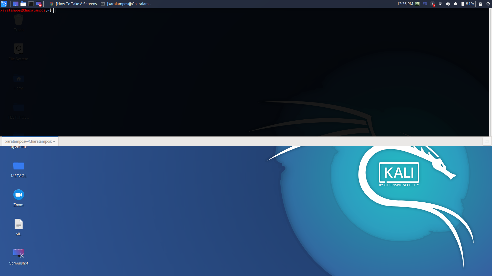
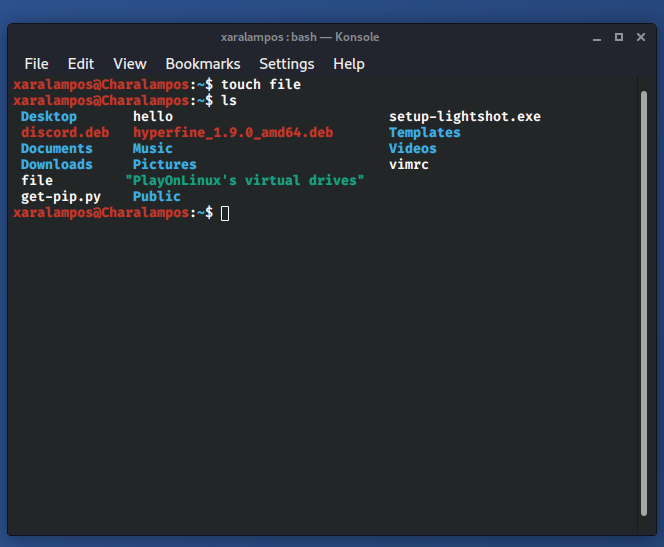
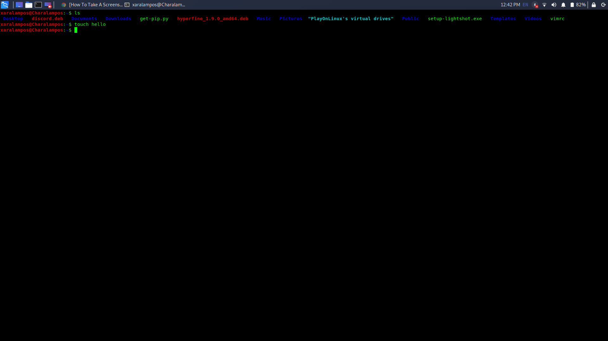
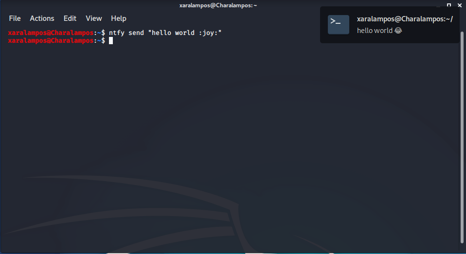

# ΙΟΝΙΟ ΠΑΝΕΠΙΣΤΗΜΙΟ, ΤΜΗΜΑ ΠΛΗΡΟΦΟΡΙΚΗΣ 
## ΜΑΘΗΜΑ Τεχνολογία Λογισμικού

## Στοιχεία φοιτητή  
### Χαράλαμπος Στυλιανού
### ΑΜ: Π2017173

## Σύνοψη

Η αναφορά περιέχει τα links του συμμετοχικού εκπαιδευτικού υλικού αλλά και όλα τα assignments που ζητήθηκαν και με τα κατάλληλα asciinema video και  screenshots. 

## Σύντομη εισαγωγή

Στόχος του μαθήματος ήταν ο πειραματισμός και η εξοικείωση με εργαλεία που είναι κατά βάση μόνο command line με την χρήση ενός virtual machine, που μέσω του VirtualBox εγκατέστησα Ubuntu και μέσω άλλου υπολογιστή με kali. Κάθε assignment που ακολουθεί περιέχει ένα asciinema link ή screenshot.


## Συμμετοχικό περιεχόμενο

[mibook link](https://p17styl.netlify.com/)

[1η εικόνα](https://p17styl.netlify.com//gallery/amazon-alexa/)

[2η εικόνα](https://p17styl.netlify.com//gallery/unity/)

[1ο διαδραστικό παράδειγμα](https://p17styl.netlify.app/remix/terminal/)

[2o διαδραστικό παράδειγμα](https://p17styl.netlify.app/remix/platformgame/)

## Terminal
## Πρώτο Παραδοτέο : 
### Try different terminals and shells
#### Terminals

screenshots(guake/konsole/tilda)

```
sudo apt-get -f install guake 
sudo apt-get -f install konsole
sudo apt-get -f install tilda
```

##### Guake



##### Konsole



##### Tilda



Η διαφορά που βρήκα ανάμεσα στα δυο terminals είναι ότι το konsole έχει μενού το οποίο βοηθά τον χρήστη κυρίως αν είναι αρχάριος. Επίσης στο μενού υπάρχουν και τα shortcuts των διάφορων επιλογών. 
Το  tilda δεν έχει μενού  και είναι σε full screen mode και μπορείς να το κρύβεις και να το ξανά εμφανίζεις όταν πατάς το κουμπί f1.
Δεν φαίνονται στα ποιο πάνω βίντεο οι διαφορές απλά χρησιμοποιούσα άπλες εντολές. Επίσης υπάρχει μια διαφορά στο τρόπο αναπαράστασης κάποιων εντολών και στα χρώματα όμως για κάποιο λόγο δεν εμφανίζονται στα βίντεο του asciinema.


#### Shells

[fish asciinema link](https://asciinema.org/a/311087)

```
brew install fish
```
Όλες οι πληροφορίες που χρειάζεσαι για το fish μπορείς να τις βρεις [εδώ](https://fishshell.com/).

Το fish είναι ένα πολύ καλό και εύχρηστο shell γιατί σου παρέχει πολλές ευκολίες στο χρήστη σε χρώμα, αυτόματη συμπλήρωση κτλ.

## Δεύτερο Παραδοτέο : 
### performance monitoring
[Asciinema Link 2](https://asciinema.org/a/311417)

Με τη χρήση του hyperfine μπορούμε να συγκρίνουμε 2 scripts σε python με  τον μέσο χρόνο εκτέλεσης τους. Το hyperfine  έχει την ιδιότητα να κάνεις warmup τον κώδικα σου για να βγάλεις όσο το πιο δυνατό πιο σωστό χρόνο και έχεις την δυνατότητα να διαλέξεις πόσες φορές να εκτελεστεί ο κάθε κώδικας και να σου δώσει τον μέσο χρόνο τους και τη διαφορά χρόνου που έχουν όπως το παράδειγμα στο λινκ του Asciinema.


## Τρίτο Παραδοτέο :
### send notifications to your desktop-mobile
[ntfy Asciinema](https://asciinema.org/a/320655)




## Τέταρτο Παραδοτέο :
### choose your stack
Το howdoi σε βοήθα όταν έχεις ξεχάσει κάποια εντολή στο terminal. 

Για παράδειγμα :

```
howdoi create a folder
howdoi install
howdoi update 
```

[howdoi asciinema link](https://asciinema.org/a/320671)

Το fuck σε βοήθα όταν έχεις πληκτρολόγησης μια εντολή στο terminal και την έχεις γράψει λάθος ή ξέχασες πως γράφεται ακριβώς.Όταν κάνεις μια εντολή λάθος πληκτρολογείς την εντολή fuck και σου βγάζει τις προτεινόμενες λύσεις.

 Για παράδειγμα : 
 
```
echho hello
fuck
echo hello
```

[fuck asciinema link](https://asciinema.org/a/320674)

## Πέμπτο Παραδοτέο :
### use the terminal as the IDE
#### using VIM

[Asciinema Link 5](https://asciinema.org/a/326676)

```
i = insert
Esc = exit insert
:wq = save and quit
```

## Έκτο Παραδοτέο :
### set-up a system for python development
#### using pipenv
[Asciinema Link 6](https://asciinema.org/a/326724)

```
sudo apt-get install python3-pip
sudo apt-get install python3-venv
sudo pip3 install pipenv 
pipenv install psutil
pipenv shell
vi test2.py
:wq
python3 test2.py
exit
```

## Έβδομο Παραδοτέο : 
### Set-up cloud services
#### Ssh to a remote machine and demonstrate your remote cli user land (e.g., email, editor, cv, code, etc)

```
sudo apt-get install openssh-server
ssh localhost 
ssh machine_username@machine_ip (To connect on other machine)
sudo nano /etc/ssh/sshd_config (To modify the config file)
```

[Asciinema Link](https://asciinema.org/a/335534)


## Συμπεράσματα

Μετά από την ολοκλήρωση των  εργασιών είναι πως μπορουμε να δουμε μια αλλη πλευρα κυριος χωρις UI , ο οποίος μας επιτρέπει να προγραμματίσουμε ή να προσαρμόσουμε στα δικα μας μετρα οτιδήποτε θελουμε εμεις. Επίσης μπορείς να δεις οτι με τη χρήση του terminal σε γενικές γραμμές είναι αρκετά ελαφριά η χρήση και μπορεί να γίνει αρκετά εύκολη η χρήση με τα κατάλληλα εργαλεία όπως για παράδειγμα η εντολή fuck και howdoi που ήταν ενα απο τα assignments.


