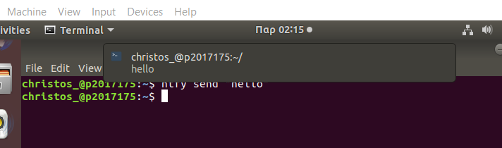
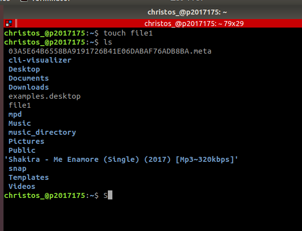
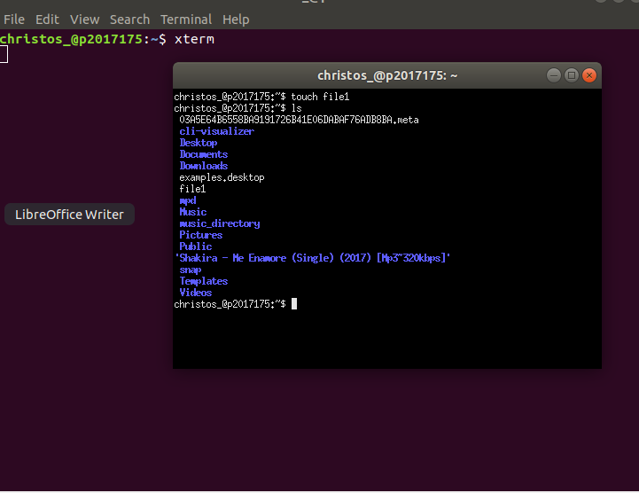

# ΙΟΝΙΟ ΠΑΝΕΠΙΣΤΗΜΙΟ, ΤΜΗΜΑ ΠΛΗΡΟΦΟΡΙΚΗΣ 
## Μάθημα : Τεχνολογία Λογισμικού
## Kαθηγητής: Χωριανόπουλος Κωνσταντίνος 

## Στοιχεία φοιτητή : Χρίστος Δημοσθένους
### ΑΜ: Π2017175 

## Συμμετοχικό εκπαιδευτικό υλικό

https://p17dimo.netlify.com/

https://p17dimo.netlify.com//gallery/coding/

https://p17dimo.netlify.com//gallery/vr/

### Πρώτο παραδοτέο
#### Send notifications to your desktop-mobile
Έχω χρησιμοποιήσει το ntfy

### Δεύτερο παραδοτέο
#### Try different terminals and shells
#### Terminator

#### Xterm

### Τρίτο Παραδοτέο
#### Performance Monitoring
Έχω χρησιμοποιήσει το hyperfine για να συγκρίνω δύο scripts στην γλώσσα python τον μέσο χρόνο εκτέλεσης τους
#### ascinema : https://asciinema.org/a/326688

### Τέταρτο Παραδοτέο
#### choose your stack
To howdoi μας βοήθα όταν έχουμε σκάλωσει με μιά εντολή στο terminal και την ξεχάσαμε.Γράφουμε τι θέλουμε και μας δίνει την απάντηση στην επόμενη γραμμή
#### asciinema : https://asciinema.org/a/329110

### Πέμπτο Παραδοτέο
#### Use the terminal as the IDE
#### asciinema : https://asciinema.org/a/329116

### Έκτο Παραδοτέο
#### Set-up a system for python development
#### asciinema : https://asciinema.org/a/329125
