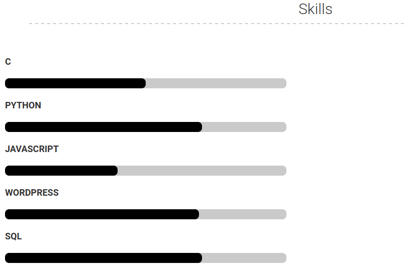

## ΠΡΟΣΩΠΙΚΑ ΣΤΟΙΧΕΙΑ:

### Κοτσαγιαννίδης Πέτρος
### ΑΜ: Π2017189
### [Github Profile](https://github.com/p17kots)

| Εβδομάδα* |Παραδοτέο|
| --- | --- 
| <a href="#P">1</a> | <α href="#P"> Φορκ του αποθετηρίου και δημιουργία της σελίδας της αναφοράς με τα προσωπικά στοιχεία σας, της σύνοψης με αυτόν τον πίνακα περιεχομένων, και συγγραφή της εισαγωγής με περιγραφή των αναγκών και των στόχων σας για το αντίστοιχο μάθημα*</a> |
|<a href="#P-1"> 2 </a>  |<a href="#P-1"> βιογραφικό</a> |
| 3 | Αίτημα ενσωμάτωσης στην ιστοσελίδα |
| 4 | Άσκηση γραμμής εντολών |
| 5 | Συμμετοχικό περιεχόμενο |
| 6 | Άσκηση γραμμής εντολών |
| 7 | βιογραφικό |
| 8 | Αίτημα ενσωμάτωσης στην ιστοσελίδα |
| 9 | Άσκηση γραμμής εντολών |
| 10 | συμμετοχικό περιεχόμενο |
| 11 | Άσκηση γραμμής εντολών |
| 12 | Τελική αναφορά* 

### <a name="P">ΕΙΣΑΓΩΓΗ:</a>

Το μάθημα επικεντρώνεται στην διάδραση του χρήστη με το λογισμικό ενός πολυμεσικού υπολογιστή.Προσωπικός μου στόχος,είναι να βελτιώσω τις γνώσεις και τις δεξιότητες μου στό κομμάτι των βασικών δομικών στοιχέιων του λογισμικού ενός υπολογιστικού συστήματος(π.χ γραμμή εντολών,επεξεργασία αρχείων,κώδικας) καθώς και να ανακαλύψω εργαλεία που θα με βοηθήσουν να εξατομικεύσω την διαδρασή μου με τον υπολογιστή.  

### <a name="P-1">Βιογραφικό:</a>

### [Βιογραφικό](https://p17kots.github.io/cv/)
### [Αποθετήριο](https://github.com/p17kots/cv)

Για την πλήρη υλοποίηση του βιογραφικού χρησιμοποιήθηκαν τα εξής εργαλεία: github-pages,jekyll,latex,padoc.Πιο συγκεκριμένα,έγινε χρήση [αυτού](https://github.com/sproogen/modern-resume-theme) του αποθετηρίου σαν φόρμα βιογραφικού,το οποίο βασίζεται στο jekyll.Το βιογραφικό παρέχεται και σε μορφή [PDF](https://p17kots.github.io/cv/cv.pdf),μέσω της σελίδας.
Πέρα από την συμπλήρωση και παραμετροποίηση του βιογραφικού,προστέθηκε παραπάνω λειτουργικότητα στην διαδικασία υλοποίησης και παραπάνω υλικό στην προϋπάρχουσα φόρμα.Για την ακρίβεια,προστέθηκαν διαδραστικές μπάρες οι οποίες αναφέρονται στις μέχρι τώρα εξειδικεύσεις που έχω αποκτήσει και στο ποσοστό γνώσεων μου πάνω σεαυτές. 

#### Ενδεικτικό screeshot

Επίσης,υλοποιήθηκε [πρόγραμμα](https://github.com/p17kots/cv/blob/main/when_changes.py) σε python το οποίο κάθε φορά που γίνεται αλλαγή στο YML αρχείο,κάνει επανεκκίνηση τον τοπικό εξυπηρετητή για να φανούν οι αλλαγές,χωρίς να χρειάζεται να το κάνω χειροκίνητα σε κάθε αλλαγή.Απλά τρέχω μία φορά το πρόγραμμα στην αρχή.

