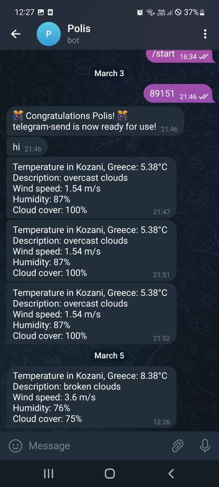

# Τεχνολογία Λογισμικού

Ονοματεπώνυμο: Στεφανίδης Πολύδωρος

GitHub Profile: [p18stef](https://github.com/p18stef)

Organization: [AwayFromKeyboardd](https://github.com/AwayFromKeyboardd)

ΑΜ: Π2018139

| Εβδομάδα | [Όλα τα παραδοτέα βρίσκονται στην ίδια σελίδα της τελικής αναφοράς](https://epidrome.github.io/teaching/deliverables/) με τα προσωπικά στοιχεία σας (Όνομα, ΑΜ, github profile) και μαζί με αυτόν εδώ τον πίνακα περιεχομένων | Σύνδεσμος στην [εβδομαδιαία παρουσίαση προόδου στις συζητήσεις](https://github.com/courses-ionio/help/discussions/categories/show-and-tell) | Αυτοαξιολόγηση σύμφωνα με τα κριτήρια της αντίστοιχης άσκησης |
| --- | --- | --- | --- |
| [1]() | [Δημιουργία ομάδας](https://epidrome.github.io/teaching/team/) + [Φορκ και δημιουργία σελίδας τελικής αναφοράς](https://epidrome.github.io/teaching/guide/), [προσθήκη πίνακα περιεχομένων](https://raw.githubusercontent.com/courses-ionio/sw/master/README.md), [συγγραφή της εισαγωγής](https://epidrome.github.io/teaching/intro/), αποστολή της εισαγωγής [για σχολιασμό στην συζήτηση](https://github.com/courses-ionio/sw/discussions/categories/show-and-tell) και καταγραφή του συνδέσμου συζήτησης δίπλα --> | [Συζήτηση](https://github.com/courses-ionio/sw/discussions/1173) | |
| [2]() | Γραμμή εντολών (systemd) και διαδικασία συνεργασίας με pull request στον οργανισμό της ομάδας σας |  | |
| [3] | Γραμμή εντολών (no systemd) |  | |
| [4]() | Κατασκευή του βιβλίου Α2 (συνεργατικά) |  | |
| [5]() | Συμμετοχικό περιεχόμενο A1 + A2 |  | |
| [6]() | Γραμμή εντολών (custom static blog generator) |  | |
| [7]() | Συμμετοχικό περιεχόμενο B1 |  | |
| [8]() | Κατασκευή του βιβλίου Β2 (συνεργατικά) |  | |
| [9]() | Συμμετοχικό περιεχόμενο B2 |  | |
| [10]() | Τελική αναφορά* |  | |

## 1o ΠΑΡΑΔΟΤΕΟ: ΕΙΣΑΓΩΓΗ ΚΑΙ ΔΗΜΙΟΥΡΓΙΑ ΟΜΑΔΩΝ
 Στο συγκεκριμένο παραδοτέο σκοπεύω να διατυπώσω τους στόχους μου σχετικά με την παρακολούθηση του μαθήματος τεχνολογίες λογισμικού. Ερχόμενος από το προηγούμεμνο μάθημα επικοινωνία ανθρώπου υπολογιστή θα ήθελα να εξοικειωθώ ακόμη περισσότερο με την πλατφόρμα του github, το λειτουργικό σύστημα του linux αλλά και με την χρήση του τερματικού cmd. Το υποκειμενικό στοιχείο που θα παρουσιάζει η αναφορά μου θα στοχεύει στην ασφάλεια δικτύων και εφαρμογών μιας και είναι το θέμα της πτυχιακής μου εργασίας στην οποία θα δουλεύω ταυτόχρονα. Το κομμάτι αυτό θα προσπαθήσω να το εμφανίσω τόσο στις ασκήσεις γραμμής εντολών όσο και στο συμμετοχικό περιεχόμενο.
 
 ## 2o ΠΑΡΑΔΟΤΕΟ: Γραμμή εντολών (systemd)
Σε αυτό το σκέλος της εργασίας καλούμαστε να ολοκληρώσουμε μια άσκηση γραμμής εντολών. Πιο συγκεκριμένα επέλεξα να χρησιμοποιήσω την εφαρμογή του telegram και μέσω του ntfy να στέλνω ειδοποιήσεις στο κινητό μου σχετικά με τον καιρό της πόλης μου. Αρχικά έκανα install το ntfy  στο σύστημα linux, στην συνέχεια κατέβασα στο κινητό μου την εφαρμογή του telegram. Μέσω telegram δημιούργησα ένα bot και χρησιμοποίησα το token που μου έδωσε ώστε να εξασφαλίσω την εποικινωνία. Στην συνέχεια βρήκα έναν κώδικα σε python [ Εδώ ](polis.py) σχετικά με την διεργασία που ήθελα εγώ να εκτελεί. Στην συνέχεια θα παρουσιάσω δύο scrennshots τα οποία σχετίζονται με τις ειδοποιήσεις που έρχονται στο κινητό αλλά και μία μικρή συνομιλία με το bot του τύπου "hi"

- [asciinema neofetch](https://asciinema.org/a/o4XS6TphLhfJjSjCEi3hnc77g)

- [asciinema telegram](https://asciinema.org/a/TPSk9GpfopDdQi5kPnKySd7dO)

Σε αυτά τα δύο links βλέπουμε την εκτέλεση μιας απλής εντολής τύπου warm up και μία γραμμής εντολών τύπου systemd με την λειτουργία του python script.
