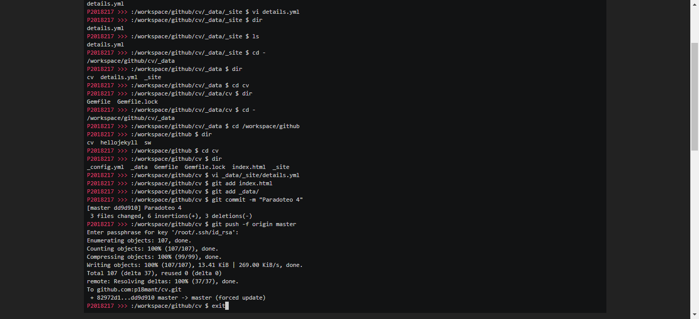
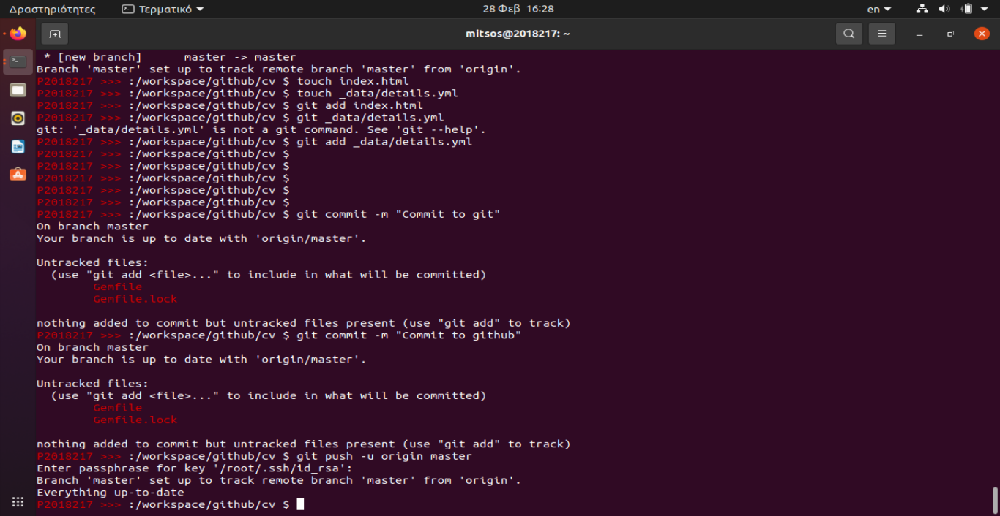
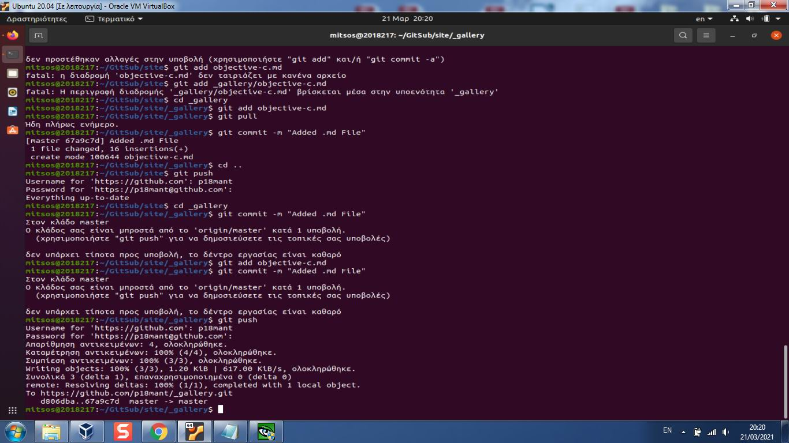
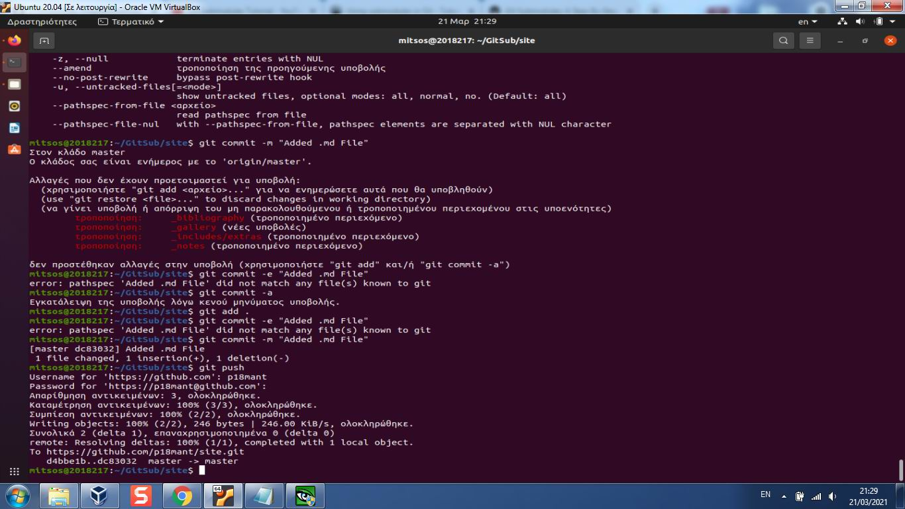

# Μάθημα: Τεχνολογία Λογισμικού
## Ονοματεπώνυμο: Δημήτριος Μαντζιώρης
### Αριθμός Μητρώου: Π2018217
### [GitHub Profile](https://github.com/p18mant)

| Εβδομάδα* | Παραδοτέο |
| --- | --- |
| 1 | Εισαγωγή/Δημιουργία της σελίδας της αναφοράς με τα προσωπικά στοιχεία* <a href="#1">[Παραδοτέο 1]</a>|
| 2 | Βιογραφικό <a href="#2">[Παραδοτέο 2]</a>|
| 3 | Αίτημα ενσωμάτωσης στην ιστοσελίδα <a href="#3">[Παραδοτέο 3]</a>|
| 4 | Άσκηση γραμμής εντολών <a href="#4">[Παραδοτέο 4]</a>|
| 5 | Συμμετοχικό περιεχόμενο <a href="#5">[Παραδοτέο 5]</a>|
| 6 | Άσκηση γραμμής εντολών|
| 7 | Βιογραφικό |
| 8 | Αίτημα ενσωμάτωσης στην ιστοσελίδα |
| 9 | Άσκηση γραμμής εντολών |
| 10 | Συμμετοχικό περιεχόμενο |
| 11 | Άσκηση γραμμής εντολών |
| 12 | Τελική αναφορά* |

### [1]
## Παραδοτέο 1</a>
## Εισαγωγή
### Στόχος
- Στόχος του μαθήματος είναι η μελέτη των βασικών αρχών και εννοιών της Τεχνολογίας Λογισμικού. 
- Για κάθε βασική αρχή / έννοια θα υπάρξει μελέτη και εφαρμογή σε μία τουλάχιστον σχετική μεθοδολογία μέσα από παραδείγματα εργαλείων που τις υποστηρίζουν. 
- Μέσα από διαφορετικές ασκήσεις θα εντρυφήσουμε στην επίλυση πρακτικών προβλημάτων της Τεχνολογίας Λογισμικού.
### Ανάγκες
 Οι Ανάγκες από την παρακολούθηση του μαθήματος αφορoύν:
- Aξιοποίηση των εργαλείων της πλατφόρμας (github) καθώς και των λειτουργιών της. 
- Δυνατότητες συνεργασίας με συμφοιτητές και διδάσκοντες.
- Ανίχνευση και επίλυση σφαλμάτων.
- Ορθή κατανομή στη διαχείριση εργασιών.
- Oικοδόμηση γνώσης για την κατασκευή διαδραστικών πρωτοτύπων και εφαρμογών. 
### Κεντρική προϋπόθέση επίτευξης του Σ Τ Ο Χ Ο Υ :
   - Καθημερινή ενασχόληση προς απόκτηση γνωστικής και πρακτικής επάρκειας, με απώτερο στόχο τη βέλτιστη αξιοποιήση των διαθέσιμων εργαλέιων στην πράξη.

### [2]
## Παραδοτέο 2</a>
## Βιογραφικό Σημείωμα με χρήση γραμμής εντολών σε απλή μορφή
### [Asciinema Link 1](https://asciinema.org/a/395269)
### [Asciinema Link 2](https://asciinema.org/a/395827)
### [Σελίδα Βιογραφικού Σημειώματος](https://p18mant.github.io/cv/)
### [Σελίδα Βιογραφικού Σημειώματος με χρήση Netlify](https://ecstatic-euclid-5ce1d6.netlify.app/)
### [Αποθετήριο Βιογραφικού Σημειώματος](https://github.com/p18mant/cv)

## Βιογραφικό Σημείωμα με χρήση tamplate
### [Σελίδα Βιογραφικού Σημειώματος](https://p18mant.github.io/online-cv/)
### [Σελίδα Βιογραφικού Σημειώματος με χρήση Netlify](https://competent-agnesi-a3b96e.netlify.app/)
### [Αποθετήριο Βιογραφικού Σημειώματος](https://github.com/p18mant/online-cv/)

### [3]
## Παραδοτέο 3</a>
## 1ο Αιτήμα Ενσωμάτωσης στην Ιστοσελίδα του Τμήματος Πληροφορικής
### [Σελίδα 1ου Αιτήματος Ενσωμάτωσης](https://epic-keller-5f60f1.netlify.app/posts/2020/11/04/aristeia-ionio-panepistimio/)
### [Αποθετήριο 1ου Αιτήματος Ενσωμάτωσης](https://github.com/p18mant/sitegr/tree/2018217)

### [4]
## Παραδοτέο 4</a>
## Άσκηση γραμμής εντολών: set-up continuous integration
Σε αυτή την εργασία πραγματοποίησα αλλαγές στο repository του βιογραφικού  πού είχα φτίαξει σε προηγούμενη άσκηση μέσω της γραμμής εντολών.

## Εκπλήρωση ζητούμενων πρώτης εργασίας
* [x] Άλλαξα το περιεχόμενο των αρχείων details.yml _site/details.yml και index.html μέσω του VI editor
* [x] Ενημέρωσα το repository με το νέο περιεχόμενο κάνοντας push.

#### [Σύνδεσμος Άσκησης γραμμής εντολών 1](https://asciinema.org/a/399052)
#### [Σύνδεσμος Άσκησης γραμμής εντολών 2](https://asciinema.org/a/399058)

### [5]
## Παραδοτέο 5</a>
## Συμμετοχικό Περιεχόμενο: Προσθήκη φωτογραφίας στο Ηλεκτρονικό Βιβλίο Ο Προγραμματισμός της Διάδρασης
* [x] Ενημέρωσα το repository του βιβλίου μέσω των submodules και CLI με το νέο περιεχόμενο/φωτογραφία κάνοντας push.

## 1η Άσκηση Συμμετοχικού Περιεχομένου
### [Ιστοσελίδα Βιβλίου - Ο Προγραμματισμός της Διάδρασης](https://optimistic-bartik-1be75a.netlify.app/)
### [1η Φωτογραφία Άσκησης Συμμετοχικού Περιεχομένου](https://optimistic-bartik-1be75a.netlify.app/gallery/objective-c/)
### [2η Φωτογραφία Άσκησης Συμμετοχικού Περιεχομένου](https://optimistic-bartik-1be75a.netlify.app/gallery/python/)
### [Αποθετήριο Συμμετοχικού Περιεχομένου](https://github.com/p18mant/site)

#### [Σύνδεσμος γραμμής εντολών Συμμετοχικού Περιεχομένου part-1](https://asciinema.org/a/401005)
#### [Σύνδεσμος γραμμής εντολών Συμμετοχικού Περιεχομένου part-2](https://asciinema.org/a/400622)
#### [Σύνδεσμος γραμμής εντολών Συμμετοχικού Περιεχομένου part-3](https://asciinema.org/a/401045)

