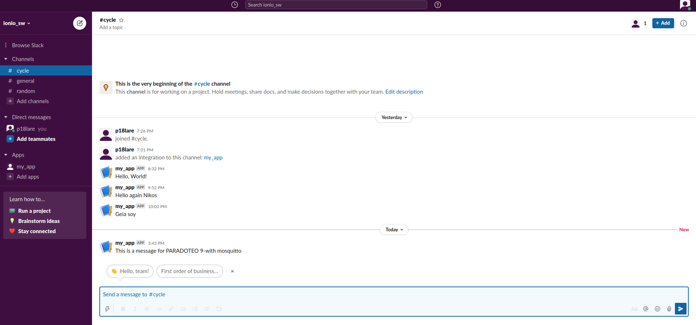

# μάθημα: ΤΕΧΝΟΛΟΓΙΑ ΛΟΓΙΣΜΙΚΟΥ
### ΛΑΡΕΝΤΖΑΚΗΣ ΝΙΚΟΛΑΟΣ
### ΑΜ: 2018220
### e-mail: p18lare@ionio.gr
### [Προφίλ στο github](https://github.com/cyclenikolaos)
### [Σύνδεσμος αποθετηρίου του μαθήματος SW](https://github.com/cyclenikolaos/sw)

Οι διαθέσιμες εργασίες είναι αυτές που έχουν τον κωδικό SW

| <a name="start">Εβδομάδα</a> | Παραδοτέο |
| --- | --- |
| 1 | <a href="#Παραδοτέο 1">Φορκ του αποθετηρίου και δημιουργία της σελίδας της αναφοράς με τα προσωπικά στοιχεία σας, της σύνοψης με αυτόν τον πίνακα περιεχομένων, και συγγραφή της εισαγωγής με περιγραφή των αναγκών και των στόχων σας για το αντίστοιχο μάθημα* |</a>
| 2 | <a href="#Παραδοτέο 2">βιογραφικό |</a>
| 3 | <a href="#Παραδοτέο 3">Αίτημα ενσωμάτωσης στην ιστοσελίδα |</a>
| 4 | <a href="#Παραδοτέο 4">Άσκηση γραμμής εντολών |</a>
| 5 | <a href="#Παραδοτέο 5">Συμμετοχικό περιεχόμενο |</a>
| 6 | <a href="#Παραδοτέο 6">Άσκηση γραμμής εντολών |</a>
| 7 | <a href="#Παραδοτέο 7">βιογραφικό |</a>
| 8 | <a href="#Παραδοτέο 8">Αίτημα ενσωμάτωσης στην ιστοσελίδα |</a>
| 9 | <a href="#Παραδοτέο 9">Άσκηση γραμμής εντολών |</a>
| 10 | <a href="#Παραδοτέο 10">συμμετοχικό περιεχόμενο |</a>
| 11 | <a href="#Παραδοτέο 11">Άσκηση γραμμής εντολών |</a>
| 12 | <a href="#Παραδοτέο 12">Τελική αναφορά* |</a>

Στο μάθημα αυτό έχω σκοπό να μελετήσω τη θεωρία και να κάνω πρακτική εξάσκηση στη σχεδίαση και ανάπτυξη λογισμικού. Θα προσπαθήσω να ολοκληρώσω όλα τα παραδοτέα ώστε να κατανοήσω τα βήματα που πρέπει να ακολουθούνται κατά τη διαδικασία της οργάνωσης του λογισμικού.

## <a name="Παραδοτέο 1">Παραδοτέο 1</a>
### <a href="#start">Εισαγωγή</a>
Στο πλαίσιο του πρώτου παραδοτέου, έκανα τις ζητούμενες ενέργειες ώστε να δημιουργήσω το δικό μου αποθετήριο του μαθήματος και το δικό μου κλαδί με όνομα τον αριθμό μητρώου μου.

## <a name="Παραδοτέο 2">Παραδοτέο 2</a>
## ΒΙΟΓΡΑΦΙΚΟ

### [Σύνδεσμος αποθετηρίου CV](https://github.com/cyclenikolaos/cv)
### [Εκτελέσιμο του βιογραφικού μου](https://cyclenikolaos.github.io/cv/)

## <a name="Παραδοτέο 3">Παραδοτέο 3</a>
## Αίτημα ενσωμάτωσης στην ιστοσελίδα του Ιονίου Πανεπιστημίου
  
Έκανα προσθήκη του καθηγητή Χάρη Μουρατίδη στους επισκέπτες καθηγητές
### [Σύνδεσμος pull request](https://github.com/ioniodi/sitegr/pull/87#pullrequestreview-606593660)
### [Εκτελέσιμο](https://hopeful-rosalind-f96cf5.netlify.app/people/)

## <a name="Παραδοτέο 4">Παραδοτέο 4</a>
## 1η άσκηση γραμμής εντολών</a>

Έκανα clone το αποθετήριό μου και μετά από τροποποίηση, έκανα add, commit και push στο κλαδί master
### [asciinema link Παραδοτέο 4](https://asciinema.org/a/399140)

## <a name="Παραδοτέο 5">Παραδοτέο 5</a>
## 1ο συμμετοχικό περιεχόμενο</a>

Έκανα fork τα repository site, images, _gallery. Έκανα εισαγωγή των φωτογραφιών και thumb και δημιούργησα τα md αρχεία. Από το τερματικό, έκανα clone το site, συνέδεσα τα submodule και έκανα push τις αλλαγές στο cyclenikolaos/site.

### [Αποθετήριο _gallery](https://github.com/cyclenikolaos/_gallery)
### [Αρχείο fortran.md](https://github.com/cyclenikolaos/_gallery/blob/83050198b91bf890c7378f42d8578bb997eaed57/fortran.md)
### [Αρχείο multitouch.md](https://github.com/cyclenikolaos/_gallery/blob/83050198b91bf890c7378f42d8578bb997eaed57/multitouch.md)
### [Αποθετήριο images](https://github.com/cyclenikolaos/images)
### [Εικόνα fortran.jpg](https://github.com/cyclenikolaos/images/blob/master/fortran.jpg)
### [Εικόνα fortran-thumb.jpg](https://github.com/cyclenikolaos/images/blob/master/fortran-thumb.jpg)
### [Εικόνα multitouch.jpg](https://github.com/cyclenikolaos/images/blob/master/multitouch.jpg)
### [Εικόνα multitouch-thumb.jpg](https://github.com/cyclenikolaos/images/blob/master/multitouch-thumb.jpg)
### [asciinema link Παραδοτέο 5](https://asciinema.org/a/400978)
### [Εκτελέσιμο Netlify](https://cyclenikolaos.netlify.app/)

## <a name="Παραδοτέο 6">Παραδοτέο 6</a>
## 2η άσκηση γραμμής εντολών - set-up continuous integration</a>

Κατέβασα την εφαρμογή ntfy για την αποστολή στο desktop ειδοποίησεων όταν ολοκληρώνεται ένα task. Κατέβασα το εργαλείο youtube-dl της python για το κατέβασμα video από το youtube. Δημιούργησα το αρχείο ntfy.yml. Έκανα ανακατεύθυνση στο αρχείο syslog
### [asciinema link Παραδοτέο 6](https://asciinema.org/a/403520)

## <a name="Παραδοτέο 7">Παραδοτέο 7</a>
## Βιογραφικό - Δημιουργία αρχείου pdf</a>

* [x] Εγκατέστησα το weasyprint με την εντολή pip3 install weasyprint
* [x] Δημιούργησα το φάκελο pdf στο σκληρό μου δίσκο για να αποθηκεύεται το βιογραφικό μου μορφή pdf
* [x] Δημιούργησα μέσα στο φάκελο .git/hooks το αρχείο post-commit ώστε να τρέχει την εντολή weasyprint με κάθε commit
### [asciinema link Παραδοτέο 7](https://asciinema.org/a/oDsbcxAwRzW9d567Vp7NKmVP0)

## <a name="Παραδοτέο 8">Παραδοτέο 8</a>
## Αίτημα ενσωμάτωσης στην ιστοσελίδα του Ιονίου Πανεπιστημίου

Έχω ανεβάσει το [issue #205](https://github.com/ioniodi/sitegr/issues/205) ώστε να προσθέσω το λογότυπο του τμήματος στην αρχική σελίδα. Θα τροποποιήσω το _config.yml του sitegr αποθετηρίου προκειμένου να παίρνει το remote theme από το δικό μου αποθετήριο minimal-ionio. Θα τροποποιήσω το _config.yml του minimal-ionio. Επίσης, θα τροποποιήσω το masterhead.html στο minimal-ionio.

## <a name="Παραδοτέο 9">Παραδοτέο 9</a>
## 3η άσκηση γραμμής εντολών - Δημιουργία ειδοποιήσεων στο server μου</a>

Πραγματοποίησα:
* [x] Δημιουργία λογαριασμού, workspace και channel στο [Slack](https://app.slack.com/client/T020AJNNFQR/C020AJR2B25/user_profile/U01V8TPAW9K)
* [x] Εγκατάσταση του mosquitto
* [x] Εγκατάσταση του mosquitto-client
* [x] Εγκατάσταση του mqttwarn
* [x] Τροποποίηση του αρχείου mqttwarn.ini

Ανέβασα στο [asciinema](https://asciinema.org/a/409789) video για τη λειτουργία του mqttwarn και τη λήψη του notification
