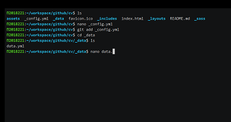
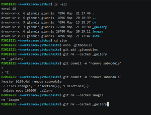
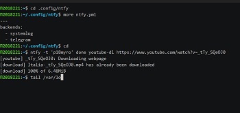

# ΜΑΘΗΜΑ: ΤΕΧΝΟΛΟΓΙΑ ΛΟΓΙΣΜΙΚΟΥ
### Αριθμός Μητρώου: Π2018221
### Ονοματεπώνυμο: Μυρώνης Ιωάννης
### [Προφίλ στο github](https://github.com/p18myro 'Προφίλ στο github')

| Εβδομάδα* | Παραδοτέο |
| --- | --- |
| 1 |<a href="#Παραδοτέο 1"> Φορκ του αποθετηρίου και δημιουργία της σελίδας της αναφοράς με τα προσωπικά στοιχεία σας, της σύνοψης με αυτόν τον πίνακα περιεχομένων, και συγγραφή της εισαγωγής με περιγραφή των αναγκών και των στόχων σας για το αντίστοιχο μάθημα.</a> |
| 2 |<a href="#Παραδοτέο 2"> βιογραφικό </a> |
| 3 | <a href="#Παραδοτέο 3"> Αίτημα ενσωμάτωσης στην ιστοσελίδα  </a>|
| 4 | <a href="#Παραδοτέο 4"> Άσκηση γραμμής εντολών  </a>|
| 5 | <a href="#Παραδοτέο 5"> Συμμετοχικό περιεχόμενο  </a>|
| 6 | <a href="#Παραδοτέο 6"> Άσκηση γραμμής εντολών </a>|
| 7 | <a href="#Παραδοτέο 7"> βιογραφικό </a> |
| 8 | <a href="#Παραδοτέο 8"> Αίτημα ενσωμάτωσης στην ιστοσελίδα  </a>|
| 9 | <a href="#Παραδοτέο 9"> Άσκηση γραμμής εντολών  </a>|
| 10 | <a href="#Παραδοτέο 10"> συμμετοχικό περιεχόμενο </a> |
| 11 | <a href="#Παραδοτέο 11"> Άσκηση γραμμής εντολών </a>|
| 12 | <a href="#Παραδοτέο 12"> Τελική αναφορά*  </a>|

## ΕΙΣΑΓΩΓΗ

Σκοπός του μαθήματος τεχνολογία λογισμικού είναι η ενασχόληση με τις βασικές αρχές του μαθήματος μέσω ατομικών αλλά και συνεργατικών ασκήσεων. Μέσω των διαφόρων ειδών ασκήσεων, θα εκπαιδευτούμαι στην χρήση εργαλείων που αφορούν την ανάπτυξη εφαρμογών ακολουθώντας τις τεχνολογικές εξελίξεις.

## Παραδοτέα Μαθήματος
  
### <a name="Παραδοτέο 1">Παραδοτέο 1</a>
### Δημιουργία Αποθετηρίου
Έγινε fork του [αποθετηρίου του μαθήματος](https://github.com/courses-ionio/sw) και δημιουργία ενός νέου branch με όνομα τον αριθμό μητρώου μου. Ακολούθως,  μέσα στον φάκελο projects έγινε δημιουργία ενός φακέλου με όνομα τον αριθμό μητρώου μου και του αρχείου της τελικής αναφοράς.
### <a name="Παραδοτέο 2">Παραδοτέο 2</a>
### ΒΙΟΓΡΑΦΙΚΟ
Δημιουργία βιοργαφικού σημειώματος. Έκανα τις κατάλληλες αλλαγές στα αρχεία config.yml, assets/images, _sass/_base.scss και εισήγαγα τα στοιχεία μου στο _data/data.yml
#### [Σύνδεσμος  αποθετηρίου CV](https://github.com/p18myro/cv)
#### [Εκτελέσιμο CV](https://p18myro.github.io/cv/)

### <a name="Παραδοτέο 3">Παραδοτέο 3</a>
### Αίτημα ενσωμάτωσης στην ιστοσελίδα  
Προσθήκη περιεχομένου στην ιστοσελίδα του τμήματος. Εγίνε προσθήκη του ΕΔΙΠ του τμήματος Γιώργου Κατωμερη.
#### [Σύνδεσμος pull request](https://github.com/ioniodi/sitegr/pull/86)
#### [Εκτελέσιμο Netlify](https://sleepy-northcutt-a221a8.netlify.app/people/katomeris/)

### <a name="Παραδοτέο 4">Παραδοτέο 4</a>
### Άσκηση γραμμής εντολών: set-up continuous integration
Σε αυτή την εργασία πραγματοποίησα αλλαγές στο repository του βιογραφικού  πού είχα φτίαξει σε προηγούμενη άσκηση μέσω της γραμμής εντολών.

### Εκπλήρωση ζητούμενων πρώτης εργασίας
* [x] Άλλαξα το περιεχόμενο των αρχείων _config.yml και data.yml μέσω του editor nano
* [x] Ενημέρωσα το repository με το νέο περιεχόμενο κάνοντας push.

#### [Σύνδεσμος Άσκησης γραμμής εντολών 1](https://asciinema.org/a/398838)

### <a name="Παραδοτέο 5">Παραδοτέο 5</a>
### Συμμετοχικό περιεχόμενο
Έγιναν fork τα repositories site, images και _gallery από το pibook. Στην συνέχεια έγινε προσθήκη από την  γραμμή εντολών των φωτογραφιών και των thumb στο repository images και δημιουργία ενός αρχείου .md για κάθε φωτογραφία στο repository _gallery. Στην συνέχεια έγινε clone το repository site στο terminal και σύνδεση των submodules. Τέλος έγιναν push οι αλλαγές  από το terminal στο site.

#### [Σύνδεσμος asciinema Συμμετοχικό περιεχόμενο ](https://asciinema.org/a/400966)

#### [Εκτελέσιμο Netlify site ](https://p18myro.netlify.app)
#### [Αρχείο simcity_Video  _gallery](https://github.com/p18myro/_gallery/blob/200ab4101d51ce4005f8c8b0146016d77e286391/simcity-videogame.md)
#### [Αρχείο Lisp programming language _gallery](https://github.com/p18myro/_gallery/blob/200ab4101d51ce4005f8c8b0146016d77e286391/Lisp-programming-language.md)
#### [Αρχείο images Lisp-programming-language-thumb.png](https://github.com/p18myro/images/blob/ba4db3bb2c825351132615ccd3f657b0bacc04e6/Lisp-programming-language-thumb.png)
#### [Αρχείο images Lisp-programming-language.png](https://github.com/p18myro/images/blob/ba4db3bb2c825351132615ccd3f657b0bacc04e6/Lisp-programming-language.png)
#### [Αρχείο images simcity-videogame-thumb.png](https://github.com/p18myro/images/blob/ba4db3bb2c825351132615ccd3f657b0bacc04e6/simcity-videogame-thumb.png)
#### [Αρχείο images simcity-videogame.png](https://github.com/p18myro/images/blob/ba4db3bb2c825351132615ccd3f657b0bacc04e6/simcity-videogame.png)
#### [Εκτελέσιμο Netlify gallery/lisp-programming-language ](https://p18myro.netlify.app/gallery/lisp-programming-language/)
#### [Εκτελέσιμο Netlify gallery/simcity-videogame ](https://p18myro.netlify.app/gallery/simcity-videogame/)
#### [Εκτελέσιμο Netlify slides/programming ](https://p18myro.netlify.app/slides/programming/)
#### [Εκτελέσιμο Netlify slides/videogames](https://p18myro.netlify.app/slides/videogames/)
#### [Εκτελέσιμο Netlify timeline/programming](https://p18myro.netlify.app/timeline/programming/)
#### [Εκτελέσιμο Netlify timeline/videogames](https://p18myro.netlify.app/timeline/videogames/)

### <a name="Παραδοτέο 6">Παραδοτέο 6</a>
### Άσκηση γραμμής εντολών: send notifications to your desktop-mobile
Αρχικά έκανα εγκατάσταση του ntfy για να παίρνω ειδοποιήσεις στο desktop pip3 install ntfy. Ακολούθως έγινε εγκατάσταση  του telegram pip3 install ntfy[telegram] και ρύθμιση ώστε να παίρνω ειδοποιήσεις στο κινητό τηλέφωνο.  Ακόμη έγινε εγκατάσταση  του emoji  pip3 install ntfy[emoji]. Στο επόμενο βήμα έγινε δημιουργία του ntfy.yml αρχείου μέσα στο .config/ntfy και τροποποίηση  του ώστε να στέλνει ειδοποιήσεις στο telegram και κάθε ειδοποίηση να εγγράφεται στο syslog όπως μπορούμε να δούμε και στο asciinema. Τέλος για την παρουσίαση της εργασίας έγινε εγκατάσταση του youtube-dl, κατέβασμα ενός βίντεο και εγγραφή του notification όταν ολοκληρώθηκε στο systemlog.

#### [Σύνδεσμος asciinema Συμμετοχικό περιεχόμενο ](https://asciinema.org/a/403530)

#### Screenshot application telegram

#### Screenshot ntfy Desktop

### <a name="Παραδοτέο 7">Παραδοτέο 7</a>
### ΒΙΟΓΡΑΦΙΚΟ
* [x] Εγκατάσταση του weasyprint μέσω pip: pip3 install weasyprint
* [x] Δημιουργία φάκελου pdf για να αποθηκεύεται το αρχείο pdf
* [x] Αυτοματοποίηση της διαδικασίας με χρήση git hooks. Δημιούργησα  δυο  αρχεία το pre-commit και το post-commit μέσα στο .git/hooks

#### [Σύνδεσμος asciinema Συμμετοχικό περιεχόμενο ](https://asciinema.org/a/405448)

#### [Σύνδεσμος  αποθετηρίου CV](https://github.com/p18myro/cv)
#### [Εκτελέσιμο CV](https://p18myro.github.io/cv/)

## Απαντήσεις του 5ου βίντεο-κουίζ
####  Ποια είναι η χρησιμότητα του προγραμματισμού στον συστημικό τρόπο σκέψης με παράδειγμα πέρα από αυτό που περιγράφει ο Άλαν Κέη;
- Στον συστημικό τρόπο σκέψης η χρήση του προγραμματισμού βοηθά καθώς μέσω της δημιουργίας για παράδειγμα μίας εφαρμογής μπορούμε να γίνουμε  μέρος  ενός γενικότερου προβλήματος και να συμβάλουμε στην επίλυση του.
#### Για ποιο λόγο κατασκευάζουμε συνήθως το λογισμικό σε επίπεδα και με ποια κριτήρια ορίζουμε τον προγραμματισμό σε κάθε ένα από αυτά;
- Η κατασκευή του λογισμικού γίνεται συνήθως σε επίπεδα ώστε μέσα από αυτή την διαβάθμιση με χρήση υψηλού επιπέδου γλώσσας προγραμματισμού να πραγματοποιήσουμε τις λειτουργίες που θέλουμε απλοποιώντας την διαδικασία από επίπεδο σε επίπεδο. Επομένως, όσο υψηλότερο το επίπεδο, τόσο μικρότερο και το μέγεθος του κώδικας μας  για την αντιμετώπιση του ίδιου προβλήματος. 
#### Γιατί το σύγχρονο λογισμικό έχει τόσες πολλές γραμμές κώδικα και πως θα μπορούσε να αλλάξει σε κάτι πιο συμπαγές;
- Λόγω του τεράστιου όγκου εργασιών το σύγχρονο λογισμικό έχει πολλές γραμμές κώδικα. Αυτό θα μπορούσε να αλλάξει αν γινόταν μεγαλύτερη προσπάθεια να δημιουργηθούν γλώσσες προγραμματισμού που θα μπορούσαν με λιγότερες γραμμές κώδικα να επιτύχουν τις ίδιες λειτουργίες.

#### Ποιες είναι οι σημαντικές ιδέες στο λογισμικό που χρησιμοποιεί ο Άλαν Κέη και πως διαφέρουν από αντίστοιχα σύγχρονα λογισμικά με αντίστοιχες δυνατότητες;
- Οι σημαντικές ιδέες που χρησιμοποιεί ο Alan Kay αντλώντας έμπνευση από το sketchpad είναι ο προγραμματισμός με χρήση αντικειμένων καθώς και  η χρήση του προγραμματισμού με περιορισμούς. Η διαφοροποίηση μεταξύ αυτών των ιδεών με τις σύγχρονες εφαρμογές περιορίζεται στην δυνατότητα εμφάνισης.  Σημείο στο οποίο υπερτερούν τα σύγχρονα λογισμικά.

