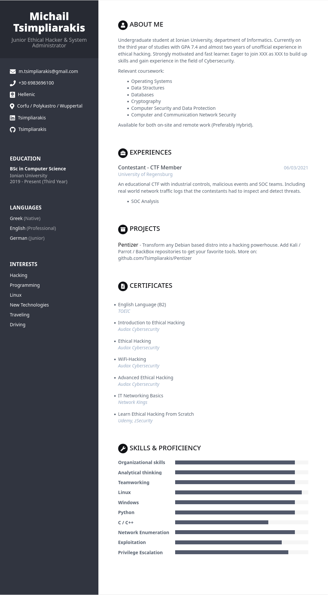
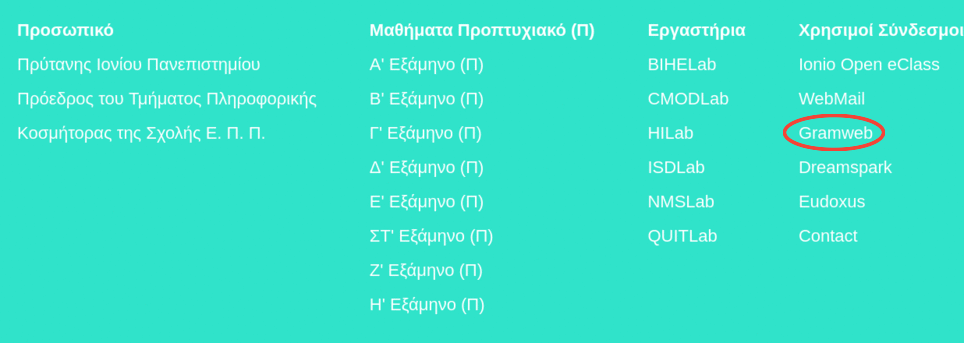
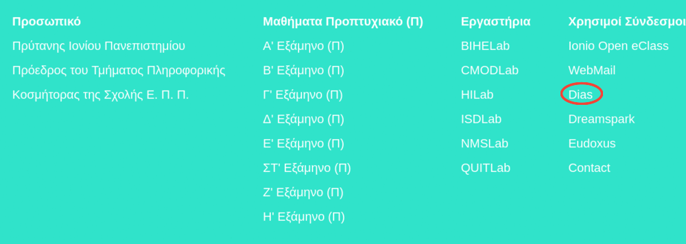

<h1 align=center> Τεχνολογία Λογισμικού </h1>
<h2 align=center> Τσιμπλιαράκης Μιχαήλ | ΑΜ:Π201903 </h2>

- Edpuzzle: p19tsib 2019033

 

| Εβδομάδα | Παραδοτέο | Show & Tell Link | Αυτοαξιολόγηση |
| :-: | :-: | :-: | :-: |
| 1 | [Εισαγωγή](#-εισαγωγή) | [Show & Tell](https://github.com/courses-ionio/help/discussions/71) | - |
| 2 | [Βιογραφικό & Webring](#-βιογραφικό--webring) | [Show & Tell](https://github.com/courses-ionio/help/discussions/170) | - |
| 3 | [Αίτημα ενσωμάτωσης sitegr](#-αίτημα-ενσωμάτωσης-sitegr) | [Show & Tell](https://github.com/courses-ionio/help/discussions/385) | - |
| 4 | [Void Linux](#-void-linux) *CLI* | [Show & Tell](https://github.com/courses-ionio/help/discussions/372) | - |
| 5 | [Συμμετοχικό περιεχόμενο A1+A2](#-συμμετοχικό-περιεχόμενο-a1a2) | [Show & Tell](https://github.com/courses-ionio/help/discussions/413) | - |
| 6 | [Άσκηση γραμμής εντολών - Ntfy](#-άσκηση-γραμμής-εντολών---ntfy) | [Show & Tell](https://github.com/courses-ionio/help/discussions/541) | - |
| 7 | [Βιογραφικό PDF](#-βιογραφικό-pdf) | [Show & Tell](https://github.com/courses-ionio/help/discussions/546) | - |
| 8 | Αίτημα ενσωμάτωσης στην ιστοσελίδα | - | - |
| 9 | Άσκηση γραμμής εντολών | - | - |
| 10 | συμμετοχικό περιεχόμενο B1+B2 | - | - |
| 11 | Άσκηση γραμμής εντολών | - | - |
| 12 | Τελική αναφορά* | - | - |
  

 

## 👉 Εισαγωγή

Από αυτό το μάθημα περιμένω να εμβαθύνω τις γνώσεις που είχα αποκτήσει και απο το προηγούμενο μάθημα (hci) πάνω στην χρήση του Github καθώς και του λειτουργικού συστήματος της οικογένειας του Linux (distros πάνω στον πυρήνα Linux). Είναι απαραίτητα προσόντα για οποιονδήποτε θέλει να ασχοληθεί με τον προγραμματισμό (και όχι μόνο)! Ακόμη με το πέρας του μαθήματος θα αποκτήσω γνώσεις πάνω στην ανάπτυξη λογισμικού, σχεδιασμό λειτουργικών συστημάτων και κατασκευή διεπαφών χρήστη, κάνοντας χρήση του τερματικού. Τέλος γνωρίζοντας τον τρόπο διδασκαλίας του κ. Χωριανόπουλου είμαι σίγουρος πως στο τέλος του εξαμήνου θα έχει αλλάξει ο τρόπος σκέψης καθώς και η οπτική μου γύρω απο την αρχιτεκτονική λογισμικού.

## 👉 Βιογραφικό & Webring

[Βιογραφικό](https://tsimpliarakis.github.io/online-cv/) - [Webring](https://kafeneio-webring.netlify.app/)

   

## 👉 Αίτημα ενσωμάτωσης sitegr

Παρατήρησα ότι στο site της σχολής δεν είχε ενημερωθεί το Gramweb το οποίο έχει αντικατασταθεί από το πιο σύγχρονο και ασφαλές [Dias](https://dias.ionio.gr).
Επομένως ενημέρωσα το text αλλά και το url πίσω απο αυτό για να κρατηθεί το site up to date.
  
  Πριν:
  
  
  Μετά:
  
  
  
  
  - [Pull Request](https://github.com/ioniodi/sitegr/pull/282)

## 👉 Void Linux

   

## 👉 Συμμετοχικό περιεχόμενο A1+A2

## 👉 Άσκηση γραμμής εντολών - Ntfy

 

## 👉 Βιογραφικό-PDF

Δημιουργήθηκε αρχείο git hook με για pre-commit ενέργεια με ρτον παρακάτω κώδικα:

- pandoc https://tsimpliarakis.github.io/online-cv --pdf-engine=xelatex -o ./pdf/resume.pdf
- git add ./pdf/resume.pdf

## ‼️ Προβλήματα που αντιμετωπίστηκαν

## ℹ️ Πηγές βοήθειας

## 🧡 Συνσεισφορά

https://github.com/courses-ionio/help/discussions/548#discussioncomment-2540295

