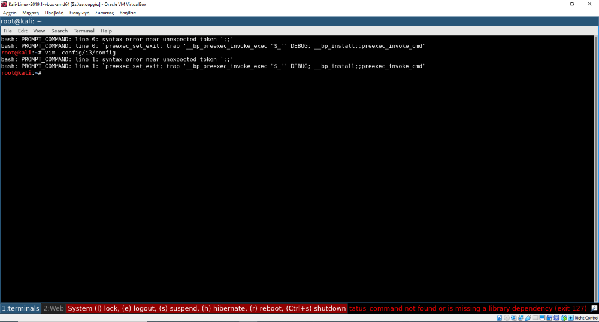
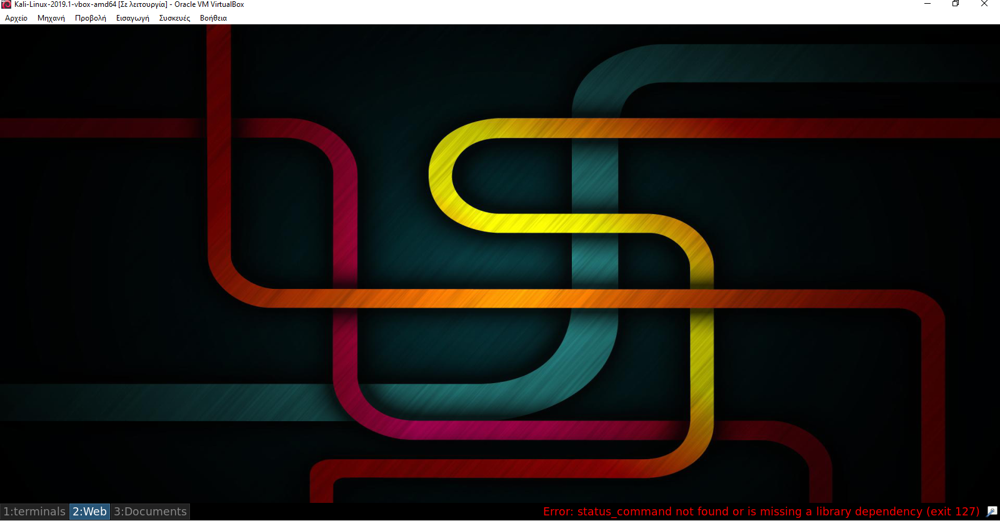
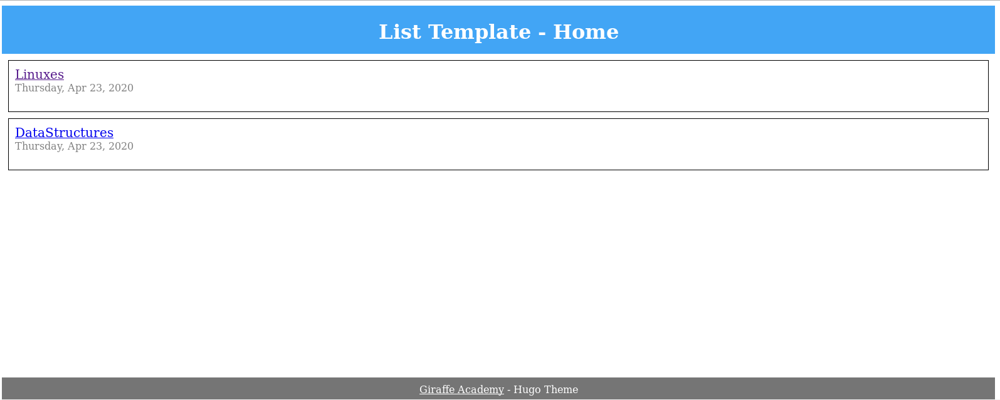

# ΤΕΧΝΟΛΟΓΙΑ ΛΟΓΙΣΜΙΚΟΥ

### Ονοματεπώνυμο: Ευτυχία Δήμητρα Μαρία Φαρμάκη
### Αριθμός Μητρώου: Π2017070
#
## ΕΙΣΑΓΩΓΗ

Στην παρακάτω εργασία υλοποίησα 7 ασκήσεις (6+1) και 3 συμμετοχικά (2+1). Αναλυτικά υπάρχει στην αρχή κάθε άσκησης το λινκ, τα εργαλεία που χρησιμοποίησα για κάθε μία απο αυτές, λεπτομέρειες στις οποίες αναφέρω ακριβώς τι έχει υλοποιηθεί σε κάθε άσκηση και τέλος οι πηγές οι οποίες με βοήθησαν σε κάθε μια απο αυτές. Με τις λεπτομέρειες στόχος ήταν να βοηθήσω ώστε αν κάτι δεν είναι κατανοητό στο asciinema, να γίνει μέσω αυτων. Σε κάποιες από αυτές έχω τοποθετήσει σχετικές εικόνες και σχετικούς υποφακέλους(codes) στο δικο μου φάκελο. 

## ΣΥΜΜΕΤΟΧΙΚΟ ΥΛΙΚΟ(30 ΜΑΡΤΙΟΥ)

### Links

[λινκ αποθετηρίου του κώδικα](https://github.com/eftichiafarmaki/gr) 

[λινκ του ιστότοπου](https://github.com/eftichiafarmaki/gr)

[λινκ αποθετηρίου του βιβλίου](https://github.com/mibook/gr)

[λινκ του προφιλ](https://github.com/eftichiafarmaki)

### A' ΠΑΡΑΔΟΤΕΟ (Εισαγωγή δύο νέων εικόνων με λεζάντα)
#
#### Σύνδεσμοι εικόνων

Για το συμμετοχικό υλικό προστέθηκαν δύο εικόνες απο τα παρακάτω λογισμικά:

- Android "donut". Είναι απο τις πρώτες εκδόσεις Android κατά την οποία έγιναν σημαντικές προσθήκες (επιπλέον μεγέθη οθόνης, δείκτη χρήσης της μπαταρίας, και της τεχνολογιας text-to-speech.
To θεώρησα μια καλή προσθήκη για τις εικόνες του βιβλίου καθώς, αν και δεν λειτουργεί πια, οι προσθήκες ήταν αξιόλογες και συνέβαλαν στην εξέλιξη του Android.

- Prolog. Το Prolog είναι μια λογική γλώσσα προγραμματισμού που σχετίζεται με την τεχνητή νοημοσύνη. Το Prolog ήταν μία από τις πρώτες λογικές γλώσσες προγραμματισμού και παραμένει η πιο δημοφιλής στις γλώσσες αυτές σήμερα, με αρκετές ελεύθερες και εμπορικές εφαρμογές διαθέσιμες. Η γλώσσα έχει χρησιμοποιηθεί για θεώρημα απόδειξη , έμπειρα συστήματα , όρος επανεγγραφή , συστήματα τύπου , και αυτοματοποιημένο σχεδιασμό , καθώς και πρωτότυπα του προορίζεται πεδίο χρήσεως, επεξεργασία φυσικής γλώσσας. Τα σύγχρονα περιβάλλοντα Prolog υποστηρίζουν τη δημιουργία γραφικών διεπαφών χρήστη, καθώς και διοικητικές και δικτυωμένες εφαρμογές.
To θεώρησα μια καλή προσθήκη για το βιβλίο καθώς δεν υπήρχε κάτι παρόμοιο για τον τομέα της τεχνητής νοημοσύνης.

[Polog-link](https://eftichiafarmaki.github.io/gr/gallery/prolog/)

[Android"donut"-link](https://eftichiafarmaki.github.io/gr/gallery/android-donut/)

**Σημείωση! Το πρόβλημα με την ιστοσελίδα του βιβλίου είχε λυθεί απο την εργασία στο μάθημα "Πολυμέσα" του προηγούμενου εξαμήνου.
Ωστόσο, ξαναέκανα fork το mibook/gr και ξαναέκανα από την αρχή τις απαραίτητες αλλαγές.**

## ΑΣΚΗΣΕΙΣ ΣΕ COMMAND-LINE(30 ΜΑΡΤΙΟΥ)
#
### Dependencies
* virtual box (kali linux)
* command line
* python
* asciinema

## First Assignment-SW (try different terminals and shells)
# 
**Links:**

[zsh-fish-link](https://asciinema.org/a/9HQqJyw9kyUyEsWkVeu5ra8TK)

[cool-retro-term-cshell](https://asciinema.org/a/Jvxzi3mKihcCabHQO8PoxYXJG)

**Details:**

Για την πρώτη εργασία χρησιμοποιήθηκαν τα παρακάνω εργαλεία για να ανοίξω τουλάχιστον δύο shells και terminals και να δοκιμάσω διάφορα plugins.

Εργαλεία: 

        z-shell
        
        fish(friendly interactive shell)
        
        oh-my-zsh(z-shell manager)
        
        oh-my-fish(fish manager)
        
        cool-retro-term
        
        c-shell

Σε πρώτη φάση επέλεξα να πλοηγηθώ και να ανοίξω τα δύο αυτά shells (fish,zsh). Σε δεύτερη φάση, εφόσον μπόρω να διορθώσω και να προσθέσω πράγματα στις εργασίες θα προσθέσω και άλλα shells αλλά και terminals.
Για αρχή, χρησιμοποιώ τα δύο αυτά εργαλεία, τους managers και τα διάφορα plugins που αυτοί προσφέρουν.

Αρχικά εγκατέστησα:
**zsh** μέσω της εντολής **sudo apt install zsh**
**fish** μέσω της εντολής **sudo apt-get install fish**.
**oh-my-zsh** με την εντολή **apt install wget git**
**oh-my-fish** με την εντολή **curl -L https://get.oh-my.fish | fish**

Τα βήματα που υλοποιήθηκαν είναι τα εξής:

- Άνοιγμα του zsh με την εντολή **zsh** (Αν θέλω να το ορίσω ως default,εγώ δεν το υλοποίησα, θα βρω το path του zsh μέσω της εντολής **whereis zsh** κι έπειτα θα το ορίσω με την εντολή chsh -s /usr/bin/zsh root).

- Για να ελέγξω και να δείξω σε ποιό shell βρίσκομαι εκτελώ την εντολή **echo $0**

- To επόμενο βήμα είναι να εγκαταστήσουμε το **oh-my-zsh framework for managing z-shell.** Αυτό επιτυγχάνεται μέσω ενός installer script και μέσω της εγκατάστασης άλλων απαιτούμενων προγραμμάτων συμπεριλαμβανομένου του wget για το κατέβασμα του installer script και το git για να το κατέβει το oh-my-zsh από το github. Αυτά επιτυγχανονται με τις ακόλουθες εντολές: **apt install wget git** και **wget https://github.com/robbyrussell/oh-my-zsh/raw/master/tools/install.sh -O - | zsh**

- Επομένως το oh-my-zsh εγκαταστάθηκε στο **home directory ~/.oh-my-zsh**

- Στη συνέχεια χρειαζόμαστε ένα **.zshrc configuration file** , το οποίο είναι διαθέσιμο στο oh-my-zsh templates directory

- Αντιγράφουμε το template .zshrc.zsh-template configuration file στο  home directory .zshrc και εφαρμόζουμε το configuration τρέχοντας το source. **cp ~/.oh-my-zsh/templates/zshrc.zsh-template ~/.zshrc** και **source ~/.zshrc**

- Επειτα, άλλαξα το θέμα του shell. Αρχικά το zsh χρησιμοποιεί το "rubbyusell". Για να βρω την ποικιλία από τα θέματα που υπάρχουν στο zsh τρεχω την εντολή **cd ~/.oh-my-zsh/themes/ και ls -a**. Η αλλαγή θα γίνει στο configuration file.

- Άρα τροποιποιώ το config file μέσω του **vim ~/.zshrc** και θέτω σαν θέμα το **"agnoster".**

- Για να δω αν τρέχει ελέγχω με το **source ~/.oh-my-zsh**

- To oh-my-zsh προσφέρει επιπλέον κάποια plugins στο directory **cd ~/.oh-my-zsh/plugins/ και ls -a**

- Για να ενεργοποιήσουμε και κάποια άλλα plugins χρειάζεται να αλλάξουμε το .zshrc config file.
Στη παρένθεση με τα plugin προσθέτω τα εξής: **web-search** , **zsh-autosuggestions** , **zsh-syntax-highlighting**
To πρώτο είναι για αναζήτηση σε ιστότοπους μέσω πολλών εφαρμογων (π.χ youtube, google, bing, ddgr), το δεύτερο είναι για αυτόματη διόρθωση και το τρίτο είναι για να τονίζει τυχόν λάθη.

- Για έξοδο-> exit

- Στη συνέχεια ανοίγω το fish shell με την εντολή **fish**

- Εφόσον έχω εγκαταστήσει το oh-my-fish, αυτό προσφέρει πολλά plugins. Ένα από αυτά είναι η εμφάνιση του καιρού.
Για να γίνει αυτό έγιναν πρώτα οι εξής εγκαταστάσεις: **omf install weather** , **sudo apt-get install jq** και στη συνέχεια για εμφάνιση του καιρού: **omf weather**

- Στο βιντεο χρησιμοποίησα και άλλα features του **oh-my-fish.**

- Για έξοδο-> exit

- Επιπλέον, η εντολη **cat /etc/shells/** δίνει τα paths από κάποια shells τα οποία είναι ήδη διαθέσιμα, όπως είναι το dash.

**Στο δεύτερο λινκ ανέβασα το installation από το cool-retro-term και το c-shell όπως φαίνεται παρακάτω:**

#
#### SOURCES

https://github.com/ohmyzsh/ohmyzsh/wiki

https://github.com/ohmyzsh/ohmyzsh/wiki/Themes

https://github.com/ohmyzsh/ohmyzsh/wiki/Plugins

https://github.com/oh-my-fish/plugin-weather

https://github.com/oh-my-fish/oh-my-fish

http://linuxscoop.com/video/install-cool-retro-term-linux-mint-17-qiana

https://www.omgubuntu.co.uk/2016/11/make-cool-retro-terminal-ubuntu

## Second Assignment-SW (Configure a custom window manager)
#
**Links:**

[i3wm-link](https://asciinema.org/a/tsMa21w0CFsDbe686cHZkjx2J)

[awesomewm-link](https://asciinema.org/a/iDJWG8Hd5Wi9TAXZa21GoAkRw)

Εργαλεία:

        i3 Windows Manager
        
        awesome
        
        
        
 #### I3 WINDOWS MANAGER:
 #
Σε πρώτη φάση, επέλεξα τον i3 windows manager. Eίναι ένας ελεύθερος, ανοιχτού κώδικα και πλήρως διαμορφωμένος διαχειριστής παραθύρων και διαθέτει tree data structure που επιτρέπει πιο ευέλικτα layouts από τις εναλλακτικές λύσεις. 

*Τα βήματα φαίνονται παρακάτω πιο αναλυτικά από το asciinema λόγω της αποκλειστικής σχεδόν χρήσης πληκτρολογίου και λόγω του ότι πολλές ρυθμίσεις που έγιναν στο config file του i3wm χρειάζονταν reboot για να εφαρμοστούν.*

- Αρχικά εγκατέστησα τον i3 windows manager μέσω της εντολής **sudo apt-get install i3-wm**

Στη συνέχεια, οι εντολές που ακολούθησα ήταν οι εξής:

        - font:Sans 13 για τη αλλαγή γραμματοσειράς
        - set $terminals "1:terminals"
           bindsym $mod+1 workspace $terminals
           bindsym $mod+shift+1 move container to workspace $terminals
        - Αντίστοιχα και για τα επόμενα δύο workspaces για να μετονομαστούν σε "web" και "documents"
        - workspace_auto_back_and_forth yes το οποίο δίνει τη δυνατότητα να επιστρέψεις στο προηγούμενο orkspace με το ίδιο πλήκτρο.
        - assign [class="firefox" instance="Navigator"]-> $Web (Η εντολή αυτή δίνει την δυνατότητα να ανοίγει ο "firefox" κάθε φορά που ανοίγουμε το workspace2->Web)
        - sudo apt-get install feh  (το πρόγραμμα για να μπορέσω να ορίσω φωτογραφία στον i3wm)
        - feh --bg-scale wall.png (η εντολή για να ορίσω το wallpaper, το bg scale το όρισα με την βοήθεια του man page feh)
        - exec_always feh --bg-scale /root/Pictures/wall.png (η εντολή αυτή δίνει την δυνατότητα να εμφανίζεται πάντα η φωτογραφία αυτή ως wallpaper στον i3wm)
        - sudo apt-get install i3lock (εντολή για να κατεβάσω το i3lock για κλείδωμα οθόνης)
        - set $i3lockwall i3lock -i /root/Pictures/wall.png -t (με την εντολή αυτή κάθε φορά που κλειδώνω την οθόνη θα εμφανίζεται η φωτογραφία που όρισα)
        - bindsym $mod+Ctrl+Shift+l exec --no-startup-id $i3lockwall (δίνει το keyboard shortcut για να κάνω τα παραπάνω)
        - set $mode_system System (l) lock, (e) logout, (s) suspend, (h) hibernate, (r) reboot, (Ctrl+s) shutdown

                mode "$mode_system" {
                bindsym l exec --no-startup-id $i3lockwall, mode "default"
                bindsym e exec --no-startup-id i3-msg exit, mode "default"
                bindsym s exec --no-startup-id $i3lockwall && systemctl suspend, mode "default"
                bindsym h exec --no-startup-id $i3lockwall && systemctl hibernate, mode "default"
                bindsym r exec --no-startup-id systemctl reboot, mode "default"
                bindsym Ctrl+s exec --no-startup-id systemctl poweroff -i, mode "default"

                # back to normal: Enter or Escape
                bindsym Return mode "default"
                bindsym Escape mode "default"
                }
         - bindsym $mod+BackSpace mode "$mode_system"
         - Οι δύο παραπάνω εντολές δημιουργούν ένα menu στο οποίο ο χρήστης έχει την δυνατότητα, μέσω μιας συντομευσης keyboard, να επιλέξει αν θέλει να κλειδώσει την οθόνη (l), να κάνει logout (e), να κάνει reboot (r) κ.α. όπως φαίνεται και στην εικόνα παρακάτω.
         
  
  
  
  
  
  
  
  
  
  ### SOURCES 
 # 
  https://i3wm.org/docs/userguide.html
  
  https://i3wm.org/screenshots/
  
  https://github.com/Phantas0s/.dotfiles/blob/master/i3/config
  
  https://opensource.com/article/18/8/getting-started-i3-window-manager
  
  https://fedoramagazine.org/getting-started-i3-window-manager/
  
  https://geekoverdose.wordpress.com/2017/02/05/i3-window-manager-setup-and-configuration/
  
  https://thibaultmarin.github.io/blog/posts/2016-10-05-Awesome-wm_configuration.html#email
  
  https://awesomewm.org/doc/api/classes/awful.widget.calendar_popup.html#awful.widget.calendar_popup.month
  
  
  
        

## Third Assignment-SW (Send notifications to your desktop-mobile):
#
**Link:**

[notify-link](https://asciinema.org/a/4yOxIH2rRATuEWdAzLqwzS8kj)

Εργαλεία:

        notify
        
        NotiFyre
        
        Pushover
        
        
 **Τα βήματα που ακολούθησα για την συγκεκριμενη εργασία, με την σειρά που φαίνονται στο βίντεο είναι τα εξής:**
 
 - Αρχικά, εγκατέστησα την εφαρμογή **Pushover** στο κινητό μου και δημιούργησα ενα API με όνομα *terminal*. Η εφαρμογή αυτομάτως μου έδωσε δύο κλειδιά, το **user key** και το **token**. Για να σταλθεί το μήνυμα όταν μία εντολή με μεγάλη διαρκεια ολοκληρωθεί, χρησιμοποίησα μια **function push** στο **.bashrc** η οποία χρησιμοποιεί τα παραπάνω κλειδιά και είναι η εξής:
 
 **function push {
    curl -s -F "token=a5rxb98us2c39ommwqz68bcnm4c7i6" \
    -F "user=urzf1vkjtj9h8m8pxjyqoidndvc6gx" \
    -F "title=terminal" \
    -F "message=$1" https://api.pushover.net/1/messages.json
}**

Για την δοκιμή αυτής, χρησιμοποίησα τις παρακάτω δύο εντολές: 

        - sleep 3; push "It Worked\!" 
        - sudo apt-get upadate && push "command finished successfully!" || push "something failed" 
        

       
   - Εφόσον αυτές ολοκληρώθηκαν, στάλθηκε κατευθείαν μήνυμα στην εφαρμογη στο κινητό μου όπως φαίνεται παρακάτω:

- Στη συνέχεια εγκατέστησα για να έρχονται μηνύματα αυτόματα στο desktop μου, εγκαταστάθηκαν και υλοποιήθηκαν τα εξής:

        - sudo pip install ntfy
        - sudo apt-get install notify-osd pulseaudio-utils libnotify-bin
        - git clone https://github.com/kaustubhhiware/NotiFyre.git
        - cd NotiFyre
        - cp notifyre.sh bash-preexec.sh ~
        - source ~/notifyre.sh
        - source ~/bash-preexec.sh
        - vim ~/notifyre.sh (στο οποίο μπορούν να γίνουν αλλαγές για ποιες εντολές θα έρχονται ειδοποιήσεις, π.χ για εντολές που εκτελούνται πανω απο 10 δευτερολεπτα, επισης μπορούν να γίνουν αλλαγές στον ήχο της ειδοποίησης κ.λ.π)
        
        

    
- Ένα δεύτερο εργαλείο είναι το **Undistract-me** για το οποίο χρησιμοποιήθηκαν οι εξής εντολές:
  
        - sudo apt-get install undistract-me
        - echo 'source /etc/profile.d/undistract-me.sh >> ~/.bashrc
        
       
   - Με τον παραπάνω τρόπο θα σταλθούν παλι ειδοποιήσεις για τις εντολες οι οποίες ολοκληρώθηκαν.
  
  
- Ένας τρίτος τρόπος είναι με το εργαλείο **Notify** και τις παρακάτω εντολές:
  
        - sudo pip install ntfy
        - echo 'eval "$(ntfy shell-integration)"' >> ~/.bashrc
        
  
- Τέλος, εκτέλεσα κάποιες απλές εντολές του **Notify**
  
        - notify-send "important!!" - u critical (το critical δείχνει στο μήνυμα ότι είναι urgent! αντίστοιχα υπάρχουν το low και normal)
        
        - notify-send "call admin!" -u critical -i face-wink (το -i εισάγει το αντίστοιχο emoji που φαίνεται δίπλα)
        
        - notify-send "this message will be displayed for 3 sec" -t 3000 ( το -t 3000 δείχνει για πόσο χρόνο θα παραμείνει το μήνυμα στο desktop)
        
        - notify-send Date "'date'" (το συγκεκριμενο μήνυμα θα εμφανίσει την ημερομηνία)
        
        - notify -t "Eftihia" send "tets" (θα εμφανίσει στο μήνυμα τον αποστολέα "Eftihia" και το μήνυμα που στέλνει "test"
        
        

        
        
 ### SOURCES 
 #
 https://pushover.net/
 
 https://mikebuss.com/2014/01/03/push-notifications-cli/
 
 https://github.com/kaustubhhiware/NotiFyre
 
 https://github.com/jml/undistract-me
 
 https://www.thegeekstuff.com/2010/12/ubuntu-notify-send/
 
 https://superuser.com/questions/345447/how-can-i-trigger-a-notification-when-a-job-process-ends
 
 https://askubuntu.com/questions/187022/how-can-i-send-a-custom-desktop-notification
 
 https://github.com/dschep/ntfy
 
 
 
 ## Fourth Assignment-SW (Create your own static site and blog generator):
 #
 **Links:**
 
 [hugo-link](https://asciinema.org/a/lW0LV9kq2EbvZnXSXqMyeMclI)  **Σε αυτό το λινκ δημιούργησα ένα site με την βοήθεια ενός site generator**
 
 [site-generator-link](https://asciinema.org/a/hTaJxFSVYunRxSkfE6CwP5tqg) **Ενώ σε αυτό το λινκ προσπάθησα να δημιουργήσω έναν blog generator**
 
 Εργαλεία: 
       
       -Hugo
       
 **Τα βήματα που ακολούθησα για την συγκεκριμενη εργασία, με την σειρά που φαίνονται στο βίντεο είναι τα εξής:**
 
        - sudo apt-get install hugo (για εγκατάσταση του HUGO)
        - hugo new site github (για δημιουργία του site μου)
        - cp /root/Downloads/mytheme.zip /root/github/themes/ (για να αντιγράψω το .zip αρχείο που κατέβασα απο το github, στο φάκελο με τα themes του site github)
        - unzip mytheme.zip (unzip του αρχείου μέσα στο φάκελο με τα themes)
        - vim config.toml
        - theme = "ga-hugo-theme-master" (για να γίνει η προσθήκη του θέματος στην σελίδα)
        - hugo new DataStructures/a.d (δημιούργησα το πρώτο post a.md μέσα στο φάκελο DataStructures)
        - vim a.md
        -  (με την εντολή αυτή πρόσθεσα στο post μου ένα βίντεο που είχα δημιουργήσει στο youtube στο πλαίσιο του μαθήματος "Δομες Δεδομενων"
        - author: "Eftihia" (για να φαίνεται ο author στο post μου)
        - hugo new Linux/b.md (δημιουργία φακέλου b.md στο φάκελο Linux)
        - vim b.md
        -  (πρόσθεσα ένα tweet από το μάθημα Multimedia που αφορά το Linux)
        - tags ["Terminal", "Shells"]
        - moods: ["TerminalsAreSexy"]
        - vim config.toml
        - [taxonomies]
                tag = "tags"
                mood = "moods"
        - hugo server -D 
        
          
 
 

### SOURCES 
#
https://gohugo.io/

https://github.com/giraffeacademy/ga-hugo-theme

https://www.howtoforge.com/how-to-install-hugo-site-generator-on-ubuntu/

https://www.freecodecamp.org/news/your-first-hugo-blog-a-practical-guide/

https://www.youtube.com/watch?v=Ph7oJDR71Jc

https://dbushell.com/2014/07/09/how-i-built-a-static-site-generator/

https://strongloop.com/strongblog/lets-code-it-static-site-generator/

## Fifth Assignment- Performance Monitoring
#
**Link:**

[fifth-assignment-link](https://asciinema.org/a/GSy4xF2zD7uNaG8OYdYM8aWVx)

**Εργαλεία:**

        - hyperfine
        
        - pycallgraph
 
 **Λεπτομέρειες:**
 
 Στην εργασία αυτή δημιούργησα python scripts (insertion.py, selection.py, bubble.py, όπως στο εργαστήριο) και τα σύγκρινα με το εργαλείο hyperfine. Υλοποίησα στη συνέχεια διάφορες απλές εντολές του εργαλείου αυτού όπως είναι το hyperfine --warm-up, το --min-runs για αριθμό ελάχιστων και μέγιστων runs. Επίσης σύγκρινα αυτα τα scripts μεταξύ τους ωστε να δω ποιό από αυτά τρέχει γρηγορότερα.
 
 **SOURCES**
 #
 https://github.com/sharkdp/hyperfine
 
 https://www.ostechnix.com/how-to-benchmark-linux-commands-and-programs-from-commandline/
 
 https://cli.fan/posts/hyperfine/
 
 
 ## Sixth Assignment-Programmable Voice
 #
 **Link:**
 [sixth-assignment-link](https://asciinema.org/a/OF03CmNLNQ5ry5wAX5QDMQvWZ)

 **Εργαλεία:**
        
        - twilio python
        
        - Python
        
 **Λεπτομέρειες:**
 
 Στην εργασία αυτή έχω δημιουργήσει μια **black list** αλλά μόνο με έναν αριθμό καθώς για δωρεάν δοκιμή του εργαλείου δίνανε μόνο έναν αριθμό. Ο κώδικας φαίνεται αναλυτικά στον φάκελο **codes**. Για την εργασία χρησιμοποίησα την γλώσσα Python.
 
 **SOURCES**
 
 https://support.twilio.com/hc/en-us/articles/223135027-Configure-a-Twilio-Phone-Number-to-Receive-and-Respond-to-Voice-Calls
 
 https://www.twilio.com/docs/voice/quickstart/python
 
 https://www.youtube.com/watch?v=-AChTCBoTUM
 
 https://groups.google.com/forum/#!topic/twilio-functions/5W1sd6fetko
 
 
 
 
 
 ## Seventh Assignment-Set-up a system for python development
 #
 **Link:**
 
 [seventh-assignment-link](https://asciinema.org/a/za44cYQoZrtqTWPu5rcxLn7Xz)
 
 **Εργαλεία:**
 
        - virtualenv
        
        - python
        
 
 **Λεπτομέρειες:**
 
 Τα εικονικά περιβάλλοντα μας επιτρέπουν να έχουμε έναν απομονωμένο χώρο στον υπολογιστή μας για Python projects, διασφαλίζοντας ότι κάθε ένα από αυτά μπορεί να έχει το δικό του σύνολο εξαρτήσεων που δεν θα διαταράξει κανένα από τα άλλα. Δημιούργησα ένα τέτοιο περιβάλλον **my_env** με τις εντολές **mkdir environments** **cd environments** **python3 -m venv my_env**. Για να το ενεργοποιήσω χρησιμοποίησα την εντολή **source my_env/bin/activate** και μέσα σε αυτό εφτιαξα ένα μικρό παράδειγα από κώδικα python ώστε να το τρέξω κι έπειτα το έκανα **deactivate**.
 
 **SOURCES**
 
 https://virtualenv.pypa.io/en/latest/
 
 https://github.com/pyenv/pyenv
 
 https://www.digitalocean.com/community/tutorials/how-to-install-python-3-and-set-up-a-local-programming-environment-on-debian-8
 
 
## B Συμμετοχικό Υλικό

* Βιογραφία του Ken Thompson

     * https://eftichiafarmaki.github.io/gr/biography/thompson/
     

## Γ Συμμετοχικό Υλικό

* Μελέτη περίπτωσης για το Linux

    * https://eftichiafarmaki.github.io/gr/case-study/linux/
    
    
 ## Συμπεράσματα
 
 Από τις παραπάνω εργασίες κατάφερα να εξοικιωθώ παραπάνω με βασικά και μη εργαλεία του linux. Ανέβασα αρκετές προσθήκες και διορθώσεις και προσπάθησα να τα κάνω όσο αναλυτικότερα ήταν δυνατόν.
    
    
 
 
 
 
 

        

