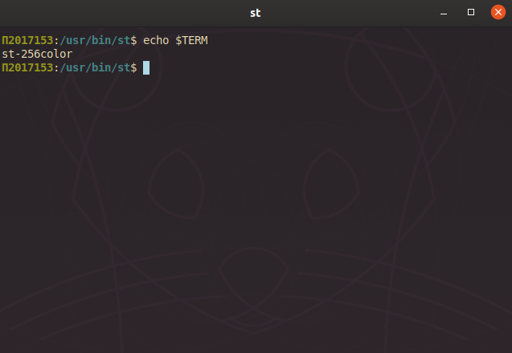
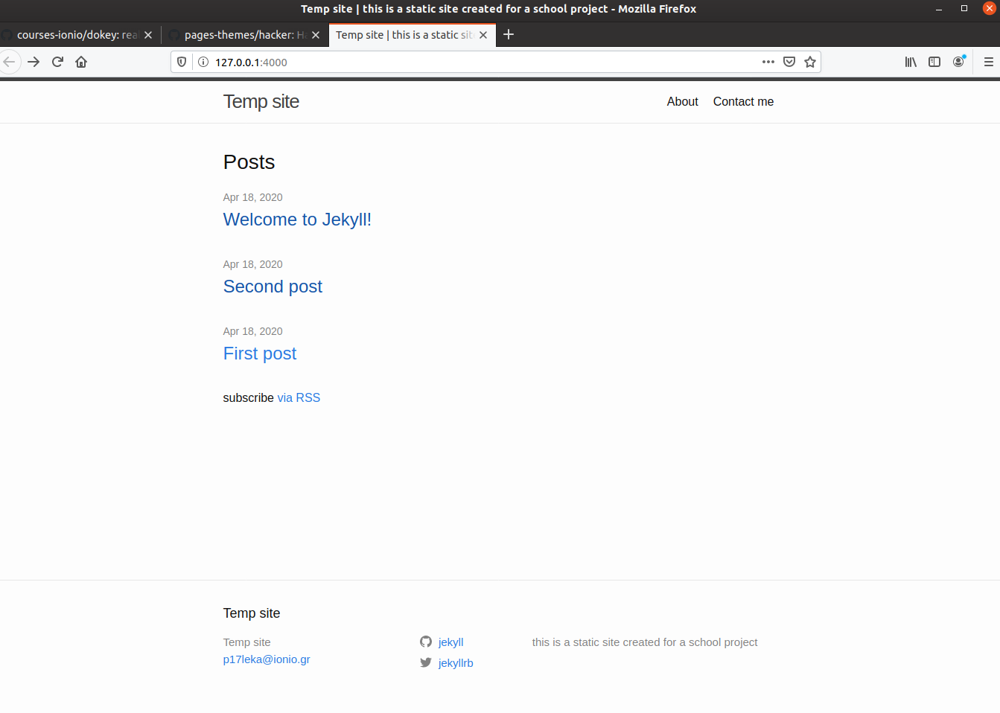
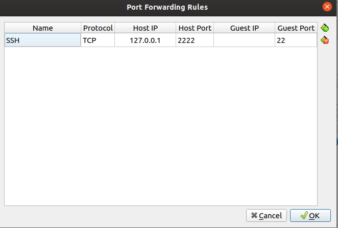

<!DOCTYPE html>
<html>                                                                
  <body>
    <h1>ΤΕΧΝΟΛΟΓΙΑ ΛΟΓΙΣΜΙΚΟΥ</h1>
    <h2>ΑΝΑΦΟΡΑ</h2>
    <h3>ΕΠΙΒΛΕΠΩΝ ΚΑΘΗΓΗΤΗΣ:XΩΡΙΑΝΟΠΟΥΛΟΣ ΚΩΝΣΤΑΝΤΙΝΟΣ</h3>
    <h3>ΠΡΟΣΩΠΙΚΑ ΣΤΟΙΧΕΙΑ:</h3>
    <h4>Α.Μ.:Π2017153</h4>
    <h4>ΟΝΟΜΑ:ΚΡΙΣΤΙΑΝ</h4>
    <h4>ΕΠΩΝΥΜΟ:ΛΕΚΑ</h4>
    <h5>ΑΣΚΗΣΗ 1</h5>
    <ul>
      <h5><li>title:try different terminals and shells</li></h5>
      <h5><li>deliverables:repeat some of the previous exercises with a different terminal-shell and create a custom configuration that fits your needs</li></h5>
      <h5><li>references used:fish,zsh,st</li></h5>
      <h5><li>prerequisites:"For installing shells and terminals none"</li></h5>
      <h5><li>asciinema links:<a href="https://asciinema.org/a/313837">fish</a>,<a href="https://asciinema.org/a/313836">zsh</a>,<a href="https://asciinema.org/a/320770">st</a></li></h5>
    </ul> 
    
<bold>Για να κανω το shell prompt να δειχνει τον Α.Μ. μου χρησιμοποιησα τις εντολες nano .bashrc ωστε να το τροποποιησω και εγραψα export PS1='Π2017153:\w# επειτα εκανα save και exit και εγραψα στο terminal source .bashrc.Για την εκτελεση αυτης της ασκησης χρησιμοποιησα τα fish και zsh shells και τον st terminal.Πρωτα εγκατεστησα τον zsh shell με την εντολη apt install zsh και επειτα τον καλεσα με την εντολη zsh.Eπειτα κατεβασα το oh-my-zsh μεσω curl με την εντολη sh -c "$(curl -fsSL https://raw.githubusercontent.com/ohmyzsh/ohmyzsh/master/tools/install.sh)" το οποιο δινει στον χρηστη παρα πολλες δυνοτοτητες οπως να αλλαξει το theme του shell του και να εγκαταστησει διαφορα αλλα πακετα οπως το zsh-autosuggestionsetc.Υστερα μετεβηκα στο .zshrc file και το εκανα edit μεσω του nano nano .zshrc.Αλλαξα το theme απο agnoster se robbyrussel και εκανα διαφορα configurations οπως να κανω enable το auto-correction,να αλλαξω το auto-update απο 13 σε 3 ημερες και επειτα εγκατεστησα το zsh-autosuggestions στα plugins.Καποια παρομοια εκανα και στο fish μεσω του oh-my-fish οπου εγκατεστησα με την διαφορα της εγκαταστασης περισσoτερων plugin στο fish shell.Επειτα εκανα μια σειρα απο ασκησεις και στα 2 shells οι οποιες ειναι παρα πολλες για να τις περιγραψω ολες στην αναφορα.Μερικα παραδειγματα ειναι οτι αλλαξα τις διαστασεις εικονων,εκανα browsing to web μεσω του terminal,κρατησα journal,ειδα μεσω του terminal ενα map ολου του κοσμου κ.τ.λ.Οι ασκησεις αυτες ανηκουν στα hci,multimediaκ.τ.λ.Συμπερασματικα τα συγκεκριμενα shells προσφερουν αρκετες δυνατοτητες στον χρηστη επιπλεον π.χ.το fish shell δινει την δυνατοτητα εκτελεσης διαφορων πραξεων μεσω terminal π.χ.math 5+5,εκτελεση της random  εντολης στο shell ενω παραλληλα ο zsh εχει τα δικα του προταιρηματα οπως recursive path expansion και αλλα+οτι και τα 2 shells ειναι αρκετα ευκολο και ενας αρχαριος χρηστης να τα κανει config ωστε να ταιριαζουν στο στυλ του.Οσο για τον terminal st δεν εκανα ασκησεις αφου τις ειχα κανει τις πιο πολλες στα shells.Για να δειξω οτι ειμαι στον st χρησιμοποιησα την εντολη echo $TERM και επειτα παραμετροποιησα το .Xdefaults αρχειο αλλαζοντας διαφορα χρωματα,trasparency,fonts etc.Για να εξακριβωθει η αλλαγη υπαρχουν scrennshot πιο κατω.Επισης δοκιμασα διαφορες εντολες ειδικες στον st οπως Alt+K για scroll up και Alt+J για scroll down,Alt+C για copy Alt+V για paste και Alt+shift+K για zoom in Alt+shift+J για zoom out.Συνοπτικα ο st ειναι ενας terminal που μπορει να παραμετροποιηθει πολυ ευκολα(χρωματα,fonts etc) αλλα εκτος απο αυτο εχει και αλλα καλα χαρακτηριστικα οπως τα shortcuts που αναφερθηκαν πριν και επιπλεον ειναι πολυ ελαφρυς τερματικος και αρα υποστηριζει παλαιοτερα συστηματα.Τελος υποστηριζει εικονες και emoji καλυτερα απο καθε αλλο τερματικο που εχω δει με τα καταλληλα configurations.</bold>

    

     
     
    
 
    

    <h5>ΑΣΚΗΣΗ 2</h5>
    <ul>  
     <h5><li>title:set up a system for python development</li></h5>
     <h5><li>deliverables:install and configure in a user folder a python project that is not available through the package manager</li></h5>
     <h5><li>references used:python virtual enviroments</li></h5>
     <h5><li>prerequisites:python,pip</li></h5>  
     <h5><li>asciinema link:<a href="https://asciinema.org/a/314131">python-devsys</a></li></h5>
    </ul>  
    
<bold>Για την εκτελεση αυτης της ασκησης αποφασισα να χρησιμοποιησω τα pipenv και virtualenv για να δημιουργησω virtual enviroments για τα python project μου.Πρωτα σιγουρευτηκα πως εχω κανει install python kai pip με τις εντολες pip --version kai python --version.Επειτα εγκατεστησα το pipenv μεσω του pip install --user pipenv ο οποιος ειναι dependency manager για τα python projects ενω παραλληλα εφτιαξα και ενα directory py_project mkdir py_project o οποιος θα ειναι ο directory για το python project μου.Μπηκα στο φακελο cd py_project και εγκατεστησα τα πακετα που χρειαζονται με την εντολη pipenv install requests.Εφτιαξα ενα απλο αρχειο main.py με τον nano editor nano main.py που επιστρεφει την ip address και το ετρεξα με pipenv run python main.py.Μετα κατεβασα το virtualenv το οποιο  είναι ένα εργαλείο για τη δημιουργία απομονωμένων περιβαλλόντων Python.Το virtualenv δημιουργεί ένα φάκελο που περιέχει όλα τα απαραίτητα εκτελέσιμα για τη χρήση των πακέτων που θα χρειαζόταν ένα έργο της Python.Το virtualenv μπορεί να χρησιμοποιηθεί αυτόνομο, στη θέση του Pipenv.Το κατεβασα με την εντολη pip install vritualenv.Πηγα στο project folder που ηθελα cd py_project(σαυτη τη περιπτωση ημουν ηδη εκει)και χρησιμοποιησα την εντολη virtualenv venv που θα δημιουργήσει ένα φάκελο στον τρέχοντα κατάλογο ο οποίος θα περιέχει τα εκτελέσιμα αρχεία Python και ένα αντίγραφο της βιβλιοθήκης pip που μπορουμε να χρησιμοποιήσουμε για την εγκατάσταση άλλων πακέτων.Στην ουσια φτιαξαμε το virtual enviroment μας.Για να χρησιμοποιησουμε το virtual enviroment τo κανουμε activate με την εντολη source venv/bin/activate.Επισης θα μπορουσαμε να χρησιμοποιησουμε τον python interpreter της επιλογης μας(οπως python 2.7)π.χ virtualenv -p /usr/bin/python2.7 venv και να αλλαξουμε τον interpreter globally με ενα env variable στο .bashrc αρχειο π.χ.export VIRTUALENVWRAPPER_PYTHON=/usr/bin/python2.7.Kανουμε install τα packages στο virtual enviroment με pip install requests και οταν τελιωσουμε τη δουλεια μας στο virtual enviroment το κανουμε deactivate με την εντολη deactivate.Για να κανουμε delete ενα virtualenviroment χρησιμοποιουμε την εντολη rm-rf <<ονομα enviroment>>.Μπορουμε και να παγωσουμε την τρεχουσα κατασταση των πακετων περιβαλλοντος με την εντολη pip freeze > requirements.txt οποτε επειτα θα μπορουσε καποιος να εγκαταστησει τα ιδια πακετα με τα ιδια versions.</bold>

    <h5>ΑΣΚΗΣΗ 3</h5>
    <ul>
      <h5><li>title:send notifications to your desktop-mobile</li></h5>
      <h5><li>deliverables:send a notifcation when a big task completes, eg download, compiling, etc</li></h5>
      <h5><li>references used:ntfy</li></h5>
      <h5><li>prerequisites:pip</li></h5> 
      <h5><li>asciinema link:<a href="https://asciinema.org/a/312866">ntfy</a></li></h5>
    </ul> 
    
<bold>Για την εκτελεση αυτης της ασκησης αποφασησα να χρησιμοποιησω το ntfy το οποιο επιτρεπει στον χρηστη να στελνει notifications απο το desktop-mobile.Εγκατεστησα το ntfy με την εντολη pip install ntfy και επειτα εκανα config to ~/.ntfy.yml αρχειο με τον nano editor ετσι ωστε να φτανουν τα μηνυματα στο κινητο μου.Για backend χρησιμοποιησα το pushover το οποιο κατεβασα απο το appstore στο κινητο μου και αφου βρηκα το user key μεσω του pushover στο κινητο μου το εγραψα στο ntfy.yml αρχειο.Επισης εκανα enable την αυτοματη αποστολη ειδοποιησεων οταν οι εντολες που εκτελουνται μακροπροθεσμα τελειωνουν σε bash και zsh κανοντας edit το .bashrc αρχειο μου με τον nano γραφοντας eval "$(ntfy shell-integration)".Επειτα εκτελεσα καποιες πολυ απλες εντολες οπου υπαρχουν και στη σελιδα του ntfy οπως ntfy send test η ntfy done sleep 15.Επειτα για μερικα χαρακτηριστικα του ntfy χρειαζονταν να κατεβασω μερικα extra dependencies οπως pip install ntfy[pid] για να χρησιμοποιησω το ntfy με διεργασιες(pids) και pip install ntfy[emoji] για να χρησιμοποιησω το ntfy με  emoji μεσω των εντολων ntfy done --pid <<συγκεκριμενη διεργασια που θελουμε>>και ntfy send ":tada:ntfy supports emoji! :100" για να δειξω και την αποστολη με emoji.Υπαρχει και η επιλογη -t η οποια επιτρεπει να βαλεις εναν τιτλο στο μηνυμα την οποια εδειξα πολλες φορες.Τελος για την ολοκληρωση της ασκησης εφτιαξα ενα script με τις εντολες apt-update,apt-upgrade,dist-upgrade(δεν χρειαζομουν sudo ημουν σε kali)και εβαλα το ntfy να μου στειλει μηνυμα μολις τελιωσουν τα updates e.t.c με την εντολη ntfy send "Packages updated".Εκανα το script εκτελεσιμο με την εντολη chmod +x update.sh(ονομα script) και το ετρεξα με ./update.sh.Αποδειξεις οτι τα μηνυμα εφτασαν υπαρχουν σε screenshots παρακατω.</bold>

    

      
      
    

    
<bold>Εικονες 1 και 2 με τα screenshot</bold>

    <h5>ΑΣΚΗΣΗ 4</h5>
    <ul>
      <h5><li>title:performance monitoring</li></h5>
      <h5><li>deliverables:monitor the performance of your python scripts and visualize them with colors and/or spark lines</li></h5>
      <h5><li>references used:hyperfine,py-spy</li></h5>
      <h5><li>prerequisites:pip</li></h5> 
      <h5><li>asciinema link:<a href="https://asciinema.org/a/313838">hyperfine</a>,<a href="https://asciinema.org/a/320717">py-spy</a></li></h5>
    </ul> 
    
<bold>Για την εκτελεση αυτης της ασκησης αποφασησα να χρησιμοποιησω τα εργαλεια hyperfine και py-spy για να κανω performance monitoring σε αλγοριθμους ταξινομησης γραμμενους σε γλωσσα python.Οι αλγοριθοι που χρησιμοποιησα βρισκονται ολοι στον φακελο code.Για την εγκατασταση του hyperfine χρησιμοποιησα τις εντολες wget https://github.com/sharkdp/hyperfine/releases/download/v1.9.0/hyperfine_1.9.0_amd64.deb και dpkg -i hyperfine_1.9.0_amd64.deb για install.Εκτελεσα καποιες πολυ απλες εντολες και επειτα χρησιμοποιησα τον <a href="code/rand.py">rand.py</a> για να παραξω 100 τυχαιους αριθμους ετσι ωστε να δω το performance τον αλγοριθμων σε αυτους.Χρησιμοποιησα εναν απο τους αλγοριθμους στην αρχη τον <a href="code/selection.py">selection.py</a> για να δω τον χρονο ταξινομησης του αρχειου που παρηχθεισε απο τον rand.py και επειτα πειραματιστηκα με τις παραμετους που μπορει να παρει το hyperfine οπως hyperfine --warmup 3 που ειναι μια εντολη που κανει warmup ωστε τα δεδομενα να ειναι φορτωμενα στην cache memory πριν ξεκινησει η ταξινομηση τον αριθμων ωστε να μην επηρεαστει το αποτελεσμα.Για να αλλαξω τον αριθμο των φορων που το hyperfine εκτελει καθε εντολη χρησιμοποιησα τις εντολες hyperfine --runs<<αριθμος φορων>>(δλδ ακριβως τοσες φορες),hyperfine --min-runs(τουλαχιστον τοσες φορες) και --max-runs(μεγιστο τοσες φορες).Για να εξαγω τα αποτελεσματα σε αρχειο χρησιμοποιησα τις εντολες  --export-markdown<<ονομα αρχειου>>,--export-csv<<ονομα>>etc.Τελος ετρεξα και τους 3 αλγοριθμους ταξινομησης σε ενα αρχειο με 100 αριθμους και επειτα το ξαναεκανα αφου παρηγαγα ενα νεο αρχειο με 1000 αριθμους.Τα συμπερασματα που εβγαλα ειναι αναμενομενα ο αλγοριθμος selection.py τρεχει γρηγοροτερα απο τον insertion.py και πολυ πιο γρηγορα απο τον bubble.py και στις 2 περιπτωσεις αρχειων(100,1000) που ειναι αναμενομενο καθως ξερουμε πως ο bubble.py ειναι πιο αργος και ο selection.py πιο γρηγορος.Ολοι οι αλγοριθμοι βρισκονται <a href="code">εδω</a>.Καθαρα λογω asciinema επελεξα να παραγω και να χρησιμοποιησω αρχεια των 100 και 1000 τυχαιων αριθμων που δεν ειναι πολυ μεγαλα και ετσι δεν παιρνουν πολυ χρονο για να εκτελεστουν τα benchmarks του hyperfine.Ομως εαν χρησιμοποιουσαμε αρχεια 10000 η 100000 αριθμων τα αποτελεσματα θα ηταν τα ιδια απλως o selection.py θα τελιωνε ακομα πιο γρηγορα απο τους αλλους και ο bubble.py πιο αργα.Χρησιμοποιησα και το py-spy το οποιο ειναι ενα αλλο εργαλειο για performance monitoring και συγκεκριμενα χρησιμοποιησα τις εντολες py-spy top -- python <<ονομα αλγοριθμου.py>><<αριθμος τυχαιων αριθμων>>για να δω πιο τμημα του αλγοριθμου αναλωνει τον περισσοτερο χρονο.(Συγκεκριμενα στον bubble.py)και χρησιμοποιησα την εντολη py-spy record -o profile.svg -- python <<ονομα αλγ.py>><<αριθμος τυχαιων αριθμων>>που θα εξαγει τα αποτελεσματα σε γραφικη μορφη.
</bold>

    <h5>ΑΣΚΗΣΗ 5</h5>
      <ul>
        <h5><li>title:create your own static site and blog generator/set-up continuous integration</li></h5>
        <h5><li>deliverables:the generator should consider posts, pages, and templates/build and deploy your static site and your cv dynamically every time you make a small change in the source files</li></h5>
        <h5><li>references used:jekyll/github(github-pages)</li></h5>
        <h5><li>prerequisites:ruby version 2.5.0 or higher,rubygems,gcc and make and other required jekyll dependancies/git,github account</li></h5>
        <h5><li>asciinema links:<a href="https://asciinema.org/a/321335">jekyll</a>,<a href="https://asciinema.org/a/321353">deployment</a>,<a href="https://asciinema.org/a/321358">con.integration</a></h5>
        <h5><li>link για το site:<a href="https://p17leka.github.io/temp_site/">site</a></li></h5>
      </ul>
    
<bold>Για την ασκηση αυτη αποφασησα να χρησιμοποιησω το jekyll το οποιο ειναι ενα απο τα πιο γνωστα static site generators για να φτιαξω ενα static site και επειτα το εκανα deploy μεσω github pages κανοντας set up continuous integration.Η εγκατασταση του jekyll απαιτει αρκετα προαπαιτουμενα οποτε δεν μπορω να την εξηγησω εδω υπαρχει στην σελιδα του jekyll.Αφου το κατεβασα εφτιαξα μια static ιστοσελιδα με ονομα temp_site και για αρχη αλλαξα τον τιτλο,το email και το description της.Επειτα αλλαξα το minima-theme σε jekyll-theme-hacker αφου το εκανα install πρωτα ομως αποφασησα τελικα να κρατησω το default καθως μαρεσε πιο πολυ.Το hacker-theme υποστηριζε μονο το default layout(γιαυτο και αλλαξα τα layouts στα index.md,about.md και post) σε αντιθεση με το minima που υποστηριζε τα post,page,home και αλλα.Επειτα εφτιαξα καποια πολυ απλα posts και εδω να αναφερω πως εκανα edit το front matter σε καθε post κατι που δεν χρειαζονταν καθως θα μπορουσε καποιος να εχει front matter defaults ετσι ωστε καθε φορα που φτιαχνει ενα νεο post η μια νεα σελιδα να συμπληρωνεται αυτοματα το front matter(με βαση τα default).Επειτα εφτιαξα μια αλλη σελιδα την contact me page και την συμπληρωσα μονο με το email μου.Δεν εκανα κατι πολυπλοκο με τα posts και pages καθως θα μεγαλωνε πολυ το βιντεο στο asciinema αλλα και η αναφορα εδω.Επισης δεν μπορω να εξηγησω αυτη την ασκηση εντολη προς εντολη(το τι κανουν δλδ.)καθως θα μεγαλωσει πολυ η αναφορα(φαινονται στο βιντεο του asciinema).Μετα εκανα deploy το site μεσω github pages και αλλαξα τον τιτλο για να δω αμα δουλευει το continuous integration και τελικα δουλευε.Προφανως δεν μπορω να δειξω μεσω asciinema πως εφτιαξα το repository στο github η το account που ειχα φτιαξει.Οι εντολες ολες φαινονται στο asciinema.Γενικα το jekyll σου δινει τη δυνατοτητα να φτιαξεις πολυ ευκολα και γρηγορα ιστοσελιδες και να τις κανεις edit(αλλαξεις theme etc) ενω παραλληλα τα github-pages σου επιτρεπουν κανεις deploy ενα site πολυ ευκολα μεσω terminal.Παρακατω υπαρχουν screenshots του site(δεν ειναι ολα εδω υπαρχουν καποια στον φακελο screenshots πανω πανω σαυτο το repository και υπαρχει και ενα link για το site.</bold>

    

     
     
     
    
  
    

    <h5>ΑΣΚΗΣΗ 6</h5>
      <ul>
        <h5><li>title:set-up cloud services</li></h5>
        <h5><li>deliverables:ssh to a remote machine and demonstrate your remote cli user land (e.g., email, editor, cv, code, etc)</li></h5>
        <h5><li>references used:OpenSSH</li></h5>
        <h5><li>prerequisites:ssh and sftp preinstalled on most linux distros</li></h5>
        <h5><li>asciinema links:<a href="https://asciinema.org/a/321120">ssh</a>,<a href="https://asciinema.org/a/321121">sftp</a></h5>
      </ul>
    
<bold>Για την ασκηση αυτη αποφασησα να χρησιμποιησω τα ssh και sftp λογισμικα ωστε να συνδεθω σε ενα μακρινο μηχανημα στη δικη μου περιπτωση συνδεθηκα σε ενα vm με os ubuntu αφου πρωτα αλλαξα τις ρυθμισεις στο network(port forwarding).Yπαρχει screenshot παρακατω.Η ip που θα συνδεομαι θα ειναι η 127.0.0.1 και το port θα ειναι το 2222.H default συνταξη ειναι ssh << username(chris) >>@<< ip address(127.0.0.1) >> -p << port(2222) >>.Δοκιμασα αρκετες απο τις παραμετρους που μπορει να παρει το ssh τις οποιες θα εξηγησω παρακατω αλλα προφανως δεν μπορω να τις εξηγησω ολες στην αναφορα γιαυτο υπαρχει το man page του ssh.Μερικες ενδεικτικα ειναι ssh -4 chris@127.0.0.1 -p 2222 που αναγκαζει το ssh να χρησιμοποιηει IPV4 addresses,ssh -c aes256-ctr chris@127.0.0.1 -p 2222 η οποια κανει encrypt το ssh session με τον αλγοριθμο της επιλογης μας(απο αυτους που επιτρεπεται),ssh -E logfile.txt chris@127.0.0.1 -p 2222 κανει append debug logs στο logfile.txt,ssh -T chris@127.0.0.1 -p 2222 η οποια κανει disable το pseudo-terminal,etc.Το να αναφερω και αλλες ξεφευγει απο τον σκοπο αυτης της αναφορας γιαυτο υπαρχει παλι το manpage.Αφου πειραματιστηκα με τις παραμετρους εκτελεσα καποιες πολυ βασικες εντολες για τις οποιες δεν νομιζω να χρειαζεται εξηγηση.Επειτα συνδεθηκα στο μηχανημα(vm)μεσω sftp sftp -P 2222 chris@127.0.0.1.Μερικες απο τις παραμετρους που χρησιμοποιησα ειναι sftp -B 33000 -P 2222 chris@127.0.0.1 η οποια κανει set το buffer size και sftp -l 1000 -P 2222 chris@127.0.0.1 η οποια κανει limit το bandwidth.Τελος χρησιμοποιησα τις ειδικες εντολες του sftp για να μεταφερω αρχεια απο το host μηχανημα(vm)στο δικο μου μεσω των εντολων get<< filename >> και put << filename >>.Εαν θελαμε να συνδεθουμε σε κανονικο μηχανημα θα χρησιμοποιουσαμε την ιδια συνταξη με αυτη τη περιπτωση με τη διαφορα της χρησης της ip address του μηχανηματος που θελαμε και του port.Συμπερασματικα το ssh και sftp επιτρεπουν σε χρηστες να συνδεθουν σε διαφορες απομακρυσμενες μηχανες πραγμα που προφανως ειναι πολυ χρησιμο για ολους τους χρηστες καθως μπορουν ευκολα να ανταλαξουν αρχεια κ.τ.λ.</bold>

    
    
    
    <h5>ΑΣΚΗΣΗ 7</h5>
      <ul>
       <h5><li>title:choose your stack</li></h5>
       <h5><li>deliverables:set-up a set of cli tools with minimal dependencies and a software licence that allows commercial use and selling</li></h5>
       <h5><li>references used:howdoi,how2</li></h5>
       <h5><li>prerequisites:"pip,npm"</li></h5>
       <h5><li>asciinema links:<a href="https://asciinema.org/a/320998">howdoi</a>,<a href="https://asciinema.org/a/321027">how2</a></h5>
      </ul>
    
<bold>Για την ασκηση αυτη αποφασια να χρησιμοποιησω τα λογισμικα howdoi και how2 τα οποια ειναι ισως και τα πιο γνωστα της κατηγοριας τους.Κατεβσασα το howdoi με την εντολη pip install howdoi και επειτα εκτελεσα διαφορες εντολες(διαφορα querys) και πειραματιστηκα με τις διαφορες παραμετους που μπορει να παρει το howdoi.Μερικες απλες εντολες χωρις παραμετρους που χρησιμοποιησα ενδεικτικα ειναι:howdoi make a folder ubuntu,howdoi delete a folder ubuntu,howdoi make a file ubuntu,howdoi ubuntu find a file,howdoi change terminal ubuntu,etc.Ολες οι εντολες που χρησιμοποιησα ειναι παρα πολλες οποτε δεν θα τις αναφερω ολες αλλα θα αναφερω μερικες παραμετρους.Με την παραμετρο -a το howdoi επιστρεφει ολη την απαντηση και οχι ενα κομματι της(ολο το text).Με την παραμετρο -l επιστρεφει μια link απαντηση αντι για μια απαντηση σε text.Με την παραμετρο -C κανει clear την cache.Με την παραμετρο -c τα αποτελεσματα ειναι εγχρωμα.Με την παραμετρο -n<< number >> επιστρεφει οσα διαφορετικα αποτελεσματα ζητησει ο χρηστης(πχ.number=4).Και με την παραμετρο -p<< position >>επιλεγει την απαντησει στη θεση που θελει ο χρηστης(πχ.position=2).Τελος με την παραμετρο -e<< search engine >>το howdoi ψαχνει την απαντηση με βαση το search engine που επιλεγει ο χρηστης(πχ.search engine=searx).Ομως εδω να λειφθει υποψη οτι ο χρηστης πρεπει manually να βρει το howdoi.py αρχειο και να το κανει edit για να υποστηριχθει το search engine που ο χρηστης θελει.Οσο αφορα το how2 το κατεβασα με την εντολη npm install -g how-2 και εκτελεσα καποιες παρομοιες εντολες με τις παραπανω χωρις ομως τις παραμετρους καθως δεν υπαρχουν.Επισης μεσω του space πληκτρου(αφου κανεις πρωτα query) το how2 σου δινει τη δυνατοτητα να δεις και αλλες ερωτησεις που ισως σε ενδιαφερουν(στην ουσια ειναι πιο φιλικο στον χρηστη).Συμπερασματικα και τα 2 λογισμικα ειναι πολυ χρησιμα καθως επιτρεπουν την γρηγορη αναζητηση αποτελεσματων σε προβληματα που ισως αντιμετωπισει ενας χρηστης(ιδιατερα χρησιμα ειναι σε προγραμματιστικο επιπεδο αλλα και σε νεους χρηστες που τωρα ξεκινανε να ασχολουνται με linux).Προσωπικα προτιμησα το how2 πιο πολυ αν και το howdoi εχει αρκετες επιλογες(παραμετρους,search enginesetc.)διοτι οπως ανεφερα πιο πριν ειναι κατα τη γνωμη μου πιο φιλικο προς τον χρηστη και πιο ευχρηστο.</bold>

  
    
<h5>ΣΥΜΜΕΤΟΧΙΚΟ ΕΚΠΑΙΔΕΥΤΙΚΟ ΥΛΙΚΟ-Α ΜΕΡΟΣ</h5>
    
<bold>Για το πρωτο μερος του συμμετοχικου εκπαιδευτικου υλικου προσθεσα 2 φωτογραφιες που πιστευω εχουν σχεση με το πνευμα της ιστοσελιδας του μαθηματος στο προσωπικο αποθετηριο της ιστοσελιδας του μαθηματος που εφτιαξα.Η πρωτη ειναι το λειτουργικο συστημα openbsd ενω η δευτερη ειναι το κελυφος bourne.</bold>
 
      Αποθετηριο ιστοσελιδας μαθηματος:<a href="https://github.com/mibook/gr">link1</a> 
      Ιστοσελιδα μαθηματος:<a href="https://www.mibook.org/">link2</a> 
      Προσωπικο αποθετηριο ιστοσελιδας μαθηματος:<a href="https://github.com/p17leka/gr">link3</a> 
      Προσωπικη ιστοσελιδα μαθηματος:<a href="https://p17leka.github.io/gr/">link4</a> 
      Eικονα openbsd:<a href="https://p17leka.github.io/gr/gallery/openbsd/">openbsd</a> 
      Eικονα bourne-shell:<a href="https://p17leka.github.io/gr/gallery/bourne-shell/">bourne-shell</a><br/r>
  </body> 
</html    
