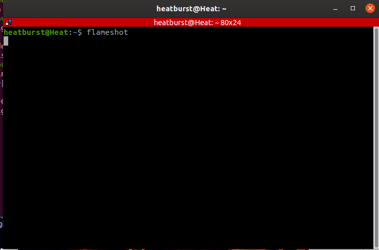

# Τεχνολογία λογισμικού

### Ελευθέριος Ελευθεριάδης | Π2017166

## Συμμετοχικό εκπαιδευτικό υλικό

## Προσωπικό link βιβλίου [link](https://p17elev.netlify.com/)

## Προσωπικό αποθετήριο

Για την εργασία συμμετοχικού περιεχομένου εισήχθησαν για το πρώτο παραδοτέο 
δύο εικόνες με λεζάντα και ελεύθερα πνευματικά δικαιώματα στους κατάλληλους 
φακέλους του δικού μας αποθετηρίου

[link](https://github.com/eleftherioseleftheriadis/gr/blob/P2017166/_gallery/netlify.md)

[link](https://github.com/eleftherioseleftheriadis/gr/blob/P2017166/_gallery/trci.md)

## Εργασίες SW

## Πρώτη εργασία

Assignment: Send notifications to your desktop-mobile 

Περιγραφή: Με την χρήση της εντολής ntfy λαμβάνουμε μήνυμα για την ολοκλήρωση μιας μακρόχρωνης
διαδικασίας.

[example](https://asciinema.org/a/qqzt0c1OOOxADeeDiq2kp8g1G)

Screenshot:

## Δεύτερη εργασία

Assignment: Try different terminals and shells

Περιγραφή: Δύο φωτογραφίες από διαφορετικά terminal Terminator Tilda και δύο φωτογραφίες από εντολές που δεν εκτελούνται στο προεπιλεγμένο shell αλλά εκτελούνται στα ksh, csh αντίστοιχα

[example](https://asciinema.org/a/2QW2xYB31R7OEmdha8AdoEfDw)

[example](https://asciinema.org/a/YTnGNw8aMqKQ1Bm5Cb71a7yjb)

Screenshots:

 
