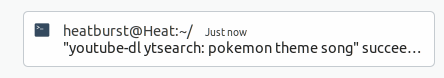
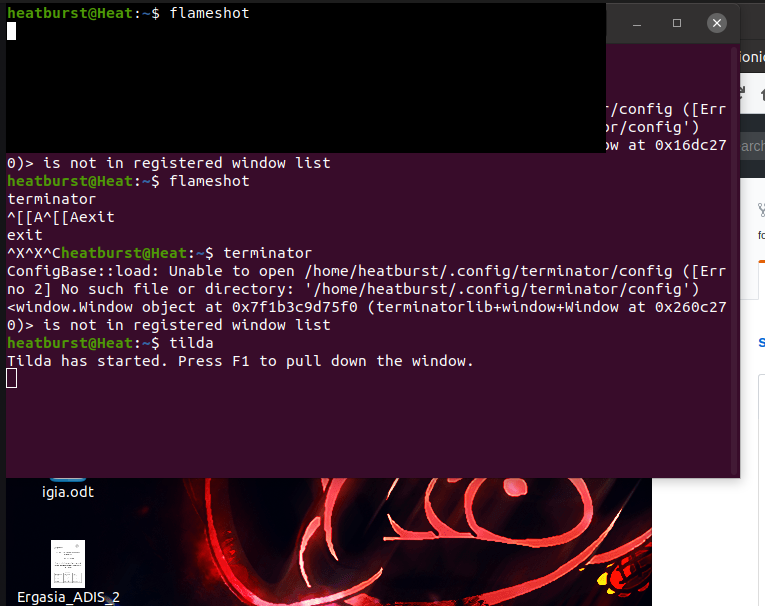

# Τεχνολογία λογισμικού

### Ελευθέριος Ελευθεριάδης | Π2017166

## Σύνοψη

Η αναφορά αποτελέιται από τις ζητούμενες ασκήσεις του μαθήματος "Τεχνολογία Λογισμικού" του έκτου εξαμήνου. Επίσης από τα link των βίντεο στο asciinema που υποδεικνύουν την υλοποίηση της αντίστοιχης άσκησης και τα εργαλέια που χρησιμοποιήθηκαν για την κάθεμια. Στην συνέχεια περιέχει τους συνδέσμους από την εργασίες συμμετοχικού υλικού και του προσωπικού αποθετηρίου.

## Εισαγωγή

Ο τίτλος του μαθήματος "Τεχνολογίες Λογισμικού" υποδικνύει ότι το επίκεντρο του μαθήματος είναι το λογισμικό. Ο όρος λογισμικό είναι ένα μεγάλο πεδίο της επιστήμης της πληροφορικής. Στο μάθημα αυτό ασχολούμαστε με το λογισμικό με την χρήση του τερματικού και των γραμμών εντολών. Η χρήση του τερματικού στην εποχή μας δεν είναι τόσο μεγάλη επειδή η αλληλεπίδραση με το λογισμικό είναι ευκολότερη μέσο ενός γραφικού περιβάλλοντος. Παρόλα αυτά η η χρήση του τερματικού από ένα άτομο με μια μέση γνώση ως προς τις πιο κοινές εντολές προσφέρει μια γρηγορότερη χρήση και διαχείρηση του υπολογιστή. Βάση αυτού στο παρόν μάθημα ανατέθηκαν εργασίες για την χρήση του τερματικού και για εξοικίωση με αυτό.

## Συμμετοχικό εκπαιδευτικό υλικό

## Προσωπικό link βιβλίου [link](https://p17elev.netlify.com/)

## Προσωπικό αποθετήριο

Για την εργασία συμμετοχικού περιεχομένου εισήχθησαν για το πρώτο παραδοτέο 
δύο εικόνες με λεζάντα και ελεύθερα πνευματικά δικαιώματα στους κατάλληλους 
φακέλους του δικού μας αποθετηρίου

[1st image link](https://github.com/eleftherioseleftheriadis/gr/blob/P2017166/_gallery/netlify.md)

[2nd image link](https://github.com/eleftherioseleftheriadis/gr/blob/P2017166/_gallery/trci.md)

[interactive image link](https://github.com/eleftherioseleftheriadis/gr/blob/master/_remix/shell.md)

## Εργασίες SW

## Πρώτη εργασία

Assignment: Send notifications to your desktop-mobile 

Περιγραφή: Με την χρήση της εντολής ntfy λαμβάνουμε μήνυμα για την ολοκλήρωση μιας μακρόχρωνης
διαδικασίας.

[example](https://asciinema.org/a/qqzt0c1OOOxADeeDiq2kp8g1G)

Screenshot:

## Δεύτερη εργασία

Assignment: Try different terminals and shells

Περιγραφή: Δύο φωτογραφίες από διαφορετικά terminal Terminator Tilda και δύο φωτογραφίες από εντολές που δεν εκτελούνται στο προεπιλεγμένο shell αλλά εκτελούνται στα ksh, csh αντίστοιχα

[example](https://asciinema.org/a/2QW2xYB31R7OEmdha8AdoEfDw)

[example](https://asciinema.org/a/YTnGNw8aMqKQ1Bm5Cb71a7yjb)

Screenshots:

## Τρίτη εργασία
Assignment: Performance monitoring

Hyperfine

 https://asciinema.org/a/O6DWhRyztfaPRq1tmeaKEZN1t

## Τέταρτη εργασία

Assignment: Choose your stack
Περιγραφή: Χρήση της εντολής για να διωρθόσει την τελευταία εντολή που γράψαμε βρίσκοντας το τυπογραφικό λάθος.
thefuck

https://asciinema.org/a/68yNmiha0Fzx8f4ReAapVRISK

## Πέμπτη εργασία

Assignment: Set-up a system for python development

https://asciinema.org/a/1xEl6TCtZFUdYtfjHOveTo4Xo

## Έκτη εργασία

Assignment: Use the terminal as the IDE

https://asciinema.org/a/4t6dEiUumRrFJ4XXrPNnqu4ri
