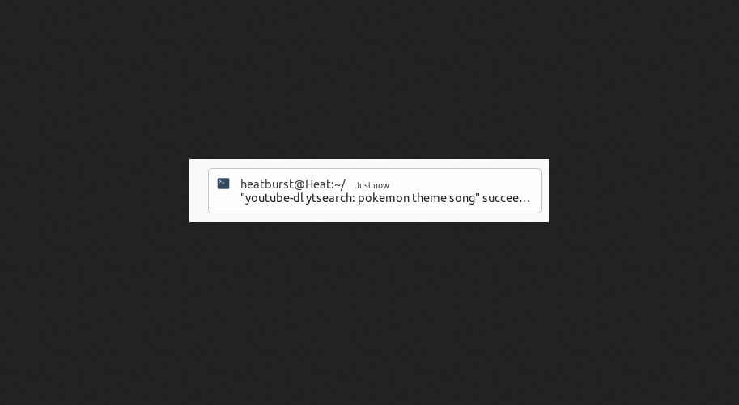

# Τεχνολογία λογισμικού

### Ελευθέριος Ελευθεριάδης | Π2017166

## Σύνοψη

Η αναφορά αποτελέιται από τις ζητούμενες ασκήσεις του μαθήματος "Τεχνολογία Λογισμικού" του έκτου εξαμήνου. Επίσης από τα link των βίντεο στο asciinema που υποδεικνύουν την υλοποίηση της αντίστοιχης άσκησης και τα εργαλέια που χρησιμοποιήθηκαν για την κάθεμια. Στην συνέχεια περιέχει τους συνδέσμους από την εργασίες συμμετοχικού υλικού και του προσωπικού αποθετηρίου.

## Εισαγωγή

Ο τίτλος του μαθήματος "Τεχνολογίες Λογισμικού" υποδικνύει ότι το επίκεντρο του μαθήματος είναι το λογισμικό. Ο όρος λογισμικό είναι ένα μεγάλο πεδίο της επιστήμης της πληροφορικής. Στο μάθημα αυτό ασχολούμαστε με το λογισμικό με την χρήση του τερματικού και των γραμμών εντολών. Η χρήση του τερματικού στην εποχή μας δεν είναι τόσο μεγάλη επειδή η αλληλεπίδραση με το λογισμικό είναι ευκολότερη μέσο ενός γραφικού περιβάλλοντος. Παρόλα αυτά η η χρήση του τερματικού από ένα άτομο με μια μέση γνώση ως προς τις πιο κοινές εντολές προσφέρει μια γρηγορότερη χρήση και διαχείρηση του υπολογιστή. Βάση αυτού στο παρόν μάθημα ανατέθηκαν εργασίες για την χρήση του τερματικού και για εξοικίωση με αυτό.

## Συμμετοχικό εκπαιδευτικό υλικό

## Προσωπικό link βιβλίου [link](https://p17elev.netlify.com/)

## Προσωπικό αποθετήριο

Για την εργασία συμμετοχικού περιεχομένου εισήχθησαν για το πρώτο παραδοτέο 
δύο εικόνες με λεζάντα και ελεύθερα πνευματικά δικαιώματα στους κατάλληλους 
φακέλους του δικού μας αποθετηρίου.

[1st image link](https://github.com/eleftherioseleftheriadis/gr/blob/P2017166/_gallery/netlify.md)

[2nd image link](https://github.com/eleftherioseleftheriadis/gr/blob/P2017166/_gallery/trci.md)

[interactive image link](https://p17elev.netlify.app//remix/shell/)

## Εργασίες SW

## Πρώτη εργασία

Assignment: Send notifications to your desktop-mobile 

Περιγραφή: Σε αυτήν την εργασία γίνεται η χρήση του ntfy. Αφόυ εγκαταστήσαμε το ntfy και στείλαμε notifications στο desktop μας, κάθε φορά που τελειώνει η εκτέλεση κάποιου μεγάλου task διάρκειας πάνω από 10 δευτερόλεπτα στένεται αυτόματα ειδοποίηση.  Το task που επέλεξα να εκτελέσω για την παρουσίαση του ntfy ήταν το download ενός τργουδιού το οποίο εκτελεί ένα απλό download μεγαλύτερο απο 10 δευτερόλεπτα το οποίο με το που τελείωσε έστειλε ειδοποίηση στον υπολογιστή για την επιτυχία του. Το desktop notifications που προέκυψε από αυτό το task παρουσιάζεται παρακάτω με την χρήση screenshot. Παρακάτω ακολουθεί το screenshot που παρουσιάζει το notification και το βίντεο του asciinema.

[example](https://asciinema.org/a/qqzt0c1OOOxADeeDiq2kp8g1G)

Screenshot:

## Δεύτερη εργασία

Assignment: Try different terminals and shells

Περιγραφή: Στο πάρακατω assignment αρχικά εγκαταστούμε το terminal Terminator και το Tilda όπως βλέπουμε στα αντίστοιχα Screenshots. Το Terminator είναι terminal το οποίο δίνει την δυνατότητα στον χρήστη να τρέχει πολλαπλά terminal στο ίδιο παράθυρο. Επίσης δίνει την δυνατότητα στον χρήστη να τα διαμορφώνει το ένα δίπλα στο άλλο με οριζόντιο και κατακόρυφο διαχωρισμό. Στη συνέχεια το Tilda είναι ένας εξομοιωτής τερματικού το οποίο ότι πέφτει από την άκρη της οθόνης όταν ο χρήστης  πατάει ένα συγκεκριμένο ρυθμιζόμενο πλήκτρο πρόσβασης. Αυτό είναι παρόμοιο με τις ενσωματωμένες κονσόλες σε παιχνίδια όπως το Quake. Ακολούθως παρουσιάζεται μια απλή χρήση του KSH (The Korn) Shell το οποίο έχει εφευρεθεί πολύ πριν από το BASH, έχει συσχετισμένους πίνακες και χειρίζεται τη σύνταξη βρόχου καλύτερα από το bash. Ακόμα, η εκτύπωση εντολών του ksh είναι καλύτερη από την εντολή echo. Τέλος παρουσιάζεται το Csh Shell του οποίου τα χαρατηριστικά έχουν ενσωματωθεί από το BASH κατά κύριο λόγο.

[example](https://asciinema.org/a/2QW2xYB31R7OEmdha8AdoEfDw)

[example](https://asciinema.org/a/YTnGNw8aMqKQ1Bm5Cb71a7yjb)

Screenshots:

## Τρίτη εργασία
Assignment: Performance monitoring

Περιγραφή: Το πάρακατω βίντεο παροθσιάζει την χρήση της εντολής hyperfine η οποία ένα ανοικτού κώδικα πρόγραμμα σύγκρισης μεταξύ πλατφορμών και γραμμένο σε γλώσσα προγραμματισμού Rust. Δίνει την δυνατότητα στον χρήστη να κάνει παρακωλούθηση επιδόσεων.

 https://asciinema.org/a/O6DWhRyztfaPRq1tmeaKEZN1t

## Τέταρτη εργασία

Assignment: Choose your stack
Περιγραφή: Στην πάρακατω άσκηση γίνεται χρήση της εντολής thefuck για να διωρθόσει την τελευταία εντολή που γράψαμε βρίσκοντας το τυπογραφικό λάθος. Ακολούθως παρουσιάζεται η εντολη howdoi η οποία προσφέρει την ευκολία στον χρήστη να ρωτήση πρακτικά το τερματικό τον τρόπο να εκτελέσει τις επιθυμητές του ενέργειες.

https://asciinema.org/a/68yNmiha0Fzx8f4ReAapVRISK

https://asciinema.org/a/MC7kBaif3gQIfpc8F5mINooQ5

## Πέμπτη εργασία

Assignment: Set-up a system for python development

Περιγραφή: Με την χρήση του Pipenv shell. Το Pipenv shell χρησιμοποιείται για να δημιουργήσει ένα ενεργό περιβάλλον σχεδόν με τον ίδιο τρόπο όπως με την πηγή env / bin / activate, αλλά θα το κάνει και σε ένα νέο shell. Ακολούθως το χρησιμοποιούμε για ένα απλό παράδειγμα χρήσης του shell για την εμφάνιση της πρότασης hello world μέσω του terminal.

https://asciinema.org/a/1xEl6TCtZFUdYtfjHOveTo4Xo

## Έκτη εργασία

Assignment: Use the terminal as the IDE

Περιγραφή: Ένα IDE είναι μια εφαρμογή λογισμικού που παρέχει ολοκληρωμένες εγκαταστάσεις σε προγραμματιστές υπολογιστών για ανάπτυξη λογισμικού. Ένα IDE αποτελείται συνήθως από τουλάχιστον έναν επεξεργαστή πηγαίου κώδικα, εργαλεία αυτοματισμού κατασκευής και ένα πρόγραμμα εντοπισμού σφαλμάτων. Στο πάρακατω παράδειγμα παρουσιάζετε μια σύντομη χρήση του vim για να υποδειχτεί η χρήση του σαν περιβάλλον ανάπτθξης λογισμικού.

https://asciinema.org/a/4t6dEiUumRrFJ4XXrPNnqu4ri

## Έβδομη εργασία

Assignment: Set-up cloud services

Περιγραφή: Το OpenSSH είναι μια σειρά από βοηθητικά προγράμματα ασφαλούς δικτύωσης που βασίζονται στο πρωτόκολλο Secure Shell, το οποίο παρέχει ένα ασφαλές κανάλι μέσω ενός μη ασφαλούς δικτύου σε αρχιτεκτονική πελάτη-διακομιστή. Με την χρήση του OpenSSH μπορούμε να συνδεθούμε από απόσταση με ένα machine (στο παράδειγμα επειδή δεν διαθέτω κάτι άλλο θα συνδεθώ με το δικό μου) θα παρουσιάσω ένα script και θα φανεί η επιλογή παραμετροποίηση στο αρχείο του ssh.

https://asciinema.org/a/LVTo0h8bQ1vyuXgpZeG2AzzWO
